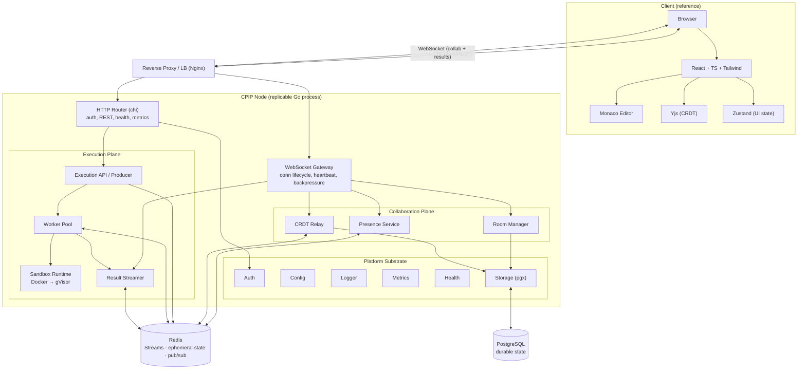
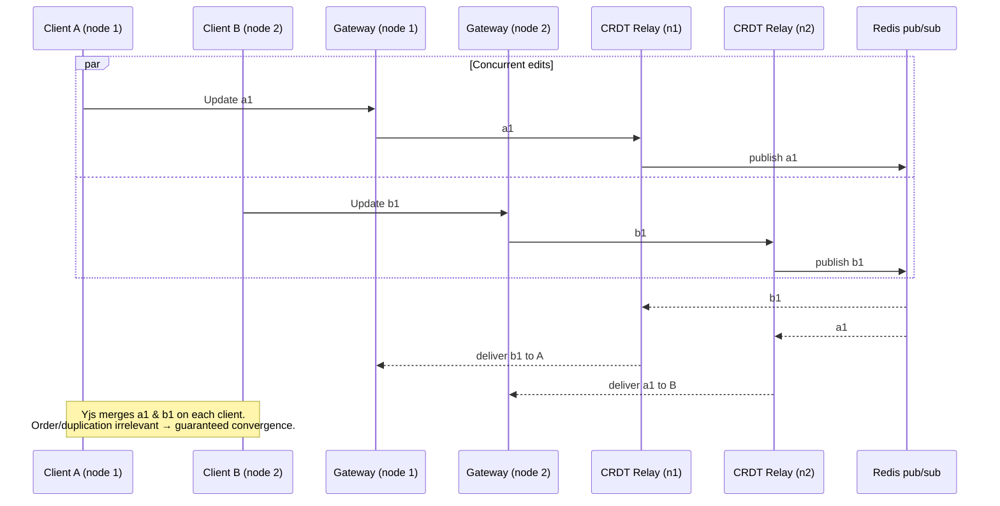
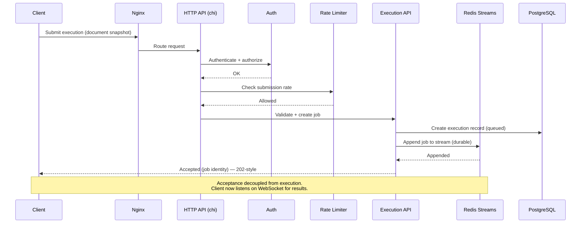
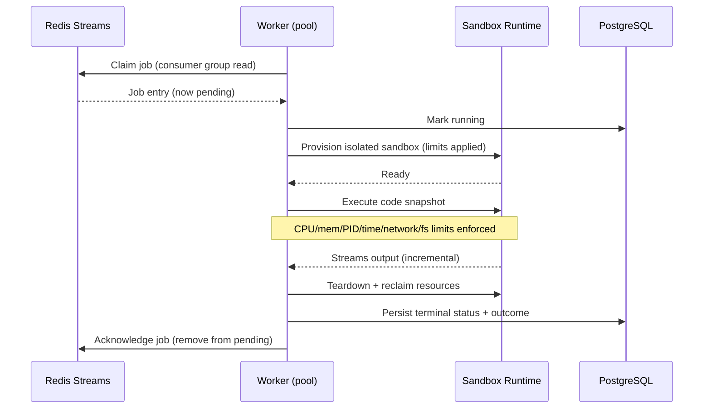
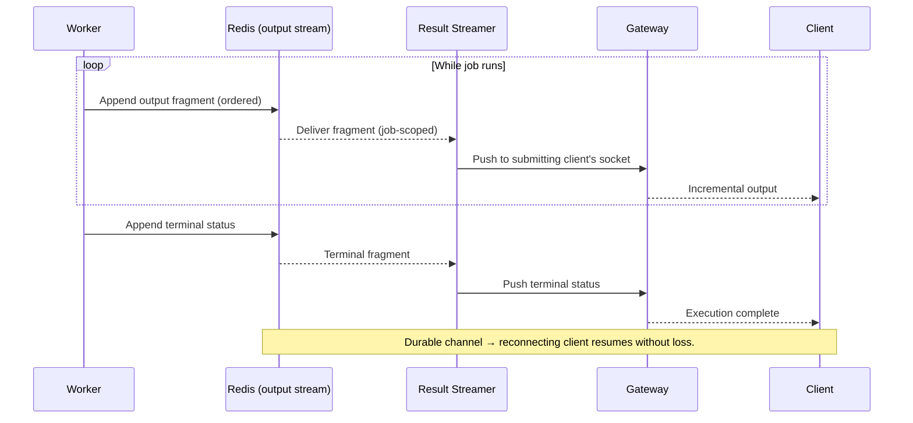
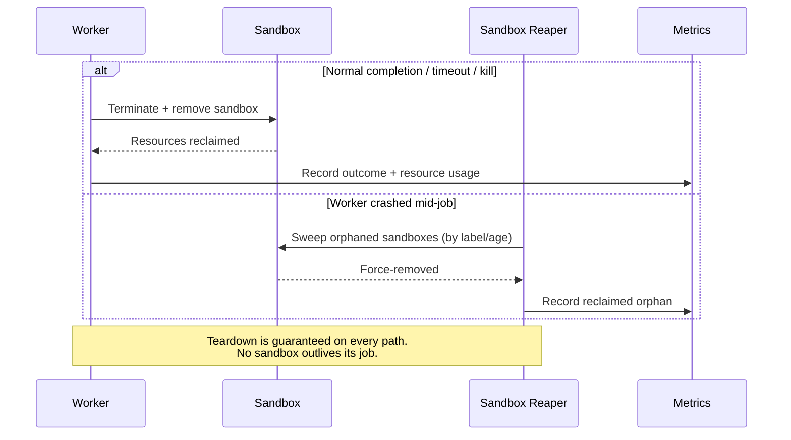
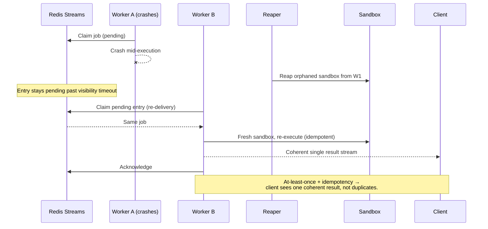
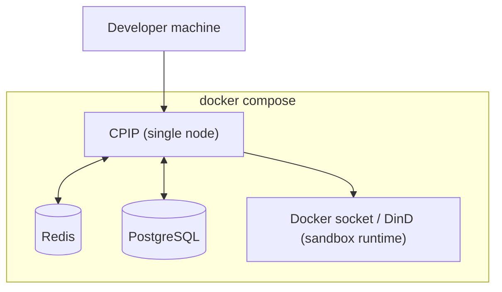
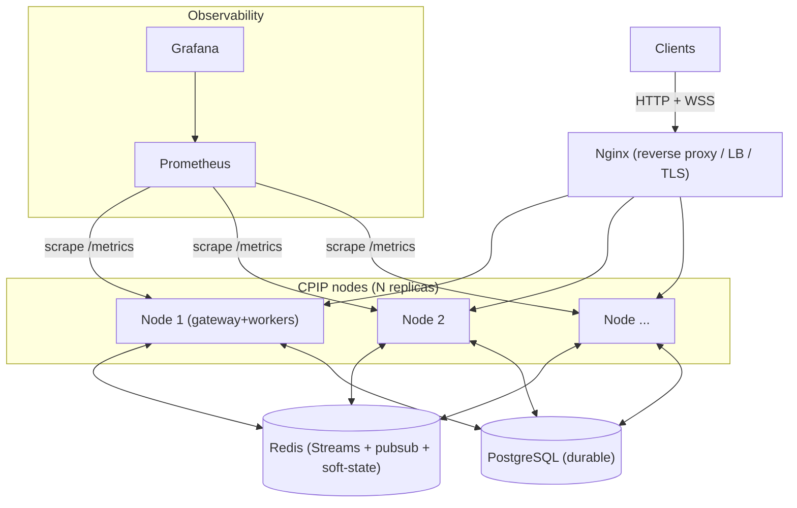
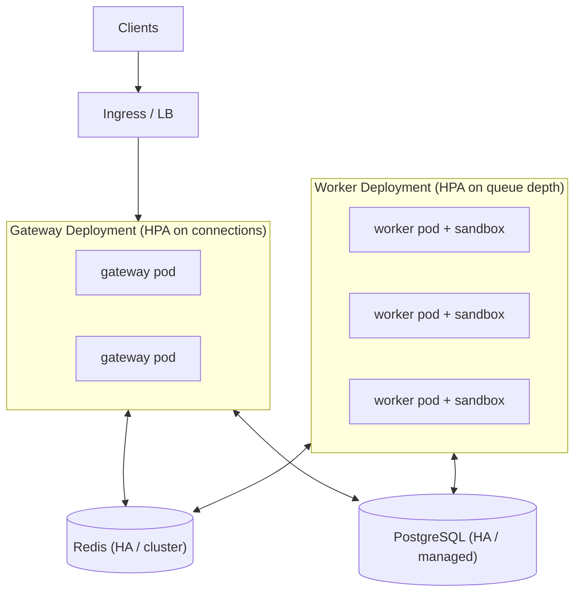

# Collaborative Programming Infrastructure Platform (CPIP)
## System Architecture Blueprint

| Field | Value |
|---|---|
| **Document status** | Draft v1.0 — pre-implementation |
| **Document owner** | Principal Architect |
| **Last updated** | 2026-07-12 |
| **Companion document** | `PRD.md` (product & engineering requirements — the *what/why*) |
| **This document** | The *how* — architecture, components, flows, decisions |
| **Classification** | Single source of truth for all implementation stages |
| **Explicit non-goals** | No code, no API design, no WebSocket message contracts, no DB schema, no protocol payloads |

> **Reading order:** This blueprint assumes the requirements, constraints, and principles in `PRD.md`. Where the PRD says *what must be true*, this document says *how the system is structured to make it true*. It stops precisely at the boundary of implementation: it names seams, responsibilities, and contracts-as-concepts, but never their concrete signatures, payloads, or schemas.

---

## Table of Contents

1. Executive Architecture Overview
2. Architectural Principles
3. High-Level Architecture
4. Component Responsibilities
5. Communication Architecture
6. End-to-End Request Flows
7. Runtime Architecture
8. Package Architecture
9. Data Ownership
10. Scalability Strategy
11. Reliability Strategy
12. Security Architecture
13. Observability Architecture
14. Deployment Architecture
15. Architecture Decision Records (ADRs)
16. Engineering Trade-offs
17. Future Evolution

---

# 1. Executive Architecture Overview

## 1.1 What This System Is

CPIP is a **modular monolith** written in Go that provides two composed infrastructure capabilities behind a single deployable unit:

1. A **real-time collaboration plane** — a WebSocket gateway, room manager, CRDT relay, and presence service that let many clients edit one document and converge on consistent state with live awareness.
2. A **code execution plane** — an execution intake API, a durable job log (Redis Streams), a bounded concurrent worker pool, a sandboxed runtime (Docker → gVisor), and a result-streaming path.

Both planes sit on a **shared platform substrate**: authentication, persistence (PostgreSQL via pgx), configuration, structured logging, metrics, and health. State is deliberately **externalized** into Redis and PostgreSQL so that the Go process itself is horizontally replicable and any node can serve any client.

The two planes are separate concerns that meet at exactly one place: a client's WebSocket connection carries *both* collaboration traffic and execution result streams, and an execution job's source is *a snapshot of* the collaborative document. They share transport and identity; they share almost nothing else. This separation is the spine of the architecture.

## 1.2 The Two Planes and the Substrate

```
        ┌───────────────────────── CPIP process (replicable) ─────────────────────────┐
        │                                                                              │
        │   COLLABORATION PLANE                     EXECUTION PLANE                     │
        │   ┌───────────────────────┐               ┌───────────────────────┐          │
        │   │ WS Gateway            │               │ Execution API         │          │
        │   │ Room Manager          │   snapshot    │ Job Producer          │          │
        │   │ CRDT Relay            │──────────────▶│ Worker Pool           │          │
        │   │ Presence Service      │   (doc→job)   │ Sandbox Runtime       │          │
        │   └───────────────────────┘               │ Result Streamer       │          │
        │              │  result stream (job→client) ◀──────────┘          │          │
        │              └────────────────────────────────────────┘          │          │
        │                                                                              │
        │   PLATFORM SUBSTRATE                                                          │
        │   Auth · Config · Logger · Metrics · Health · Storage(pgx) · Redis client    │
        └──────────────────────────────────────────────────────────────────────────────┘
                          │                               │
                    ┌─────▼─────┐                   ┌─────▼──────┐
                    │  Redis    │                   │ PostgreSQL │
                    │ (Streams, │                   │ (durable   │
                    │  ephemeral│                   │  state)    │
                    │  state,   │                   └────────────┘
                    │  pub/sub) │
                    └───────────┘
```

## 1.3 Request Lifecycle at a Glance

- **Collaboration lifecycle:** Client authenticates → opens a WebSocket → is bound to a room → CRDT updates flow client↔gateway↔other clients while the relay persists document state and the presence service propagates awareness. This is a **long-lived, stateful, bidirectional** interaction.
- **Execution lifecycle:** Client submits a document snapshot for execution → the Execution API validates and **appends a job to a durable Redis Stream** and acknowledges immediately (acceptance decoupled from processing) → a worker in the pool claims the job via a consumer group → the worker provisions a sandbox, runs the code under strict limits, and **streams output back through Redis** → the Result Streamer relays that output over the client's WebSocket in order → the sandbox is torn down and an execution record is persisted. This is a **short-lived, event-driven, at-least-once** pipeline.

The rest of this document decomposes these two lifecycles into components, flows, runtime behavior, and the operational concerns (scaling, reliability, security, observability, deployment) that make them production-grade.

---

# 2. Architectural Principles

These principles are the invariants every design decision below is checked against. They inherit and sharpen the development principles in `PRD.md §14`.

## 2.1 Infrastructure-First
The plumbing is the product. Backpressure, delivery guarantees, isolation, graceful shutdown, and observability are primary features — not cross-cutting afterthoughts. Any component is "done" only when it behaves correctly under concurrency, failure, and load.

## 2.2 Modular Monolith (not Microservices, yet)
The system ships as **one Go binary with strongly bounded internal modules**. Modules communicate through explicit in-process interfaces (seams), never by reaching into each other's internals. This yields the *learning* of distributed systems (externalized state, delivery semantics, horizontal scale) without the *operational tax* of a service mesh. The module boundaries are drawn where future service-extraction seams would naturally fall (gateway tier, worker tier, sandbox runtime).

## 2.3 Package-Oriented Go
Packages are organized by **capability/domain**, not by technical layer. Each package owns a coherent responsibility, exposes a minimal surface, and hides its internals. Dependencies flow inward toward stable abstractions; `internal/` prevents accidental external coupling. No package is a "utils" dumping ground.

## 2.4 Stateless Services Where Possible
Business logic components hold **no session-critical state in local memory that is required for correctness**. Connection objects and in-flight buffers live in memory (they must), but the *authoritative* room state, presence, job state, and results live in Redis/PostgreSQL. This makes the process replaceable and horizontally scalable, and makes graceful failover possible.

## 2.5 Event-Driven Execution
The execution plane is **asynchronous and log-centric**. Submitting a job is an append to a durable stream; processing is a consumer pulling from that stream. Producers and consumers are decoupled in time and capacity, which gives natural buffering, backpressure, and independent scaling.

## 2.6 Loose Coupling, High Cohesion
Each subsystem does one thing and depends on others only through narrow contracts. The **sandbox runtime is a replaceable seam** (Docker→gVisor→Firecracker). The **transport is a seam** (the gateway hides WebSocket details from the room/presence logic). The **job log is a seam** (Redis Streams could become Kafka). Cohesion within a module is high; coupling across modules is deliberately thin.

## 2.7 Production-First Mindset
Every component is built as if it will be operated at 3 a.m. during an incident: it is observable (logs/metrics/correlation IDs), it fails safe (bounded buffers, timeouts, deterministic teardown), it drains cleanly, and it recovers on restart. Prototype conveniences that would not survive production are rejected up front.

## 2.8 Security by Default
Untrusted code is assumed hostile. The execution path runs under least privilege, strict resource limits, and a defensible trust boundary from the very first sandbox — hardening (gVisor) is an upgrade of an already-safe design, not a rescue of an unsafe one.

## 2.9 Backpressure Everywhere
No unbounded queue, buffer, or fan-out exists in the system. Every producer/consumer boundary has a bound and a defined behavior on overflow (block, shed, or drop-slowest). Slow clients and job bursts degrade the system gracefully; they never exhaust it.

## 2.10 Deterministic, Testable Concurrency
Concurrency-critical paths (fan-out, worker pool, result ordering, shutdown) are designed to be race-free and reproducibly testable. Ownership of shared state is explicit; the race detector gates critical code.

---

# 3. High-Level Architecture

## 3.1 Component Topology



## 3.2 Canonical Linear Flow (annotated)

The classic top-to-bottom flow, with each connection explained:

| From → To | Mechanism | Why this edge exists |
|---|---|---|
| **Browser → React** | in-app | Reference client renders editor and orchestrates Yjs/Zustand. |
| **React → WebSocket Gateway** | WebSocket (via LB) | Persistent full-duplex channel for edits, presence, and result streams. |
| **Gateway → Room Manager** | in-process seam | Binds a connection to a room; enforces membership/authorization. |
| **Room Manager → Presence Service** | in-process + Redis | Membership changes drive awareness; presence is shared across nodes via Redis. |
| **Room Manager → CRDT Relay** | in-process | Relay fans out edits to room members and persists converged state. |
| **CRDT Relay → Redis (pub/sub)** | Redis | Cross-node fan-out: an edit received on node A must reach a member on node B. |
| **CRDT Relay → PostgreSQL** | pgx | Durable persistence of document state for restore/catch-up. |
| **React → Execution API** | HTTP (via LB) | Job submission is a request/response acceptance, not a stream. |
| **Execution API → Redis Streams** | Redis | Durable, ordered job log decoupling acceptance from processing. |
| **Worker Pool → Redis Streams** | Redis consumer group | Workers pull jobs with at-least-once semantics and pending-entry recovery. |
| **Worker Pool → Sandbox** | runtime seam | The worker provisions and drives an isolated execution environment. |
| **Sandbox → Result Streamer** | in-process + Redis | Output is streamed incrementally through a durable Redis channel. |
| **Result Streamer → Gateway → Client** | Redis → WebSocket | Ordered output reaches the submitting client, possibly on another node. |
| **Worker/Exec → PostgreSQL** | pgx | Execution records persisted for history and audit. |

## 3.3 Why the Two-Plane Split

Collaboration is **synchronous, stateful, latency-critical, and connection-bound**. Execution is **asynchronous, stateless-per-job, throughput-oriented, and log-bound**. Coupling them would force one set of trade-offs on both. Splitting them lets the collaboration plane optimize for tail latency and the execution plane optimize for durable throughput, while sharing only transport and identity.

---

# 4. Component Responsibilities

Each subsystem is described by **Responsibilities · Inputs · Outputs · Dependencies · Failure handling**. No signatures or payloads — only roles and contracts-as-concepts.

## 4.1 Frontend (Reference Client)
- **Responsibilities:** Exercise the backend: render editor, run Yjs locally, display presence/results, submit executions. It is a test harness, not a product.
- **Inputs:** User keystrokes; server-pushed edits, presence, and output.
- **Outputs:** CRDT updates, presence signals, execution submissions.
- **Dependencies:** WebSocket gateway, Execution HTTP API.
- **Failure handling:** Reconnect with backoff; resync CRDT state on reconnect; surface degraded/connection state to the user.

## 4.2 HTTP Router (chi)
- **Responsibilities:** Serve request/response endpoints — authentication, room provisioning, execution submission, health, metrics. Apply middleware (auth, logging, rate limiting, recovery).
- **Inputs:** HTTP requests.
- **Outputs:** HTTP responses; hand-offs to Execution API and Auth.
- **Dependencies:** Auth, Execution API, Health, Metrics.
- **Failure handling:** Panic-recovery middleware; consistent error responses; rate limiting to shed abusive load.

## 4.3 WebSocket Gateway
- **Responsibilities:** Own the full WebSocket connection lifecycle — handshake, authentication, room binding, heartbeats/liveness, per-connection send buffering with **backpressure**, and teardown. Multiplex collaboration traffic and result streams over one connection. It is the *only* component that knows about raw sockets.
- **Inputs:** Inbound WebSocket frames; outbound messages from Room/Presence/CRDT/Result components.
- **Outputs:** Delivered frames to clients; lifecycle events (join/leave/disconnect) to the collaboration plane.
- **Dependencies:** Auth, Room Manager, Presence, CRDT Relay, Result Streamer.
- **Failure handling:** Heartbeat timeout reaps dead connections; bounded per-connection send buffer drops the *slow connection* (not the room) on overflow; clean resource release on teardown; connection loss triggers presence updates.

## 4.4 Room Manager
- **Responsibilities:** Own room lifecycle (create/join/close), membership, and authorization to a room. Bind connections to rooms and coordinate with CRDT/Presence for that room.
- **Inputs:** Join/leave/close requests; connection lifecycle events.
- **Outputs:** Membership state; authorization decisions; room-scoped routing of edits/presence.
- **Dependencies:** Auth, Storage, Redis (for cross-node membership/awareness), CRDT Relay, Presence.
- **Failure handling:** Membership is externalized so a node loss doesn't lose the room; unauthorized joins rejected; idempotent join/leave to tolerate reconnect races.

## 4.5 Presence Service
- **Responsibilities:** Track and propagate awareness — who is present, cursor/selection state, connection status — across all nodes serving a room.
- **Inputs:** Presence signals from clients; membership events.
- **Outputs:** Awareness updates fanned out to room members (including on other nodes).
- **Dependencies:** Redis (ephemeral shared state + pub/sub), Room Manager, Gateway.
- **Failure handling:** Presence is soft state with TTLs; stale entries expire; loss of a node's presence data self-heals as clients reconnect and re-announce.

## 4.6 CRDT Relay
- **Responsibilities:** Relay CRDT updates between room members, ensure cross-node fan-out, and persist converged document state. The relay is an **authority for persistence and distribution**, not for conflict resolution (Yjs resolves conflicts on clients).
- **Inputs:** CRDT updates from clients; catch-up requests on join/reconnect.
- **Outputs:** Fanned-out updates to other members; persisted document state; state snapshots for catch-up.
- **Dependencies:** Redis (cross-node pub/sub), Storage (durable state), Room Manager, Gateway.
- **Failure handling:** Because CRDTs converge regardless of order/duplication, relayed updates are safe to re-deliver; on reconnect a client resyncs to the persisted state; persistence failures degrade to in-memory relay with alerting rather than dropping edits silently.

## 4.7 Execution API / Job Producer
- **Responsibilities:** Accept execution submissions, validate/authorize them, and **append a durable job to Redis Streams**, acknowledging acceptance immediately. Enforce submission rate limits.
- **Inputs:** Execution submissions (a document snapshot + execution parameters).
- **Outputs:** A job appended to the stream; an acceptance acknowledgement with a job identity for later correlation.
- **Dependencies:** Auth, Redis Streams, Rate limiter, Storage (record creation).
- **Failure handling:** If the stream append fails, submission is rejected (fail closed) so the client can retry; acceptance is idempotent per submission to avoid duplicate jobs on client retry.

## 4.8 Queue (Redis Streams)
- **Responsibilities:** Serve as the durable, ordered **job log** and the **output channel**. Provide consumer-group semantics: at-least-once delivery, per-consumer claims, pending-entry tracking, and recovery of un-acked entries.
- **Inputs:** Appended jobs; appended output fragments.
- **Outputs:** Delivered entries to worker consumers and result readers.
- **Dependencies:** Redis.
- **Failure handling:** Un-acknowledged entries remain pending and are re-claimed after a visibility timeout; poison entries are routed to a dead-letter stream after a retry ceiling (see §11).

## 4.9 Worker Pool
- **Responsibilities:** A **bounded** set of workers that claim jobs from the consumer group, provision a sandbox, drive execution under limits, stream output, persist the record, and acknowledge the job. Concurrency never exceeds the configured pool size.
- **Inputs:** Jobs claimed from Redis Streams.
- **Outputs:** Output fragments to the result channel; execution records; job acknowledgements.
- **Dependencies:** Redis Streams, Sandbox Runtime, Result Streamer, Storage.
- **Failure handling:** Idempotent handling so re-claimed jobs don't double-emit client-visible results; a worker crash leaves the entry pending for re-claim; per-job timeout guarantees a worker cannot hang forever; deterministic sandbox teardown on every exit path.

## 4.10 Sandbox Runtime
- **Responsibilities:** Provide an isolated, resource-limited, ephemeral execution environment for a single job. Enforce CPU/memory/PID/time limits, filesystem constraints, and network denial. Present a **runtime-agnostic contract** so Docker can be swapped for gVisor.
- **Inputs:** A job's code snapshot and execution parameters.
- **Outputs:** Streamed stdout/stderr; a terminal status (completed/failed/killed/timeout); reclaimed resources.
- **Dependencies:** Container runtime (Docker/gVisor); host kernel isolation primitives (namespaces, cgroups, seccomp).
- **Failure handling:** Any limit breach → deterministic kill with correct terminal status; teardown is guaranteed even on worker crash (reaper sweeps orphaned sandboxes); host protected from resource exhaustion by cgroup ceilings.

## 4.11 Result Streamer
- **Responsibilities:** Carry a job's output from workers to the submitting client, preserving order and completeness, over a durable channel that supports reconnect catch-up.
- **Inputs:** Output fragments from workers (via Redis).
- **Outputs:** Ordered output frames pushed to the client's WebSocket, wherever that client is connected.
- **Dependencies:** Redis (durable output channel + pub/sub), Gateway.
- **Failure handling:** A reconnecting client resumes from the durable channel without losing produced output; terminal status is always delivered; if the client is gone, output persists in the channel until TTL for later retrieval.

## 4.12 Persistence (Storage / pgx)
- **Responsibilities:** Own all durable relational state — identities, room/document state, execution records — behind a repository seam. Manage connection pooling and transactional integrity.
- **Inputs:** Read/write requests from Room, CRDT, Execution, Auth.
- **Outputs:** Durable, consistent records.
- **Dependencies:** PostgreSQL.
- **Failure handling:** Connection pooling with timeouts; ret/circuit-breaking on transient errors; the collaboration plane degrades to in-memory relay with alerting if persistence is temporarily unavailable (never drops edits silently); execution acceptance fails closed if records can't be created.

## 4.13 Configuration
- **Responsibilities:** Load and validate environment-driven configuration (limits, pool sizes, timeouts, endpoints) once at startup; expose typed, immutable config to all components.
- **Inputs:** Environment/config sources.
- **Outputs:** Validated configuration object.
- **Failure handling:** **Fail fast** — invalid/missing required config aborts startup with a clear error; no defaults that would silently weaken isolation or limits.

## 4.14 Logging
- **Responsibilities:** Structured, leveled, correlatable logging across all subsystems; propagate correlation IDs for a job/session across module boundaries.
- **Failure handling:** Logging never blocks the request path; log emission failures degrade quietly without affecting correctness.

## 4.15 Metrics
- **Responsibilities:** Expose core metrics (active connections, rooms, queue depth, worker utilization, execution latency/outcomes, error rates) for scraping.
- **Failure handling:** Metric collection is best-effort and non-blocking.

## 4.16 Health Checks
- **Responsibilities:** Expose liveness and readiness signals reflecting dependency health (Redis, Postgres) and node state (draining or not).
- **Failure handling:** A node that loses a critical dependency or is draining reports **not-ready** so the load balancer removes it from rotation without killing in-flight work.

---

# 5. Communication Architecture

CPIP uses exactly four communication mechanisms, each chosen for a specific interaction shape. Minimizing the number of mechanisms is deliberate — fewer moving parts, fewer failure modes.

## 5.1 HTTP (chi) — request/response
- **Used for:** authentication, room provisioning, execution submission, health, metrics.
- **Why:** These are discrete, bounded, cacheable/idempotent request→response interactions. HTTP gives standard semantics (status codes, middleware, rate limiting) and is trivially load-balanced across stateless nodes.
- **Not used for:** anything long-lived or streamed.

## 5.2 WebSockets — persistent bidirectional streaming
- **Used for:** collaboration edits, presence, and result streams.
- **Why:** Collaboration and live output require **low-latency, full-duplex, server-push** delivery over a persistent connection. Polling or SSE cannot express the bidirectional, low-latency editing loop. One connection multiplexes both collaboration and results to conserve sockets.
- **Trade-off accepted:** stateful connections complicate scaling and load balancing — addressed with externalized state, heartbeats, backpressure, and reconnection (see §7, §10).

## 5.3 Redis — durable log, ephemeral state, and cross-node fan-out
- **Used for:** (a) **Streams** as the execution job log and output channel; (b) **ephemeral shared state** for presence/membership with TTLs; (c) **pub/sub** for cross-node collaboration and result fan-out.
- **Why:** A single dependency delivers three needed capabilities — durable at-least-once streaming (consumer groups), fast shared soft-state, and cross-node messaging — without operating a separate broker. It is the linchpin that makes multiple stateless nodes behave as one logical service.
- **Trade-off accepted:** single-instance Redis is an availability dependency initially (see §11).

## 5.4 PostgreSQL (pgx) — durable system of record
- **Used for:** identities, document state for restore, execution records.
- **Why:** Strong consistency and durability for the data that must survive restarts; relational integrity; a high-performance idiomatic Go driver.
- **Boundary:** Postgres is never on the hot real-time path for edits (that is Redis + memory); it is the durable backstop.

## 5.5 Internal Packages — in-process interface seams
- **Used for:** all intra-node module communication (gateway↔rooms↔presence↔CRDT↔execution).
- **Why:** In-process calls across **narrow interfaces** are the lowest-latency, simplest coupling for a monolith, and they define exactly where future services would be split. Contracts are conceptual interfaces, not network APIs — no serialization tax inside the node.

## 5.6 Communication Decision Summary

| Interaction | Mechanism | Shape | Key property needed |
|---|---|---|---|
| Auth, submit job, health | HTTP | request/response | Simplicity, idempotency, LB-friendly |
| Edits, presence, output | WebSocket | streaming duplex | Low latency, server push |
| Job log, output channel | Redis Streams | durable log | At-least-once, ordering, recovery |
| Cross-node fan-out | Redis pub/sub | broadcast | Node-agnostic delivery |
| Presence/membership soft state | Redis (TTL) | shared cache | Fast, self-expiring |
| Durable records | PostgreSQL | transactional store | Consistency, durability |
| Intra-node module calls | Go interfaces | in-process | Zero-serialization, tight seams |

---

# 6. End-to-End Request Flows

Sequence diagrams for the critical flows. These show **interaction order and responsibility**, not payloads or signatures.

## 6.1 User Joins a Room

```mermaid
sequenceDiagram
    participant C as Client
    participant LB as Nginx
    participant G as WS Gateway
    participant A as Auth
    participant R as Room Manager
    participant P as Presence
    participant CR as CRDT Relay
    participant DB as PostgreSQL
    participant RD as Redis

    C->>LB: Open WebSocket
    LB->>G: Upgrade connection
    G->>A: Authenticate connection
    A-->>G: Identity established
    G->>R: Bind connection to room
    R->>A: Authorize identity for room
    A-->>R: Authorized
    R->>DB: Load persisted document state
    DB-->>R: Latest converged state
    R->>CR: Register member; request catch-up snapshot
    CR-->>G: Send initial state to client
    R->>P: Announce presence (join)
    P->>RD: Record presence (TTL) + publish join
    RD-->>P: Fan-out join to other nodes
    P-->>G: Presence roster to member(s)
    G-->>C: Joined: state + roster delivered
```

## 6.2 User Edits Code (single editor)

```mermaid
sequenceDiagram
    participant C as Client (Yjs)
    participant G as WS Gateway
    participant CR as CRDT Relay
    participant RD as Redis (pub/sub)
    participant DB as PostgreSQL

    C->>G: CRDT update (local edit)
    G->>CR: Forward update (room-scoped)
    CR->>RD: Publish update to room channel
    CR->>DB: Persist converged state (async, debounced)
    RD-->>CR: Deliver to subscribers on all nodes
    CR-->>G: Fan-out to other room members
    Note over C,DB: Author sees local edit instantly (optimistic);<br/>persistence is debounced off the hot path.
```

## 6.3 Multiple Users Edit Simultaneously



## 6.4 User Reconnects

```mermaid
sequenceDiagram
    participant C as Client
    participant G as Gateway (any node)
    participant R as Room Manager
    participant CR as CRDT Relay
    participant DB as PostgreSQL
    participant P as Presence
    participant RD as Redis

    Note over C: Transient disconnect (network blip)
    C->>G: Reconnect + resume room (new socket, any node)
    G->>R: Rebind connection to room
    R->>CR: Request catch-up
    CR->>DB: Load latest converged state
    DB-->>CR: State
    CR-->>G: Send state; client CRDT reconciles delta
    R->>P: Re-announce presence
    P->>RD: Refresh presence entry (TTL)
    G-->>C: Fully resynced
    Note over C,CR: CRDT reconciliation is delta-based;<br/>no lost edits because state is authoritative in DB/Redis.
```

## 6.5 Execute Code (submission → acceptance)



## 6.6 Worker Execution



## 6.7 Streaming Output to Client



## 6.8 Container Cleanup



## 6.9 Persistence Flow

```mermaid
sequenceDiagram
    participant CR as CRDT Relay
    participant W as Worker
    participant S as Storage (pgx)
    participant PG as PostgreSQL

    CR->>S: Persist converged document (debounced)
    S->>PG: Write within transaction
    PG-->>S: Committed
    W->>S: Persist execution record (status/outcome)
    S->>PG: Write within transaction
    PG-->>S: Committed
    Note over CR,PG: Real-time path never blocks on Postgres;<br/>writes are async/debounced. Postgres is the durable backstop.
```

## 6.10 Failure Recovery (worker crash mid-job)



---

# 7. Runtime Architecture

## 7.1 Concurrency Model
CPIP is built on Go's CSP model: **goroutines communicate via channels; shared state is owned, not shared-and-locked wherever avoidable**.

- **Per-connection goroutines:** each WebSocket connection has a reader goroutine and a writer goroutine; the writer drains a **bounded** per-connection outbound channel (the backpressure point).
- **Room fan-out:** a room's relay owns its member set; fan-out is a bounded broadcast to per-connection channels — a slow member's channel filling up drops *that member*, never the room.
- **Worker pool:** a fixed number of worker goroutines pull from the Redis consumer group; the pool size is the global concurrency bound for executions.
- **Context propagation:** every request/job carries a `context` for cancellation, timeouts, and correlation IDs; cancellation flows from shutdown/timeout down into sandbox teardown.

## 7.2 Connection Lifecycle

```
CONNECT → AUTHENTICATE → BIND-TO-ROOM → ACTIVE (read+write loops, heartbeats)
   → [heartbeat miss OR client close OR node drain] → DRAIN → TEARDOWN → PRESENCE-UPDATE
```
- **Heartbeats:** periodic ping/pong; a missed-deadline connection is reaped.
- **Backpressure:** outbound channel is bounded; on overflow the connection is closed (slow-consumer isolation) rather than growing memory unboundedly.
- **Ownership:** the gateway owns the socket; room/presence/CRDT never touch the socket directly — they enqueue to the connection's outbound channel.

## 7.3 Room Lifecycle

```
CREATE (or lazy-create on first join) → ACTIVE (members join/leave, edits flow, state persists)
   → IDLE (no members) → EVICT from memory (state remains durable in Postgres)
   → REHYDRATE on next join (load from Postgres)
```
- Rooms are **cheap to evict and rehydrate** because authoritative state is externalized. In-memory room objects are a cache, not the source of truth.

## 7.4 Worker Lifecycle

```
START → REGISTER with consumer group → LOOP{ claim → execute → stream → persist → ack }
   → on shutdown: stop claiming → finish in-flight → ack → EXIT
```
- Workers are **stateless between jobs**; a worker holds no job state that isn't recoverable from the stream's pending list.

## 7.5 Container (Sandbox) Lifecycle

```
PROVISION (create isolated env with limits) → START → EXECUTE (stream output)
   → [complete | timeout | limit-breach | kill] → STOP → REMOVE → RECLAIM
   ⟂ orphan path: REAPER sweeps sandboxes with no owning worker
```
- **Ephemeral and single-use:** one sandbox per job, never reused across jobs (isolation guarantee).
- **Deterministic teardown:** removal is guaranteed on every exit path; the reaper is the backstop for crash paths.

## 7.6 Execution Lifecycle (state machine)

```
QUEUED → CLAIMED → RUNNING → { COMPLETED | FAILED | TIMED_OUT | KILLED }
                     └── (worker crash) → back to pending → RE-CLAIMED → RUNNING ...
```
- Terminal states are precise (timeout ≠ generic failure). Idempotency ensures re-claims don't produce duplicate client-visible output.

## 7.7 Memory Ownership Rules
- **Connections & outbound buffers:** owned by the gateway; bounded; freed on teardown.
- **Room member sets & relay caches:** owned by the room; evictable; not authoritative.
- **In-flight job/sandbox handles:** owned by the executing worker; released on teardown.
- **Everything authoritative** (document state, presence-of-record, job state, results, records) **lives outside process memory** (Redis/Postgres). Process memory is always a cache or a transient buffer — never the sole home of correctness-critical data.

## 7.8 Backpressure Points (explicit)
1. Per-connection outbound channel (slow client).
2. Room fan-out broadcast (slow member isolation).
3. Redis Streams job log (job burst absorption).
4. Worker pool size (execution concurrency bound).
5. Result output channel (bounded, TTL'd).

Each has a defined overflow behavior; none is unbounded.

---

# 8. Package Architecture

Organization is **by capability**, under `internal/` to enforce encapsulation. This is a structure map with responsibilities — not code.

```
cpip/
├── cmd/
│   └── cpip/                  # Composition root: wire config→components→server; start/stop
│
├── internal/
│   ├── api/                   # chi routers, request/response handlers (auth, exec, health, metrics)
│   ├── gateway/               # WebSocket upgrade, connection registry, multiplexing
│   ├── websocket/             # Low-level conn lifecycle: read/write loops, heartbeat, backpressure
│   ├── rooms/                 # Room lifecycle, membership, authorization, rehydration
│   ├── presence/             # Awareness state, cursors, TTL soft-state, cross-node propagation
│   ├── collaboration/         # CRDT relay: fan-out, catch-up, persistence orchestration
│   ├── execution/             # Execution API/producer: validate, create record, append job
│   ├── queue/                 # Redis Streams abstraction: append, consumer groups, pending/DLQ
│   ├── workers/               # Worker pool: claim→execute→stream→persist→ack; lifecycle
│   ├── sandbox/               # Runtime-agnostic isolation contract; Docker impl (gVisor later)
│   ├── storage/               # pgx repositories; connection pooling; transactions
│   ├── config/                # Load + validate env config; typed immutable config
│   ├── logger/                # Structured logging; correlation-ID propagation
│   ├── metrics/               # Metric registry + collectors
│   ├── health/                # Liveness/readiness; dependency + drain state
│   └── middleware/            # HTTP/WS cross-cutting: auth, recovery, rate limit, logging
│
├── pkg/                       # Genuinely reusable, dependency-free helpers (safe to import externally)
│
├── configs/                   # Environment config templates (non-secret)
├── scripts/                   # Operational/dev scripts (build, migrate, load-test harness)
├── docker/                    # Dockerfiles, compose files, sandbox base images
└── docs/                      # PRD, this blueprint, ADRs
```

### Package responsibilities

| Package | Responsibility | Depends on (inward) |
|---|---|---|
| `cmd/cpip` | Composition root; dependency wiring; process start/stop/drain. | all (composition only) |
| `api` | HTTP surface via chi; translate requests to component calls. | execution, auth (via middleware), health, metrics |
| `gateway` | Own WebSocket connections; route frames to/from planes. | websocket, rooms, presence, collaboration, workers(result) |
| `websocket` | Raw connection mechanics; heartbeat; bounded send buffers. | logger, metrics |
| `rooms` | Room/membership/authorization lifecycle. | storage, queue(cross-node), presence, collaboration |
| `presence` | Awareness/soft-state; TTL; cross-node fan-out. | queue/redis, logger |
| `collaboration` | CRDT relay; persistence orchestration; catch-up. | storage, queue/redis |
| `execution` | Job intake/producer; validation; record creation. | queue, storage, middleware(rate limit) |
| `queue` | Redis Streams: durable log, consumer groups, DLQ. | (redis client) |
| `workers` | Bounded pool; job execution orchestration; result streaming. | queue, sandbox, storage |
| `sandbox` | Isolation contract + Docker/gVisor implementations. | (container runtime) |
| `storage` | Durable repositories over pgx; pooling; transactions. | (postgres) |
| `config` | Typed, validated, fail-fast configuration. | — |
| `logger` | Structured, correlatable logging. | — |
| `metrics` | Metric collection/exposition. | — |
| `health` | Liveness/readiness + drain reporting. | storage, queue |
| `middleware` | Auth, recovery, rate limiting, request logging. | logger, auth |
| `pkg/*` | Reusable, side-effect-free utilities. | — |

**Dependency rule:** dependencies point inward toward stable abstractions (config/logger/storage). No cyclic imports; cross-plane interaction happens only through interface seams defined at the composition root.

---

# 9. Data Ownership

Every datum has exactly one **owner** (authoritative home) and possibly several **caches**. The rule: *the authoritative copy of anything correctness-critical lives outside process memory.*

| Data | Authoritative owner | Cached/transient in | Ownership rule |
|---|---|---|---|
| **Identity / auth state** | PostgreSQL | request context | Durable; never in-memory-only. |
| **Room membership** | Redis (soft) + Postgres (durable existence) | room object in memory | Memory copy is a cache; rebuildable from Redis. |
| **Presence / cursors** | Redis (TTL soft-state) | memory per node | Ephemeral; self-expiring; never persisted to Postgres. |
| **CRDT document (live)** | Client (Yjs) + Redis pub/sub in flight | relay memory | Clients hold live CRDT; server relays + persists. |
| **CRDT document (durable)** | PostgreSQL | relay memory (cache) | Debounced writes; source of truth for catch-up/restore. |
| **Execution job (queued/pending)** | Redis Streams | worker memory (in-flight) | Stream is authoritative; worker memory is transient. |
| **Execution output (in-flight)** | Redis (output stream, TTL) | worker + streamer memory | Durable channel enables reconnect catch-up. |
| **Execution record (final)** | PostgreSQL | — | Durable history/audit. |
| **Sandbox filesystem/process state** | Container (ephemeral) | — | Destroyed on teardown; never touches host durably. |
| **UI state (panels, theme)** | Client (Zustand) | — | Never server-side; not infrastructure data. |
| **Configuration** | Environment/config store | immutable in-memory | Loaded once at startup; never mutated at runtime. |

**Consequences of these rules:**
- Any node can be killed without losing correctness-critical data.
- Rooms and connections are caches → cheap eviction, cheap rehydration.
- The **client** is a legitimate authority for *live* CRDT state (Yjs), with the server as relay + durable backstop — this is why convergence survives server restarts.
- The **container** owns only ephemeral state that must never persist — the isolation guarantee.

---

# 10. Scalability Strategy

## 10.1 Horizontal Scaling of Nodes
Nodes are **stateless with respect to correctness** (state externalized to Redis/Postgres). Scaling out = adding nodes behind Nginx. Any node serves any HTTP request; any node serves any WebSocket connection; any node's workers can claim any job. This is the payoff of §2.4 and §9.

## 10.2 Sticky Sessions — and why they're *not required*
WebSocket connections are long-lived, so a load balancer naturally keeps a client on one node for the connection's life. But CPIP is designed so **stickiness is a convenience, not a correctness requirement**: because room state, presence, and cross-node fan-out all go through Redis, a client reconnecting to a *different* node resumes seamlessly. We therefore use **connection-level affinity** (LB keeps a live socket on one node) without **session affinity** (no requirement that reconnects return to the same node). This avoids the classic sticky-session scaling trap.

## 10.3 Redis Scalability
- **Phase 1:** single Redis instance carries Streams + soft-state + pub/sub.
- **Scaling path:** Redis replication for read/HA; separate Redis instances/roles for Streams vs. pub/sub vs. cache to isolate load; Redis Cluster / sharding by room or job stream when a single instance saturates. The `queue` and `presence` packages hide the topology behind a seam so sharding is an infrastructure change, not a code redesign.

## 10.4 Worker Scaling
- Workers are consumer-group members; **adding workers (in-process or as separate worker nodes) adds execution throughput** with no coordination code — the consumer group distributes claims automatically.
- Phase 1: workers co-located in the node. Future: a dedicated **worker tier** (execution nodes distinct from gateway nodes) scaled independently by queue depth. The seam already exists because workers only depend on Redis + the sandbox contract.

## 10.5 Database Scaling
- **Postgres is off the hot real-time path** (edits go through memory + Redis; Postgres writes are debounced/async). This keeps Postgres load proportional to durable-write volume, not edit volume.
- Scaling path: connection pooling (already present via pgx pool) → read replicas for history/analytics → partitioning of execution records by time → separate durable stores per domain if needed.

## 10.6 Fan-out Scaling
- Large rooms amplify fan-out. Bounded per-connection buffers and slow-consumer isolation cap the blast radius. Future optimization: hierarchical/room-sharded fan-out and per-node local delivery with a single cross-node hop via Redis (already the model).

## 10.7 Future Kubernetes Deployment
- The stateless-node design maps cleanly onto K8s: gateway nodes and worker nodes become independently scalable Deployments; HPA scales workers on queue-depth metrics; Redis/Postgres become managed/operator-run StatefulSets or external managed services. No architectural change — a packaging/orchestration change (see §17).

## 10.8 Future Distributed Workers
- Because the job log and output channel are already external (Redis), workers can be moved to a **separate fleet** that only needs Redis + sandbox runtime access. This is the first natural service extraction from the monolith.

---

# 11. Reliability Strategy

## 11.1 Graceful Shutdown / Draining
On shutdown signal: stop accepting new connections and job claims → report **not-ready** (LB drains traffic) → finish or requeue in-flight work → flush pending persistence → close connections cleanly → exit. No acknowledged job is lost; clients reconnect elsewhere.

## 11.2 Retries
- **Execution jobs:** at-least-once via consumer groups; un-acked entries re-claimed after a visibility timeout; idempotent handling prevents duplicate client-visible results.
- **Persistence:** transient DB/Redis errors retried with backoff; hard failures fail closed (submission rejected) rather than silently dropped.

## 11.3 Connection Recovery
- Client reconnects with backoff; CRDT resync from authoritative state; result streams resume from the durable output channel; presence re-announced. Because reconnects need not return to the same node, recovery is robust to node loss.

## 11.4 Worker Failures
- A crashed worker leaves its job **pending**; another worker re-claims it. The reaper cleans orphaned sandboxes. Per-job timeouts prevent a hung worker from holding a job indefinitely.

## 11.5 Dead-Letter Queue
- A job that fails or is re-claimed beyond a **retry ceiling** is moved to a **dead-letter stream** with its failure context, removed from the live pipeline, and surfaced via metrics/logs for inspection — so a poison job cannot loop forever or block the group.

## 11.6 Container Crashes
- Sandbox crash → worker observes non-zero terminal state → records `failed`/`killed` accurately → tears down → acks (crash is a legitimate outcome of untrusted code, not a system fault). The host is unaffected by construction (resource ceilings).

## 11.7 Database Failures
- **Collaboration:** degrade to in-memory relay (edits still flow and converge among connected clients) with loud alerting; resume persistence on recovery. Edits are never silently dropped.
- **Execution:** acceptance fails closed if records can't be created; in-flight jobs already on the stream continue; recovery reconciles.

## 11.8 Redis Failures
- Redis is the most critical dependency (job log + fan-out + soft-state). Its loss is a **degraded mode**, not silent corruption: new executions are rejected (fail closed); cross-node collaboration fan-out pauses; nodes report not-ready. On recovery, streams resume from durable entries. HA Redis (replication/failover) is the primary reliability upgrade (see §17). This dependency is explicitly acknowledged as the phase-1 reliability ceiling.

## 11.9 Failure-Handling Summary

| Failure | Detection | Response | Guarantee preserved |
|---|---|---|---|
| Slow client | send-buffer overflow | close that connection | Room unaffected |
| Dead connection | heartbeat timeout | reap + presence update | No zombie sockets |
| Worker crash | pending timeout | re-claim + reap sandbox | At-least-once, no orphan |
| Poison job | retry ceiling | dead-letter + alert | Pipeline never blocked |
| Sandbox crash | terminal state | record + teardown | Host safe |
| Postgres down | write errors | degrade + alert | No silent edit loss |
| Redis down | health check | fail closed + not-ready | No silent corruption |
| Node drain/deploy | shutdown signal | graceful drain | No acknowledged-work loss |

---

# 12. Security Architecture

## 12.1 Authentication Boundaries
Authentication happens at the **edge of every entry path** — HTTP requests (middleware) and WebSocket upgrade (gateway). No component beyond the edge accepts an unauthenticated principal; identity is carried inward via context.

## 12.2 Authorization & Room Permissions
Authorization is enforced at the **room boundary** (owner/participant) and the **execution boundary** (who may submit). A principal cannot receive a room's edits/presence or submit executions without passing authorization. Fine-grained RBAC is out of scope (PRD); the model is intentionally simple and enforced consistently.

## 12.3 Sandbox Isolation (the critical boundary)
Untrusted code runs only inside a sandbox that is:
- **Process-isolated** (namespaces): its own PID/mount/network/IPC namespaces.
- **Resource-capped** (cgroups): CPU time, memory ceiling, PID/process limit, wall-clock timeout.
- **Syscall-restricted** (seccomp): a restrictive syscall profile; dropped Linux capabilities; non-root user; no privilege escalation.
- **Ephemeral & single-use:** one sandbox per job, destroyed after.

## 12.4 Network Isolation
Sandboxes have **no network access by default** (network namespace with no route / disabled networking). This blocks exfiltration and outbound attacks. Any future need for network access is an explicit, tightly-scoped, allow-listed exception — never a default.

## 12.5 Filesystem Isolation
Sandboxes get an **ephemeral, constrained filesystem** — read-only base image plus a size-bounded writable scratch layer destroyed on teardown. No host paths are mounted; nothing a job writes survives or touches the host.

## 12.6 Secrets Management
Secrets (DB/Redis credentials) are injected via environment/secret store, never hard-coded, never logged, never present inside sandboxes. The sandbox environment is scrubbed of all host secrets — untrusted code sees nothing sensitive.

## 12.7 Input Validation
All external inputs (submissions, room requests) are validated at the edge before touching the pipeline: size limits on submissions, parameter validation, and rejection of malformed requests. Validation is fail-closed.

## 12.8 Rate Limiting
Rate limits protect: execution submissions (per principal), connection establishment, and edit ingress. This bounds abuse and resource-exhaustion attacks at the front door, complementing per-job resource limits at the back.

## 12.9 Defense in Depth (layered)

```
Edge:      Auth + input validation + rate limiting + reverse proxy
   ↓
Plane:     Authorization at room/execution boundaries
   ↓
Pipeline:  Bounded concurrency + per-job resource ceilings
   ↓
Sandbox:   namespaces + cgroups + seccomp + no-net + ephemeral-fs + non-root
   ↓
Host:      cgroup ceilings protect host; reaper reclaims orphans
```
No single layer is trusted alone; a breach of one is contained by the next.

## 12.10 Future gVisor Migration
Docker (shared host kernel) is the phase-1 boundary. **gVisor** introduces a **user-space kernel** that intercepts syscalls, drastically shrinking the host-kernel attack surface — the strongest practical isolation short of a VM. Because the `sandbox` package exposes a **runtime-agnostic contract**, migrating Docker→gVisor changes the runtime implementation only, not the pipeline, workers, or API. This is a hardening upgrade of an already-defensible design.

---

# 13. Observability Architecture

## 13.1 Structured Logging
Every subsystem emits **structured, leveled** logs carrying a **correlation ID** (per connection, per room, per job) so a single interaction is traceable across module boundaries. Logs never block the request path. No secrets or untrusted-code output are logged verbatim at host level.

## 13.2 Metrics
Core metrics exposed for scraping (Prometheus later):
- **Collaboration:** active connections, active rooms, presence cardinality, edit fan-out rate, send-buffer drops.
- **Execution:** queue depth, worker utilization, jobs by terminal state, execution latency (P50/P95/P99), sandbox provisioning time, dead-letter count.
- **Platform:** DB pool saturation, Redis latency, error rates by subsystem, node readiness/drain state.

## 13.3 Tracing
Correlation IDs provide **logical tracing** across the monolith's modules in phase 1. The seams are designed so that distributed tracing (OpenTelemetry) can be added when workers become a separate tier — the correlation-ID propagation is the groundwork.

## 13.4 Health Endpoints
- **Liveness:** the process is running.
- **Readiness:** dependencies (Redis, Postgres) are healthy **and** the node is not draining. The LB routes only to ready nodes — the mechanism behind graceful drain and dependency-failure isolation.

## 13.5 Monitoring
Grafana dashboards (later) over the metrics above: a collaboration dashboard (connections/rooms/fan-out), an execution dashboard (queue/workers/latency/outcomes), and a platform dashboard (dependencies/errors/saturation).

## 13.6 Alerting
Alert on the signals that predict user-visible failure: rising queue depth (workers saturated), rising dead-letter rate (poison jobs), send-buffer drop spikes (fan-out overload), dependency unhealthy, elevated execution failure rate, node flapping readiness.

## 13.7 Debugging Strategy
- **Trace by correlation ID** across logs to reconstruct any job/session end-to-end.
- **Queue introspection:** inspect pending entries and the dead-letter stream to diagnose stuck/poison jobs.
- **Runtime profiling:** Go pprof endpoints (guarded) for goroutine/heap/CPU analysis of concurrency issues.
- **Reproducible concurrency tests** under the race detector localize data races before production.

---

# 14. Deployment Architecture

## 14.1 Development (Docker Compose)


- One command brings up app + Redis + Postgres + sandbox runtime access. Config via env. Fast feedback; reproducible.

## 14.2 Production (single-region, phase 1)


- **Nginx:** TLS termination, reverse proxy, WebSocket upgrade support, connection-level load balancing.
- **CPIP nodes:** stateless-for-correctness replicas; each runs gateway + workers in phase 1.
- **Redis/Postgres:** shared externalized state.
- **Prometheus/Grafana:** scrape and visualize (later phase).

## 14.3 Future Production (worker-tier split + K8s)


- Gateway and worker tiers scale independently; workers autoscale on queue depth; Redis/Postgres become HA/managed. Enabled with **no architectural change** because the seams already exist.

## 14.4 CI/CD (GitHub Actions)
- On commit: build, vet/lint, run tests **with the race detector**, build images. Failures block promotion. This is the automated verification gate for the concurrency-critical guarantees.

---

# 15. Architecture Decision Records (ADRs)

Each ADR: **Decision · Reason · Alternatives · Trade-offs · Consequences.**

### ADR-001 — Language: Go
- **Decision:** Implement the backend in Go.
- **Reason:** First-class concurrency (goroutines/channels/context) maps directly to worker pools, fan-out, and streaming; excellent networking/WebSocket ecosystem; static binaries + small containers; built-in race detector; strong ops tooling.
- **Alternatives:** Java/JVM (mature, but heavier runtime, thread-per-task ergonomics); Node.js (single-threaded event loop awkward for CPU-bound worker orchestration); Rust (excellent but steeper velocity cost for this scope).
- **Trade-offs:** Less expressive type system; younger generics.
- **Consequences:** Concurrency-heavy code is idiomatic and testable; the race detector becomes a CI gate; small, fast deployments.

### ADR-002 — Realtime transport: WebSockets
- **Decision:** Use WebSockets for collaboration + result streaming.
- **Reason:** Full-duplex, low-latency, persistent server-push — required for the editing loop and live output.
- **Alternatives:** SSE (server→client only; can't carry the bidirectional editing loop); long-polling (latency + overhead); WebTransport (immature/less universal).
- **Trade-offs:** Stateful connections complicate scaling/LB.
- **Consequences:** Requires heartbeats, backpressure, reconnection, and externalized state — all designed in (§7, §10).

### ADR-003 — Job log & fan-out: Redis Streams
- **Decision:** Use Redis Streams for the execution job log and output channel, plus Redis pub/sub + TTL soft-state.
- **Reason:** One dependency provides durable at-least-once streaming (consumer groups, pending recovery), fast shared soft-state, and cross-node messaging — the linchpin of multi-node operation.
- **Alternatives:** Kafka (right at large scale, heavy ops tax now); RabbitMQ (separate broker, extra dependency, no soft-state/pubsub reuse); Postgres-as-queue (contention, polling).
- **Trade-offs:** Single-instance Redis is an availability dependency; less durable/partition-tolerant than Kafka.
- **Consequences:** Simple, powerful phase-1 pipeline; Redis becomes the reliability ceiling (mitigated via HA later); a clean seam allows a future broker swap.

### ADR-004 — Durable store: PostgreSQL (pgx)
- **Decision:** PostgreSQL via pgx for identities, durable document state, execution records.
- **Reason:** Strong consistency, durability, relational integrity, high-performance idiomatic driver.
- **Alternatives:** MongoDB (weaker default consistency; relational integrity is valuable here); pure Redis (not durable enough for records); NewSQL (overkill).
- **Trade-offs:** Relational store isn't the most natural home for CRDT blobs; single instance is an availability dependency.
- **Consequences:** Kept off the real-time hot path (writes debounced); durable backstop for restore/history.

### ADR-005 — Sandbox (phase 1): Docker
- **Decision:** Docker for isolation in phase 1.
- **Reason:** Simplest widely-understood way to get namespaces/cgroups/seccomp isolation + resource limits + reproducibility.
- **Alternatives:** raw namespaces/cgroups (reinventing containers); gVisor immediately (more complexity before the pipeline is proven); Firecracker (VM-grade, heavier).
- **Trade-offs:** Shared host kernel → weaker boundary; container-escape threat class.
- **Consequences:** Fast path to a working, defensible sandbox; explicit hardening upgrade planned.

### ADR-006 — Sandbox (phase 2): gVisor
- **Decision:** Migrate the sandbox runtime to gVisor after the pipeline is proven.
- **Reason:** User-space kernel intercepts syscalls → dramatically smaller host-kernel attack surface with a container-like workflow.
- **Alternatives:** Stay on Docker (weaker isolation); jump to Firecracker (more operational weight; deferred to §17).
- **Trade-offs:** Performance overhead; some syscall-compat limits.
- **Consequences:** Enabled by the runtime-agnostic `sandbox` seam; no pipeline redesign.

### ADR-007 — Architecture style: Modular Monolith
- **Decision:** One Go binary with strongly bounded modules; horizontally scalable.
- **Reason:** Delivers distributed-systems learning (externalized state, delivery semantics, scale) without microservice operational tax; boundaries drawn at future extraction seams.
- **Alternatives:** Microservices (premature complexity: discovery, mesh, cross-service tracing); single tangled binary (no seams, no scale story).
- **Trade-offs:** All modules deploy together in phase 1.
- **Consequences:** Simple ops now; worker tier is the first clean extraction later.

### ADR-008 — CRDT library: Yjs (client-side)
- **Decision:** Use Yjs on the client for CRDT conflict resolution; server relays + persists.
- **Reason:** Mature, correct, Monaco-integrated CRDT; offloads conflict resolution to a proven library so the backend focuses on the *systems* around it.
- **Alternatives:** Operational Transformation (server-authoritative, complex to implement correctly); hand-rolled CRDT (out of scope, high risk); Automerge (viable, but Yjs's Monaco/editor integration is stronger).
- **Trade-offs:** CRDT metadata overhead; format coupling to Yjs.
- **Consequences:** Convergence guaranteed regardless of relay order/duplication; server design simplified to relay + durable backstop.

### ADR-009 — HTTP router: chi
- **Decision:** Use chi for the HTTP surface.
- **Reason:** Lightweight, idiomatic, `net/http`-compatible, composable middleware — right-sized for a small REST/health/metrics surface.
- **Alternatives:** Gin/Echo (heavier, more opinionated); stdlib only (more boilerplate for middleware).
- **Trade-offs:** Fewer batteries included.
- **Consequences:** Clean middleware chain for auth/logging/rate-limiting/recovery.

### ADR-010 — Deployment: Docker Compose + Nginx + GitHub Actions (phase 1)
- **Decision:** Compose for topology, Nginx for proxy/LB, GitHub Actions for CI.
- **Reason:** Simplest reproducible way to demonstrate multi-node LB and CI/CD without orchestration overhead.
- **Alternatives:** Kubernetes now (orchestration tax before it's justified); bare processes (no reproducibility).
- **Trade-offs:** Compose isn't self-healing/autoscaling.
- **Consequences:** K8s is a packaging change later (§17), not a redesign.

---

# 16. Engineering Trade-offs

Deeper comparative reasoning behind the key choices, framed as "why this fits **CPIP** specifically."

## 16.1 Monolith vs. Microservices
Microservices buy independent deploy/scale at the cost of discovery, network hops, distributed tracing, and partial-failure complexity. CPIP's goal is to *learn distributed-systems fundamentals* — which come from **externalized state and delivery semantics**, not from service decomposition. A modular monolith delivers those fundamentals with a fraction of the operational surface, while its module boundaries pre-draw the extraction seams. **Chosen: modular monolith**, with worker-tier extraction reserved for when execution scale justifies it.

## 16.2 Redis Streams vs. RabbitMQ
RabbitMQ is a capable broker but is a *second* infrastructure dependency with its own model (exchanges/bindings), and we already need Redis for soft-state and cross-node fan-out. Redis Streams provides durable, ordered, at-least-once consumer-group delivery *and* reuses the same dependency for pub/sub and cache. Fewer moving parts, same core concepts. **Chosen: Redis Streams**; a broker (Kafka/Rabbit) is a scale-driven future upgrade behind the `queue` seam.

## 16.3 Docker vs. Firecracker
Firecracker gives VM-grade isolation with fast microVM startup — the eventual gold standard for untrusted multi-tenant execution. But it's heavier to operate and integrate. CPIP starts with Docker (simplest defensible isolation), plans gVisor next (strong isolation, container-like), and reserves Firecracker for when VM-grade isolation is warranted. **Chosen: Docker → gVisor → (Firecracker)**, a graduated hardening path — each step a runtime swap behind the same seam.

## 16.4 CRDT vs. Operational Transformation
OT is server-authoritative and historically powered Google Docs, but correct OT (especially with many operation types and offline support) is notoriously hard to implement and reason about. CRDTs converge by construction, tolerate reordering/duplication (which perfectly matches an unordered relay + reconnect model), and support offline editing naturally. Given a mature client library (Yjs), CRDT lets the server be a *simple relay + durable backstop* rather than an authoritative transformer. **Chosen: CRDT (Yjs)** — it makes the *server* architecture simpler and the convergence guarantee stronger, which is exactly what an infrastructure project wants.

## 16.5 Go vs. Java
Java/JVM is mature with excellent libraries, but its concurrency ergonomics (threads, heavier runtime, GC tuning, larger images) are a worse fit for a fleet of small, connection-heavy, container-orchestrating nodes. Go's goroutines/channels/context, static binaries, small images, and built-in race detector fit the workload and the ops model better. **Chosen: Go.**

## 16.6 WebSockets vs. SSE
SSE is simpler and great for one-way server→client streams (it could even carry result output alone). But collaboration is inherently **bidirectional and low-latency**, which SSE cannot express without a second channel. Using one WebSocket for both edits and results keeps the transport model unified and socket-efficient. **Chosen: WebSockets.** (SSE remains a reasonable fallback for pure result-streaming clients in the future.)

## 16.7 PostgreSQL vs. MongoDB
MongoDB's document model could store CRDT blobs conveniently, but CPIP's durable data (identities, execution records) benefits from **relational integrity and strong consistency**, and Postgres handles both structured records and opaque state blobs well. Given Postgres is off the hot path, its consistency guarantees are pure upside. **Chosen: PostgreSQL.**

## 16.8 Trade-off Summary

| Axis | Chosen | Deferred/Rejected | Because (for CPIP) |
|---|---|---|---|
| Architecture | Modular monolith | Microservices | Learn distributed fundamentals w/o mesh tax |
| Queue | Redis Streams | RabbitMQ / Kafka | One dependency, right concepts, low ops |
| Sandbox | Docker→gVisor | Firecracker now | Graduated, defensible hardening path |
| Sync | CRDT (Yjs) | OT | Convergence by construction; simpler server |
| Language | Go | Java | Concurrency + ops fit |
| Transport | WebSockets | SSE | Bidirectional low-latency editing loop |
| Durable store | PostgreSQL | MongoDB | Consistency + relational integrity, off hot path |

---

# 17. Future Evolution

A multi-year evolution path, each step enabled by seams built in from day one.

## 17.1 Stronger Isolation
- **gVisor** as default sandbox runtime (near-term) — user-space kernel, smaller attack surface.
- **Firecracker microVMs** — VM-grade isolation with fast startup for high-trust-boundary multi-tenancy.
- **Warm sandbox pools** — amortize provisioning latency for small jobs.
*Enabled by:* the runtime-agnostic `sandbox` seam.

## 17.2 Orchestration: Kubernetes
- Gateway and worker tiers as independent Deployments; **HPA** autoscaling workers on queue-depth metrics; self-healing; rolling deploys leveraging the existing graceful-drain design; Redis/Postgres as operator-managed or external managed services.
*Enabled by:* stateless-for-correctness nodes and externalized state.

## 17.3 Autoscaling
- Queue-depth- and utilization-driven autoscaling of the worker tier; connection-count-driven scaling of the gateway tier. Metrics for this already exist in the observability design (§13).

## 17.4 Distributed Execution Clusters
- A dedicated **worker fleet** (execution nodes) separate from gateway nodes, pulling from the same Redis consumer group. The first clean service extraction from the monolith; workers already depend only on Redis + the sandbox contract.

## 17.5 Multi-Region Deployment
- Region-local gateway/worker tiers with region-aware routing; replicated/partitioned durable state; latency-optimized collaboration with cross-region convergence (CRDTs make eventual cross-region convergence tractable). Requires promoting Redis/Postgres to geo-replicated topologies — an infrastructure evolution behind existing seams.

## 17.6 Plugin / Language Architecture
- A **language/runtime plugin SDK**: pluggable execution runtimes behind the stable sandbox contract, so new languages/toolchains are added without touching intake, workers, or streaming. A registry of runtime plugins selected per job.

## 17.7 Advanced Collaboration Infrastructure
- **Collaborative debugging** (shared breakpoints/step state as synchronized distributed state).
- **Session recording & replay** (durable event log replayed deterministically — an event-sourcing evolution of the existing streams).

## 17.8 Observability Maturity
- Full Prometheus + Grafana + Alertmanager; **OpenTelemetry distributed tracing** across the extracted tiers (correlation-ID propagation is the groundwork); SLO tracking and error budgets.

## 17.9 Data Layer Evolution
- HA Redis (replication/failover/cluster) to remove the phase-1 reliability ceiling; Postgres read replicas + partitioning; a durable broker (Kafka) behind the `queue` seam if throughput/retention demands it.

## 17.10 Evolution Principle
Every future step is a **swap or split behind an existing seam**, never a redesign. The phase-1 architecture is deliberately the *smallest system that already has the right seams* — which is what makes years of evolution possible without rewrites.

---

# Appendix A — Architecture Invariants (quick reference)

1. Authoritative correctness-critical state never lives *only* in process memory.
2. No unbounded queue, buffer, or fan-out exists anywhere.
3. Untrusted code runs only inside an isolated, resource-capped, ephemeral, non-networked sandbox.
4. Acceptance of work is decoupled from processing of work.
5. Every job is at-least-once with idempotent handling.
6. Every node is replaceable; any node serves any client.
7. Every subsystem is observable (structured logs + correlation ID + metrics).
8. Every replaceable technology sits behind a seam (sandbox runtime, job log, transport, storage).
9. Every failure has a defined detection and a defined, safe response.
10. The system drains gracefully; no acknowledged work is lost on shutdown.

---

*End of System Architecture Blueprint v1.0. Implementation, API contracts, message schemas, and database design follow in subsequent modules, governed by the components, seams, flows, and decisions established here.*
