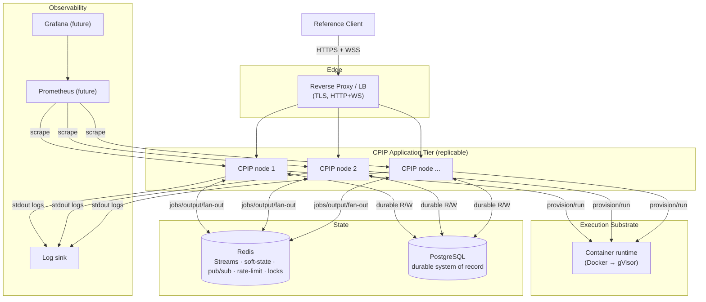
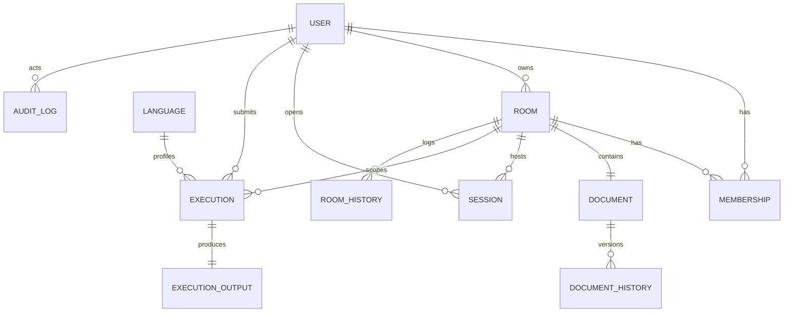

# Collaborative Programming Infrastructure Platform (CPIP)
## Infrastructure & Platform Design Specification

| Field | Value |
|---|---|
| **Document status** | Draft v1.0 — completes Stage 0 (architecture phase) |
| **Document owner** | Principal Infrastructure Architect (with SRE + Security review) |
| **Companion documents** | `PRD.md`, `ARCHITECTURE.md`, `PROTOCOL.md` |
| **This document** | Infrastructure, persistence, security, observability, deployment, operations |
| **Classification** | Final architecture blueprint — the operational SSOT before implementation |
| **Explicit non-goals** | No code, no SQL, no Dockerfiles, no K8s manifests, no CI YAML, no config files, no logging/metrics/health-check implementations |

> **Scope note.** This document specifies infrastructure *architecture and operational design* — entities and their relationships, data ownership, security boundaries, deployment topology, runbooks, and readiness criteria. It stops at the boundary of artifacts: it says *what must exist and why*, never the concrete SQL, Dockerfile, manifest, or YAML that realizes it. Those are implementation deliverables governed by this blueprint.

---

## Table of Contents
1. Infrastructure Overview
2. PostgreSQL Design
3. Redis Architecture
4. Storage Strategy
5. Configuration Management
6. Security Architecture
7. Docker Infrastructure
8. Logging Architecture
9. Metrics & Monitoring
10. Health Checks
11. Reliability Strategy
12. Scalability Strategy
13. CI/CD Strategy
14. Testing Strategy
15. Project Skeleton
16. Operational Playbooks
17. Production Readiness Checklist
18. Future Evolution
19. Architecture Decision Records (ADR)
20. Final Summary

---

# 1. Infrastructure Overview

## 1.1 Component Inventory

CPIP's production infrastructure comprises seven classes of component:

| Class | Component | Role |
|---|---|---|
| **Edge** | Reverse proxy / LB (Nginx, future) | TLS termination, HTTP+WS routing, connection-level load balancing |
| **Application** | CPIP node(s) (Go) | Gateway + collaboration + execution planes in one binary (modular monolith) |
| **Execution** | Sandbox runtime (Docker → gVisor) | Isolated, resource-capped execution of untrusted code |
| **State (durable)** | PostgreSQL | System of record: identities, documents, execution records, audit |
| **State (ephemeral/stream)** | Redis + Redis Streams | Soft state, job log, output channel, cross-node fan-out, rate limits, locks |
| **Observability** | Logs + metrics + health (Prometheus/Grafana future) | Structured logs, metrics scraping, health signaling |
| **Client** | React/TS reference client | Test harness exercising the backend |

## 1.2 Interaction Topology



## 1.3 How Components Interact (data-flow summary)
- **Client ↔ Edge:** HTTPS for request/response (auth, submit, health), WSS for realtime (collaboration, presence, streaming).
- **Edge ↔ App:** connection-level load balancing across stateless-for-correctness nodes.
- **App ↔ Redis:** the linchpin — job streams (execution), output streams (results), pub/sub (cross-node collaboration/presence fan-out), rate-limit counters, distributed locks, TTL soft-state.
- **App ↔ Postgres:** durable writes/reads off the realtime hot path (debounced checkpoints, execution records, audit).
- **App ↔ Container runtime:** workers provision single-use sandboxes and reclaim them.
- **App → Observability:** structured logs to stdout (collected downstream); metrics exposed for scraping; health for the LB.

## 1.4 Design Posture
Everything below follows five infrastructure invariants (elaborated throughout): **externalize authoritative state**, **bound every resource**, **fail closed on dependency loss**, **isolate untrusted execution by default**, and **make every component observable and replaceable**. These mirror and operationalize the architecture invariants in `ARCHITECTURE.md` Appendix A.

---

# 2. PostgreSQL Design

PostgreSQL is the **durable system of record**. It is deliberately kept **off the realtime hot path** (edits flow through memory + Redis; Postgres receives debounced checkpoints and terminal records). This section models entities architecturally — **no SQL, no tables, no columns**.

## 2.1 Entity Model

| Entity | Purpose | Key relationships | Ownership | Lifecycle |
|---|---|---|---|---|
| **User / Identity** | Principal that authenticates, owns rooms, submits executions | 1→N Rooms (as owner), 1→N Executions | Self | Long-lived; soft-deletable |
| **Room** | Unit of collaboration; owns one document | N↔N Users (membership), 1→1 Document, 1→N Executions | Owner (User) | Created → active → idle → closed |
| **Membership** | Association of a User to a Room with a role | N↔N join of User×Room | Room | Created on grant; revoked on leave/removal |
| **Document (checkpoint)** | Durable CRDT snapshot for restore/catch-up | 1→1 Room | Room | Debounced checkpoints; latest authoritative |
| **Document History** | Ordered checkpoint lineage (versioned snapshots) | N→1 Document | Room | Append-only; pruned by retention |
| **Session** | A record of a connection/participation window | N→1 User, N→1 Room | User/Room | Opened on connect; closed on disconnect |
| **Execution Record** | Immutable record of one job (status, outcome, usage) | N→1 User, N→1 Room, N→1 Language | System | Created on accept; finalized on terminal |
| **Execution Output (reference)** | Pointer/metadata to captured output | 1→1 Execution | System | Created on completion; output body in Redis/object store |
| **Language / Runtime Profile** | Supported execution profile (limits, base image ref) | 1→N Executions | Platform | Managed config; versioned |
| **Room History / Event Log** | Room-scoped lifecycle events (created/closed/membership) | N→1 Room | Room | Append-only; retention-bounded |
| **Audit Log** | Security/compliance-relevant actions | N→1 User (actor) | Platform | Append-only, immutable, long retention |
| **Configuration (dynamic)** | Runtime-tunable platform settings not in env | Platform-scoped | Platform | Read-mostly; versioned changes |

> **On "Problems":** the source prompt lists *Problems* as a possible entity. CPIP is **infrastructure, not an application** — it has no problem bank, question set, or grading. A `Problem` entity is therefore **explicitly excluded** as application-domain data (consistent with `PRD.md §2.2`). If a downstream application needs it, that application owns it, not CPIP.

## 2.2 Relationships (conceptual ERD)



## 2.3 Ownership Rules
- **User** owns its identity and its owned rooms.
- **Room** owns its document, memberships, sessions, and room history.
- **System/Platform** owns execution records, audit logs, language profiles, and dynamic configuration.
- Deleting a User **soft-deletes** and reassigns/closes owned rooms per policy (never orphan documents silently).

## 2.4 Persistence Strategy
- **Documents:** persisted as **debounced checkpoints** during activity and a final checkpoint on room close. Worst case on a missed checkpoint is a re-sync among connected clients (idempotent under CRDT merge), never a lost edit (`PROTOCOL.md §7.10`).
- **Execution records:** written on acceptance (`Queued`) and finalized on terminal state; the write-before-ack rule (`PROTOCOL.md §9.5`) guarantees a crash yields a safe re-claim, not a lost record.
- **Audit/history:** append-only, never mutated in place.
- **Hot-path rule:** no synchronous Postgres write sits on the edit-propagation path.

## 2.5 Retention & Archival
| Data | Retention (indicative) | Archival |
|---|---|---|
| Users/Rooms/Memberships | Lifetime (until deletion) | N/A |
| Document (latest checkpoint) | Lifetime of room | N/A |
| Document History | Bounded window (e.g. last N versions / M days) | Older versions archived to object store (future) |
| Sessions | Medium (e.g. 30–90 days) | Aggregated then purged |
| Execution Records | Medium–long (e.g. 90–365 days) | Cold-archive to object store (future) |
| Execution Output bodies | Short (TTL in Redis; optional object-store copy) | Object store if retained |
| Room/Event History | Bounded window | Archive or purge |
| Audit Logs | Long (e.g. 1–7 years per policy) | Immutable archive |

- Retention windows are **configurable per deployment**; the *policy shape* (append-only audit, prune history, archive cold records) is the architectural commitment.
- **Backups:** logical + physical backups of Postgres on a defined cadence with tested restore (see §16, §17). Point-in-time recovery is a target for the HA phase (§18).

---

# 3. Redis Architecture

Redis is the **operational linchpin** that makes multiple stateless nodes behave as one logical service. It serves several distinct roles; logically separating them (by keyspace, and eventually by instance) is a first-class design concern.

## 3.1 Roles of Redis

| Role | Mechanism | Purpose |
|---|---|---|
| **Job log** | Redis Streams + consumer groups | Durable, ordered, at-least-once execution pipeline with pending recovery |
| **Output channel** | Redis Streams (per-job) | Ordered, durable, TTL'd result streaming with reconnect catch-up |
| **Cross-node fan-out** | Pub/Sub | Deliver collaboration deltas & presence across nodes |
| **Presence / soft-state** | Keys with TTL (hashes/sets) | Room rosters, cursors, typing — self-expiring |
| **Temporary room state** | Keys with TTL | In-flight room coordination for evicted-but-active rooms |
| **Document snapshots (hot)** | Keys (optional) | Fast in-memory access to current CRDT state to avoid Postgres reads on rejoin |
| **Rate limiting** | Counters with TTL (token/window) | Per-principal submission/connection/edit limits |
| **Distributed locks** | Keyed lock with TTL (fenced) | Serialize rare cross-node critical sections (e.g., room materialization race) |

## 3.2 Keyspace Discipline
- **Namespaced by role and scope** (e.g., `stream:jobs`, `stream:out:<jobId>`, `presence:<roomId>`, `rl:<principal>`, `lock:<resource>`). Exact key formats are an implementation detail; the **discipline of role-prefixed, scope-suffixed namespacing is normative** so roles can later be split across instances.
- Streams for jobs vs. output are separate keyspaces so they can be sharded/scaled independently.

## 3.3 TTL Strategy
- **Presence entries:** TTL strictly greater than heartbeat timeout (`PROTOCOL.md §13`) to prevent flapping; refreshed by activity/heartbeat.
- **Output streams:** TTL of a few minutes post-terminal (reconnect catch-up window).
- **Rate-limit counters:** TTL = window length.
- **Locks:** short TTL + fencing token to survive holder death (no permanent lock leak).
- **Hot document snapshots:** TTL aligned to room idle window; Postgres remains the durable backstop.

## 3.4 Eviction Policy
- Redis is provisioned so that **durable-semantics data (job/output streams) is never evicted under memory pressure** — these are correctness-critical.
- Cache-like data (hot snapshots) **MAY** be evicted; loss triggers a Postgres reload, not corruption.
- Recommended posture: separate the **cache workload** (evictable, `allkeys-lru`-style) from the **stream/queue workload** (no eviction) — ultimately by using **distinct Redis instances/roles** (see §12.3, §18). Mixing evictable and non-evictable data in one instance with a blanket eviction policy is prohibited.

## 3.5 Memory Considerations
- Stream lengths are **capped/ trimmed** (bounded retention) so a burst of jobs/output cannot grow memory unbounded — trimming past the consumer/ack horizon and the output TTL.
- Presence/rate-limit data is naturally bounded by active users and self-expires.
- Memory headroom and `maxmemory` alarms are monitored (§9); approaching the ceiling is an alertable condition.

## 3.6 Failure Recovery
- Redis is the **phase-1 reliability ceiling** (`PROTOCOL.md §12.7`). On Redis loss: new executions rejected (fail closed), cross-node fan-out pauses, nodes report **not-ready**.
- On recovery: consumer groups resume from durable entries (un-acked jobs re-claimed); presence regenerates within one TTL cycle; rate-limit counters simply restart.
- **HA path (§18):** Redis replication + automatic failover (Sentinel/managed), then Redis Cluster for horizontal scale. The `queue`/`presence` seams hide topology so this is an infrastructure change, not a code redesign.

---

# 4. Storage Strategy

The single controlling rule: **the authoritative copy of anything correctness-critical lives outside process memory.** Process memory is always a cache or a transient buffer. (This restates and operationalizes `ARCHITECTURE.md §9`.)

## 4.1 Data-Location Matrix

| Data | Authoritative home | Cache / transient copy | Rationale |
|---|---|---|---|
| Identity/auth | PostgreSQL | request context | Durable, consistent |
| Room existence/ownership | PostgreSQL | in-memory room object | Durable identity; memory is a cache |
| Room membership (live) | Redis (soft) | in-memory set | Fast, cross-node, self-healing |
| Presence/cursors/typing | Redis (TTL) | per-node memory | Ephemeral; regenerated, not restored |
| CRDT document (live) | **Client (Yjs)** + in-flight pub/sub | relay memory, Redis hot snapshot | Clients hold live CRDT; server relays |
| CRDT document (durable) | PostgreSQL checkpoint | Redis hot snapshot | Durable restore/catch-up backstop |
| Execution job (queued/pending) | Redis Streams | worker memory | Durable, at-least-once |
| Execution output (in-flight) | Redis Stream (TTL) | worker/streamer memory | Durable catch-up channel |
| Execution output (retained) | Object store (future) / Postgres ref | — | Long-term artifact storage |
| Execution record (final) | PostgreSQL | — | Durable history/audit |
| Sandbox filesystem/process | **Container (ephemeral)** | — | Destroyed on teardown; never touches host |
| UI state (panels/theme) | **Client (Zustand)** | — | Not infrastructure data |
| Config (static) | Env / secret store | immutable in-memory | Loaded once, fail-fast |
| Config (dynamic) | PostgreSQL / config store | cached with TTL | Runtime-tunable, versioned |
| Rate-limit counters | Redis (TTL) | — | Ephemeral, self-expiring |
| Audit logs | PostgreSQL (append-only) | — | Immutable, long retention |

## 4.2 Temporary vs. Persistent Boundary
- **Temporary (Redis/container/memory):** presence, in-flight jobs/output, hot snapshots, rate-limit counters, sandbox filesystem. All bounded and self-reclaiming.
- **Persistent (Postgres/object store):** identities, rooms, document checkpoints, execution records, audit. All durable and backed up.

## 4.3 Ownership Consequences
- Any node can be killed without losing correctness-critical data.
- Rooms/connections are caches → cheap eviction, cheap rehydration.
- The **client** is a legitimate authority for *live* CRDT state; the server is relay + durable backstop.
- The **container** owns only ephemeral state that must never persist — the isolation guarantee.

---

# 5. Configuration Management

## 5.1 Configuration Taxonomy

| Type | Source | Mutability | Example concerns (not values) |
|---|---|---|---|
| **Static app config** | Environment variables | Immutable at runtime (load-once) | pool sizes, worker count, timeouts, limits, endpoints |
| **Secrets** | Secret store / injected env | Immutable at runtime; rotated externally | DB/Redis credentials, TLS material, signing keys |
| **Dynamic runtime config** | Postgres/config store (cached) | Changeable without redeploy | feature flags, rate-limit tunings, language profiles |
| **Feature flags** | Config store / capability advert | Changeable at runtime | gate optional protocol features (`PROTOCOL.md §16.4`) |
| **Build/deploy config** | CI/CD environment | Per-pipeline | image tags, target environment |

## 5.2 Environment Separation
- **Development:** local Docker Compose; relaxed limits; verbose logging; ephemeral data.
- **Testing/CI:** disposable Postgres/Redis; deterministic seeds; strict timeouts to surface flakiness.
- **Production:** hardened limits; secrets from a secret store; minimal logging verbosity; alerts wired.
- The **same binary** runs in all environments; only configuration differs (12-factor).

## 5.3 Secrets Handling (MUST)
- Secrets are **never** hard-coded, committed, logged, or placed inside sandboxes.
- Secrets are injected via environment/secret manager and read once at startup.
- Rotation is an external operation; the app re-reads on restart (or via a controlled reload for rotatable secrets in the future).

## 5.4 Validation & Loading (MUST)
- Configuration is **loaded once and validated at startup**; invalid/missing required config **aborts boot with a clear diagnostic** (fail-fast — no silent defaults that would weaken isolation or limits).
- Config is exposed as a **typed, immutable** object to the rest of the system (no ambient mutable globals).
- Dynamic config changes are **validated before apply** and versioned so a bad change is auditable and revertable.

---

# 6. Security Architecture

Untrusted code is assumed hostile; untrusted input is assumed malicious. Defense is layered (`PROTOCOL.md §18`, `ARCHITECTURE.md §12`); this section is the consolidated infrastructure view.

## 6.1 Defense-in-Depth Layers

```
Edge:       TLS · reverse proxy · CORS · rate limiting · input size caps
   ↓
Identity:   Authentication at every entry (HTTP + WS upgrade)
   ↓
AuthZ:      Room membership & execution permission checks
   ↓
Pipeline:   Bounded concurrency · per-job resource ceilings · idempotency
   ↓
Sandbox:    namespaces · cgroups · seccomp · no-net · ephemeral fs · non-root
   ↓
Host:       cgroup ceilings protect host · orphan reaper · secret scrubbing
```
No layer is trusted alone; a breach of one is contained by the next.

## 6.2 Authentication Boundaries
- Authentication occurs at **the edge of every entry path** — HTTP middleware and the WS upgrade/handshake. No component beyond the edge accepts an unauthenticated principal; identity flows inward via context.
- Credentials are time-bounded; the server never trusts client timestamps for security (`PROTOCOL.md §18.1`).

## 6.3 Authorization & Room Permissions
- Authorization is enforced at the **room boundary** (owner/member/role) and the **execution boundary** (who may submit). Enforcement is **server-side only**; the client is never trusted to self-restrict.
- Room roles (owner vs. participant) gate administrative actions; fine-grained RBAC is future scope (§6.14).

## 6.4 Execution Permissions
- Only authorized principals may submit executions; submissions are rate-limited and size-capped.
- Execution runs under the platform's identity, never the user's — untrusted code receives **no** host credentials or ambient authority.

## 6.5 Container Permissions
- Containers run **non-root**, with **dropped capabilities**, **no privilege escalation**, a **restrictive seccomp profile**, **no network**, and an **ephemeral read-mostly filesystem** (§7). These are creation-time, non-negotiable settings.

## 6.6 Secrets Management
- Per §5.3: injected, never logged, scrubbed from the sandbox environment. An escaped process finds nothing sensitive in-sandbox.

## 6.7 Environment Isolation
- Dev/test/prod are isolated (separate credentials, data stores, networks). Test data never touches production stores; production secrets never reach dev.

## 6.8 Input Validation
- Every inbound message/request is validated for envelope well-formedness, known type, required fields, and **size bounds** before processing (`PROTOCOL.md §18.3`). Scope fields (e.g., room) are validated against the connection's authorized bindings (anti-spoofing).
- Opaque CRDT/output blobs are **never re-interpreted as protocol control** — output is data, never messages.

## 6.9 Rate Limiting
- Per-principal/connection limits on: connection establishment, execution submissions, and edit ingress. Excess is shed with a retryable error carrying `retryAfter`. Rate limiting is the front-door complement to per-job resource ceilings at the back.

## 6.10 CORS
- The HTTP surface enforces a **strict allow-list** of origins for browser clients; wildcard origins are prohibited in production. Preflight is handled at the edge/middleware.

## 6.11 CSRF Considerations
- The primary auth model uses **bearer credentials in headers** (not ambient cookies), which structurally avoids classic CSRF. If cookie-based sessions are ever introduced, **anti-CSRF tokens + SameSite cookies become mandatory**. WebSocket upgrades validate `Origin` to prevent cross-site socket hijacking.

## 6.12 Replay Protection
- Time-bounded credentials + **idempotency keys** on submissions (a replay yields the *same* job, not a new one). Collaboration/presence replays are harmless by construction (CRDT idempotency, latest-wins presence).

## 6.13 Future: JWT & OAuth
- **JWT:** move to signed, short-lived access tokens with rotation and revocation lists; validated at the edge. Enables stateless auth across a larger fleet.
- **OAuth 2.0 / OIDC:** delegate identity to external providers for downstream products; CPIP consumes verified identity claims. Both are additive behind the existing auth boundary.

## 6.14 Future: RBAC & API Keys
- **RBAC:** richer role/permission model (org/team/room scopes) layered on the existing owner/member boundary.
- **API Keys:** for programmatic/service-to-service access (downstream products embedding CPIP), with per-key scoping, rate limits, and rotation.
- All are additive; the phase-1 boundary is intentionally simple and consistently enforced so richer models slot in without redesign.

## 6.15 Security Logging & Audit
- Security-relevant events (auth failures, authorization denials, rate-limit trips, dead-lettered jobs, anomalous resource usage) are logged to the **append-only audit trail** (§8.1) with actor, action, and correlation ID.

---

# 7. Docker Infrastructure

Docker (phase 1) provides isolation and resource limits for untrusted execution. The runtime is a **replaceable seam** (Docker → gVisor).

## 7.1 Container Lifecycle
Per-job, single-use: **Provision → Initialize → Execute → Monitor → Terminate → Cleanup**, with a **reaper** backstop for orphans (full state machine in `PROTOCOL.md §2.5, §10`). A container **MUST NOT** be reused across jobs.

## 7.2 Images
- **Minimal, pinned base images** per language/runtime profile, built from trusted sources, scanned for vulnerabilities, and version-pinned (no `latest`).
- Images are **immutable and content-addressed**; a language profile references a specific image digest.
- Images contain only the runtime needed to compile/execute — no shells/tools beyond necessity (reduced attack surface).

## 7.3 Volumes
- **No host bind-mounts of sensitive paths.** Each job gets an **ephemeral, size-bounded writable scratch layer** destroyed on teardown.
- The base image layer is **read-only**. Nothing a job writes survives teardown or touches the host.

## 7.4 Networks
- Sandboxes run with **networking disabled** (isolated network namespace, no route). This blocks exfiltration and outbound attacks by default. Any future network need is an explicit, allow-listed, tightly-scoped exception — never a default (§18 gVisor/Firecracker strengthen this further).

## 7.5 Resource Limits (creation-time, MUST)
CPU time, wall-clock timeout, hard memory ceiling, PID/process cap, output-volume cap, scratch-size cap — all applied at creation via cgroups, never after start. Breach → deterministic kill with a **precise** terminal status (`TimedOut`/`Killed`, not generic failure).

## 7.6 Cleanup
Guaranteed teardown on **every** exit path (normal, timeout, kill, cancel, crash). The reaper sweeps orphaned containers by label/age when an owning worker dies. Repeated runs **MUST NOT** leak containers, volumes, or images over time.

## 7.7 Image Strategy
- Images are built in CI (§13), scanned, signed/digest-pinned, and published to a registry. Language-profile updates are deliberate, reviewed changes (new digest), not silent pulls.

## 7.8 Build Strategy
- Base images are rebuilt on a cadence (security patches) and on dependency changes; rebuilds are reproducible and scanned before promotion.

## 7.9 Container Naming
- Containers are labeled with job/worker identifiers and a platform tag so the reaper and observability can attribute and sweep them. Naming is a metadata convention, not user-controlled.

## 7.10 Isolation & Execution Environment
- Non-root user, dropped capabilities, seccomp profile, no-new-privileges, no network, ephemeral fs, secret-scrubbed environment. The sandbox sees only the code snapshot and the minimal runtime.

## 7.11 Future gVisor Migration
- gVisor introduces a **user-space kernel** intercepting syscalls, drastically shrinking the host-kernel attack surface — the strongest practical isolation short of a VM. Because the sandbox runtime is a **runtime-agnostic seam**, Docker→gVisor changes the runtime implementation only, not workers/pipeline/protocol. Trade-off: syscall-compat limits + performance overhead, accepted for the security gain (§19 ADR).

---

# 8. Logging Architecture

## 8.1 Log Categories

| Category | Content | Level(s) | Destination |
|---|---|---|---|
| **Request logs** | HTTP/WS request metadata, latency, status | info/warn | stdout → collector |
| **Execution logs** | Job lifecycle (accept→terminal), status, usage | info/error | stdout → collector |
| **Worker logs** | Claim/execute/ack, retries, drains | info/warn/error | stdout → collector |
| **Sandbox logs** | Provision/teardown, limit breaches (metadata, **not** untrusted stdout) | info/warn/error | stdout → collector |
| **Security logs** | Auth failures, authz denials, rate-limit trips | warn/error | audit sink |
| **Audit logs** | Actor/action for compliance-relevant events | info | **append-only, immutable** store |
| **Error logs** | Handled + unexpected errors, panics (contained) | error/fatal | stdout → collector |
| **Lifecycle logs** | Startup, shutdown, drain, dependency health transitions | info | stdout → collector |

## 8.2 Structure & Correlation (MUST)
- All logs are **structured** (machine-parseable), leveled, and carry a **correlation ID** and, where applicable, `roomId`/`jobId`/`userId` so a single session or job is traceable end-to-end across subsystems.
- **Trace IDs** propagate across module boundaries (groundwork for distributed tracing when tiers split, §18 OpenTelemetry).
- Logging **MUST NOT** block the request path (async/buffered emission); emission failure degrades quietly.

## 8.3 Sensitive-Data Rules (MUST)
- **Never log:** secrets, credentials, raw untrusted code output as host-level logs, or PII beyond what policy permits.
- Client-facing errors are non-sensitive; internal detail lives only in server logs keyed by correlation ID.

## 8.4 Log Levels
- `debug` (dev/diagnostic), `info` (normal lifecycle), `warn` (recoverable anomaly), `error` (handled failure), `fatal` (precedes controlled shutdown of the affected unit). Production defaults to `info`; `debug` is opt-in and time-bounded.

## 8.5 Retention & Aggregation
- Operational logs: short–medium retention (e.g., 7–30 days) at the collector.
- Audit logs: long retention per policy (§2.5).
- **Future aggregation:** ship stdout to a centralized stack (e.g., Loki/ELK/OpenSearch) with indexing and correlation-ID search. Phase 1 relies on structured stdout + basic collection; the structure is designed so aggregation is a drop-in, not a rewrite.

---

# 9. Metrics & Monitoring

## 9.1 Metric Domains

| Domain | Representative signals |
|---|---|
| **Application** | request rate, error rate, handler latency, active goroutines |
| **WebSocket / Connection** | active connections, connect/disconnect rate, heartbeat failures, send-buffer drops (slow-consumer) |
| **Collaboration** | active rooms, presence cardinality, edit fan-out rate, checkpoint rate/lag |
| **Execution** | submissions/sec, jobs by terminal state, execution latency (P50/95/99), first-output latency |
| **Queue** | job stream depth, pending-entry count, consumer lag, dead-letter rate |
| **Worker** | pool utilization, jobs in flight, claim rate, re-claim (crash) rate, drain events |
| **Sandbox** | provision time, teardown time, orphan-reap count, limit-breach counts by type |
| **Redis** | latency, memory usage vs. maxmemory, stream length, evictions, connection saturation |
| **Database** | pool saturation, query latency, connection errors, checkpoint write latency |
| **Node/Infra** | CPU, memory, FD/socket count, GC pauses, readiness/drain state |

## 9.2 SLIs (Service Level Indicators)
- **Collaboration liveness:** P95 edit-propagation latency (server-side fan-out).
- **Presence freshness:** P95 presence-update propagation.
- **Execution acceptance:** P95 submit→accept latency.
- **Execution success:** ratio of jobs reaching a *non-system-fault* terminal state (system faults excluded from "user's fault").
- **Availability:** fraction of time nodes are ready and dependencies healthy.

## 9.3 SLOs (indicative targets — tune per deployment)
- Edit propagation P95 ≤ 100 ms.
- Presence propagation P95 ≤ 150 ms.
- Submit→accept P95 ≤ 50 ms.
- Execution pipeline availability ≥ 99.9% (excluding declared maintenance), gated by the Redis reliability ceiling in phase 1.
- Dead-letter rate < a small threshold (e.g., < 0.1% of jobs) — a rising rate is an early failure signal.

## 9.4 KPIs (platform health, non-SLO)
- Concurrent rooms / participants supported on the baseline host.
- Executions per minute at target latency.
- Cost/utilization efficiency (jobs per node, worker idle ratio).

## 9.5 Future Prometheus & Grafana
- **Prometheus** scrapes node metrics endpoints; recording rules compute SLIs; alerting rules fire on SLO burn and saturation.
- **Grafana** dashboards: a **collaboration** board (connections/rooms/fan-out), an **execution** board (queue/workers/latency/outcomes), and a **platform** board (Redis/Postgres/host). Phase 1 exposes the metrics; the stack is wired in the observability-maturity phase (§18).

## 9.6 Alerting Philosophy
- Alert on **symptoms that predict user impact** (SLO burn, rising queue depth/dead-letters, send-buffer drop spikes, dependency unhealthy, memory near ceiling, readiness flapping) — not on every raw metric. Every alert maps to a playbook (§16).

---

# 10. Health Checks

## 10.1 Probe Types

| Probe | Question it answers | Consumer | Failure action |
|---|---|---|---|
| **Startup** | Has the process finished initializing (config, pools, group registration)? | orchestrator/LB | Delay traffic until complete |
| **Liveness** | Is the process running / not deadlocked? | orchestrator | Restart node |
| **Readiness** | Are dependencies healthy **and** is the node not draining? | LB | Remove from rotation (no restart) |

## 10.2 Dependency Health Composed into Readiness
Readiness aggregates:
- **Database:** connection pool reachable within timeout.
- **Redis:** reachable and responsive within timeout (critical — its loss makes the node not-ready, `PROTOCOL.md §12.7`).
- **Worker pool:** at least the minimum workers registered with the consumer group.
- **Sandbox runtime:** container runtime reachable (a worker cannot execute without it).
- **Queue:** stream reachable; pending backlog within sane bounds.
- **Drain state:** a draining node reports **not-ready** even while healthy, so the LB drains it gracefully.

## 10.3 Design Rules (MUST)
- Health checks are **cheap and non-mutating**; they must not themselves cause load or side effects.
- Readiness reflects **real dependency state**, not a static "up" — a node that lost Redis but is still "alive" **MUST** report not-ready.
- Liveness and readiness are **distinct**: readiness failure drains; liveness failure restarts. Conflating them causes restart storms during dependency blips.

---

# 11. Reliability Strategy

## 11.1 Graceful Shutdown / Draining
On signal: report **not-ready** (LB drains) → stop accepting new connections and job claims → notify clients via `SERVER_DRAINING` → finish or safely release in-flight work within the drain deadline → flush pending persistence → close connections cleanly → exit. **No acknowledged job is lost.** (`PROTOCOL.md §9.8, §12`.)

## 11.2 Crash Recovery
- On restart, a node re-registers with the consumer group and rehydrates rooms **on demand** from durable state. It holds no unique in-memory state whose loss breaks correctness.
- In-flight jobs from a crashed node remain **pending** in Redis and are re-claimed (at-least-once + idempotency).

## 11.3 Database Reconnect
- pgx pool with health-checked connections, bounded acquire timeouts, and **automatic reconnect** with backoff.
- On sustained DB loss: **collaboration degrades to in-memory relay** (edits still flow/converge among connected clients) with loud alerting; **execution acceptance fails closed**. No silent edit loss.

## 11.4 Redis Reconnect
- Client with backoff reconnection; on sustained loss the node reports **not-ready** and fails execution closed. On recovery, streams resume from durable entries; presence regenerates by TTL.

## 11.5 Worker Restart
- Workers are stateless between jobs; a restarted worker resumes claiming and **MAY** pick up its own previously-pending entries after the visibility timeout.

## 11.6 Container Cleanup
- Guaranteed per-job teardown + reaper for orphans (§7.6). No container outlives its job.

## 11.7 Retry Strategy
- Governed by `PROTOCOL.md §14`: retry only idempotent operations; exponential backoff **with jitter** for transient infra failures; every retry loop has a ceiling and a terminal action (fail closed / dead-letter). Never retry client-caused rejections (validation/auth).

## 11.8 Circuit Breakers
- Around external dependencies (Redis, Postgres, container runtime): after a threshold of failures, **open** the breaker to fail fast (protecting threads/goroutines and surfacing not-ready) rather than piling up blocked operations; **half-open** probes test recovery before closing. This prevents cascading stalls when a dependency degrades.

## 11.9 Backpressure
- Bounded everywhere (`PROTOCOL.md §2.10, §11.7`): per-connection send buffers (slow-consumer isolation), room fan-out bounds, job-stream burst absorption, worker-pool concurrency cap, output-stream credit/ack flow control. No unbounded queue or buffer exists.

## 11.10 Dead-Letter Handling
- A job exceeding the retry ceiling moves to a **dead-letter stream** with failure context, removed from the live pipeline, surfaced via metrics/alerts, and inspectable by ops. A poison job can never loop forever or block the consumer group.

## 11.11 Recovery After Restart (system-wide)
- After a full stack restart: nodes rehydrate rooms from Postgres checkpoints; Redis streams resume (un-acked jobs re-claimed); connected clients re-sync (idempotent); presence regenerates. The system converges to a correct state without manual intervention for the common case; DLQ contents are triaged separately.

---

# 12. Scalability Strategy

## 12.1 Horizontal Scaling
Nodes are **stateless for correctness** (state externalized). Scale out = add nodes behind the LB. Any node serves any HTTP request, any WebSocket connection, and any node's workers can claim any job.

## 12.2 Sticky Sessions (connection affinity, not session affinity)
- The LB keeps a **live socket** on one node for its lifetime (connection affinity), which is natural for WebSockets.
- CPIP does **not require session affinity**: because state is externalized and reconnects can land on any node and resync, a client reconnecting elsewhere resumes seamlessly. This deliberately avoids the sticky-session scaling trap (`ARCHITECTURE.md §10.2`).

## 12.3 Redis Scaling
- Phase 1: single instance. Path: **role separation** (cache vs. streams vs. pub/sub on distinct instances) → **replication + failover** for HA → **Redis Cluster / sharding** (by room or job stream) when a single instance saturates. Hidden behind the `queue`/`presence` seams.

## 12.4 Worker Scaling
- Workers are consumer-group members; **adding workers adds throughput with zero coordination code** (the group distributes claims). Phase 1: co-located in nodes. Future: a **dedicated worker tier** scaled independently by queue depth (§18) — the first clean service extraction (`ARCHITECTURE.md §10.4`).

## 12.5 Connection Scaling
- Gateway capacity scales by adding nodes; per-node connection limits + bounded buffers cap blast radius. Large-room fan-out is bounded and, if needed, sharded (future).

## 12.6 Database Scaling
- Postgres is off the hot path (debounced writes). Path: connection pooling → **read replicas** for history/analytics reads → **partitioning** of execution records/history by time → separate durable stores per domain if warranted → **HA Postgres** (§18).

## 12.7 Read Replicas
- Read-heavy, non-critical-freshness queries (history, audit browsing, dashboards) are routed to replicas; the primary handles writes and freshness-critical reads. Replication lag is monitored and bounded.

## 12.8 Future: Kubernetes, Autoscaling, Distributed Workers
- **Kubernetes:** gateway and worker tiers as independent Deployments; the stateless-for-correctness design maps cleanly.
- **Autoscaling:** HPA on queue-depth (workers) and connection-count (gateways) — metrics already defined (§9).
- **Distributed workers:** a separate execution fleet pulling from the same Redis consumer group, needing only Redis + sandbox-runtime access. All enabled with **no architectural change** (§18).

---

# 13. CI/CD Strategy

*(Design of the pipeline stages; no YAML.)*

## 13.1 Branch Strategy
- **Trunk-based with short-lived feature branches**, protected `main`. Every change lands via reviewed PR; `main` is always releasable. Optional release branches for stabilization when needed.

## 13.2 Build Pipeline (stages, in order)
1. **Format check** — enforce canonical formatting (fail on drift).
2. **Lint / vet** — static lint + Go vet.
3. **Static analysis / security scan** — vulnerability scanning of deps and images; SAST where applicable.
4. **Unit tests** — with the **race detector enabled** on concurrency-critical packages (mandatory gate).
5. **Integration tests** — against ephemeral Postgres/Redis and a real container runtime for sandbox tests.
6. **Build artifacts** — compile static binary; build + scan container images.
7. **Publish** — push digest-pinned images to the registry on protected-branch success.

## 13.3 Quality Gates (MUST pass to promote)
- All tests green (incl. race detector), lint/format clean, no high/critical vulns, coverage thresholds met on critical packages.

## 13.4 Deployment Pipeline
- Promote the **same artifact** through environments (dev → staging → prod); environments differ only by config (§5.2).
- Deployments are **rolling with graceful drain** (§11.1): drain a node (not-ready → finish in-flight → replace) so no acknowledged work is lost.
- Migrations run as a **controlled, backward-compatible** step before app rollout (expand/contract pattern) so old and new versions coexist during rollout.

## 13.5 Versioning
- **Semantic versioning** for the platform; the **wire protocol carries its own version** with additive evolution (`PROTOCOL.md §16`). Image tags are digest-pinned; releases are tagged and changelogged.

## 13.6 Release & Rollback Strategy
- **Release:** progressive rollout (canary/rolling) with health + SLO checks between steps; automatic halt on SLO burn.
- **Rollback:** redeploy the previous digest-pinned artifact; because migrations are backward-compatible (expand/contract), rolling back the app does not require rolling back the schema. Rollback is a first-class, tested procedure (§16, §17).

---

# 14. Testing Strategy

Testing pyramid from fast/isolated to slow/holistic. Each level states **what it verifies**.

| Level | Verifies | Notes |
|---|---|---|
| **Unit tests** | Pure logic, state machines, edge cases | Fast, no external deps; run under race detector for concurrency code |
| **Repository tests** | Storage behavior against a real Postgres | Ephemeral DB; verifies persistence/consistency, not the driver |
| **Database tests** | Migration correctness, constraints, transactions | Expand/contract migrations verified for backward compat |
| **Redis tests** | Stream semantics, consumer-group claim/ack/pending, TTL, rate-limit | Against a real Redis; verifies at-least-once + recovery |
| **WebSocket tests** | Connection lifecycle, auth handshake, heartbeat, backpressure, slow-consumer isolation | Drives the protocol (`PROTOCOL.md`) |
| **Worker tests** | Claim→execute→stream→persist→ack, crash re-claim, idempotency, drain | Verifies delivery semantics |
| **Sandbox tests** | Isolation + limit enforcement (CPU/mem/PID/time/net/fs), teardown, orphan reaping | **Adversarial:** fork bomb, memory hog, infinite loop, network attempt, output flood |
| **Integration tests** | Cross-subsystem flows (join→edit→converge; submit→execute→stream) | Against real Postgres/Redis/runtime |
| **End-to-end tests** | Full client↔platform scenarios | Reference client drives realistic sessions |
| **Load tests** | Behavior at target concurrency (rooms, connections, jobs) | Establishes baseline capacity numbers |
| **Stress tests** | Behavior beyond capacity | Verifies graceful degradation, not collapse |
| **Chaos tests** | Fault injection: kill workers/nodes, drop Redis/DB, slow dependencies | Verifies reliability strategy (§11) holds in practice |

## 14.1 Testing Principles
- **Concurrency-critical paths** (CRDT relay convergence, worker pool, backpressure, delivery semantics, graceful shutdown) have **deterministic, repeatable** tests; the **race detector is a CI gate**.
- **Security-critical isolation** is tested **adversarially** — the sandbox tests assume hostile code and prove containment.
- **Failure modes are tested explicitly** (slow client, worker crash, dependency loss), not assumed.
- Tests use **ephemeral real dependencies** (not mocks) for storage/queue/sandbox, since the behavior under test *is* the integration behavior.

---

# 15. Project Skeleton

Repository structure with directory responsibilities (structure only — no code, no file contents). This extends `ARCHITECTURE.md §8` with the full operational tree.

```
cpip/
├── docs/            # PRD, ARCHITECTURE, PROTOCOL, this doc, ADRs — the SSOT set
├── cmd/             # Entry points (composition roots); wires config→components→server
├── internal/        # Private application code (encapsulated by Go's internal rule)
│   ├── api/            # HTTP surface (chi routers/handlers): auth, submit, health, metrics
│   ├── gateway/        # WebSocket connection ownership, multiplexing, routing
│   ├── websocket/      # Low-level conn lifecycle: read/write loops, heartbeat, backpressure
│   ├── rooms/          # Room lifecycle, membership, authorization, rehydration
│   ├── presence/       # Awareness soft-state, cursors, TTL, cross-node propagation
│   ├── collaboration/  # CRDT relay: fan-out, catch-up, checkpoint orchestration
│   ├── execution/      # Execution API/producer: validate, record, append job
│   ├── sandbox/        # Runtime-agnostic isolation contract; Docker impl (gVisor later)
│   ├── workers/        # Bounded worker pool: claim→execute→stream→persist→ack
│   ├── queue/          # Redis Streams abstraction: append, consumer groups, pending, DLQ
│   ├── storage/        # pgx repositories; pooling; transactions
│   ├── config/         # Load + validate env config; typed immutable config; fail-fast
│   ├── logger/         # Structured logging; correlation-ID propagation
│   ├── metrics/        # Metric registry + collectors
│   ├── health/         # Liveness/readiness/startup; dependency + drain state
│   └── middleware/     # Cross-cutting: auth, recovery, rate limit, request logging, CORS
├── pkg/             # Reusable, dependency-free, side-effect-free helpers (importable)
├── scripts/         # Operational/dev scripts (build, migrate runner, load-test harness)
├── docker/          # Dockerfiles + sandbox base images + compose files (artifacts, later)
├── deploy/          # Deployment descriptors (compose/K8s/proxy config) per environment
├── configs/         # Non-secret config templates per environment
├── migrations/      # Ordered, backward-compatible schema migrations (expand/contract)
├── test/            # Integration/e2e/load/chaos harnesses and fixtures
├── examples/        # Reference client + usage examples exercising the backend
└── .github/         # CI/CD workflows, PR templates, issue templates (artifacts, later)
```

**Directory rationale (selected):**
- **`internal/` by capability** (not by layer) with the Go internal barrier prevents accidental external coupling and keeps modules cohesive (`ARCHITECTURE.md §2.3`).
- **`migrations/`** is separate and ordered so schema evolution is auditable and backward-compatible (enables §13.4 rollout/§13.6 rollback).
- **`deploy/` vs. `docker/` vs. `configs/`** separate *how to deploy* from *how to build images* from *what to configure* — three distinct operational concerns.
- **`test/`** holds cross-cutting harnesses (integration/e2e/load/chaos) that don't belong to any single package's unit tests.
- **`docs/`** is the home of this four-document SSOT set plus ADRs — treated as a first-class deliverable.

---

# 16. Operational Playbooks

Concise runbooks: **Detection → Immediate action → Recovery → Follow-up.** (Procedures, not scripts.)

## 16.1 Deployment
- **Action:** roll out the new digest-pinned artifact node-by-node with graceful drain; run backward-compatible migration first; verify health + SLOs between steps.
- **Abort criteria:** SLO burn or readiness flapping → halt and roll back.

## 16.2 Rollback
- **Action:** redeploy previous artifact digest; schema stays (expand/contract makes it compatible). Verify SLOs recover.
- **Follow-up:** capture the failure signal that triggered rollback; postmortem.

## 16.3 Worker Crash
- **Detection:** re-claim (crash) rate metric / pending backlog.
- **Action:** none required for correctness (auto re-claim + reaper). If persistent, inspect logs for a poison job → check DLQ.
- **Recovery:** automatic; scale workers if backlog grows.

## 16.4 Redis Failure
- **Detection:** readiness turns not-ready; Redis latency/error alerts.
- **Action:** confirm failover (if HA) or restore instance; nodes fail execution closed and pause fan-out meanwhile.
- **Recovery:** streams resume from durable entries; presence regenerates; verify no jobs stuck in pending beyond visibility timeout.
- **Follow-up:** if phase-1 single-instance caused an outage, prioritize HA (§18).

## 16.5 Database Outage
- **Detection:** DB error alerts; readiness degraded.
- **Action:** collaboration degrades to in-memory relay (edits continue among connected clients) — communicate degraded persistence; execution acceptance fails closed.
- **Recovery:** on DB restore, checkpointing resumes; clients re-sync backfills; verify execution records reconciled.

## 16.6 Container Failure
- **Detection:** provision-failure / limit-breach metrics; orphan-reap count.
- **Action:** bounded retries handle transients; repeated provision failures → check runtime/image health; jobs dead-letter at ceiling.
- **Recovery:** fix runtime/image; triage DLQ.

## 16.7 High Memory Usage
- **Detection:** node/Redis memory near ceiling.
- **Action (node):** check for buffer growth (should be bounded — investigate a leak/regression); shed load via rate limits; scale out.
- **Action (Redis):** verify stream trimming + TTLs working; ensure non-evictable streams aren't threatened by cache growth (role separation §3.4).

## 16.8 High CPU Usage
- **Detection:** node CPU saturation; execution latency rising.
- **Action:** confirm worker concurrency cap is respected (execution is the usual CPU source); scale worker capacity or nodes; verify no runaway goroutine.

## 16.9 Connection Spikes
- **Detection:** connect-rate / active-connection surge.
- **Action:** connection rate limits + per-node caps absorb the spike; scale gateway nodes; verify send-buffer drop rate (slow-consumer isolation) stays sane.

## 16.10 Emergency Shutdown
- **Action:** drain nodes (graceful) if time allows; for a hard stop, rely on externalized state — in-flight jobs remain pending in Redis, document state is checkpointed, clients reconnect on recovery. Never `kill -9` a node as first resort if a drain is possible.

## 16.11 Recovery Procedure (post-incident)
- **Action:** bring up dependencies (Postgres, Redis) → verify health → start nodes (they rehydrate on demand) → confirm streams resume and pending jobs re-claim → triage DLQ → validate SLOs → write postmortem with corrective actions.

---

# 17. Production Readiness Checklist

A gate that **MUST** be satisfied before declaring CPIP production-ready. (Checklist, not a status claim.)

**Architecture & Design**
- [ ] Architecture blueprint complete and reviewed (`ARCHITECTURE.md`)
- [ ] Protocol & runtime spec complete and reviewed (`PROTOCOL.md`)
- [ ] Infrastructure blueprint complete and reviewed (this document)
- [ ] All ADRs recorded with trade-offs (§19)

**Persistence & State**
- [ ] Entity model & ownership finalized; migrations backward-compatible (expand/contract)
- [ ] Redis roles separated; TTL/eviction/trimming policies defined
- [ ] Data-location matrix agreed; no correlation-critical state memory-only

**Security**
- [ ] Auth boundaries enforced at every entry; authz at room/execution boundaries
- [ ] Sandbox isolation verified adversarially (fork bomb, mem hog, loop, net, output flood)
- [ ] Secrets injected, never logged, scrubbed from sandboxes
- [ ] Rate limiting, input validation, CORS, replay protection in place
- [ ] Security review signed off; audit logging wired

**Reliability**
- [ ] Graceful shutdown/drain tested (no acknowledged-work loss)
- [ ] Crash recovery + at-least-once + idempotency tested
- [ ] Circuit breakers, backpressure, DLQ implemented and tested
- [ ] DB/Redis reconnect + degrade behaviors verified

**Observability**
- [ ] Structured logging with correlation IDs across subsystems
- [ ] Core metrics exposed; SLIs/SLOs defined; alerts map to playbooks
- [ ] Health checks (startup/liveness/readiness) reflect real dependency state

**Deployment & Ops**
- [ ] Reproducible deployment; rolling deploy with drain tested
- [ ] Rollback tested (app rollback without schema rollback)
- [ ] CI/CD pipeline green with race detector + security scans as gates
- [ ] Backup strategy defined; **restore tested** (not just backups taken)
- [ ] Operational playbooks (§16) written and rehearsed

**Testing**
- [ ] Unit/integration/repository/WS/worker/sandbox tests passing
- [ ] Load + stress + chaos tests establish capacity and prove graceful degradation

**Documentation**
- [ ] SSOT docs complete; runbooks discoverable; on-call briefed

---

# 18. Future Evolution

| Area | Evolution | Enabled by (existing seam) |
|---|---|---|
| **Isolation** | Docker → **gVisor** (user-space kernel) → **Firecracker** (microVM) | runtime-agnostic `sandbox` seam |
| **Warm pools** | Pre-provisioned un-started sandboxes to cut startup latency | single-use-per-job preserved |
| **Orchestration** | **Kubernetes** for gateway + worker Deployments, self-healing, rolling | stateless-for-correctness nodes |
| **Autoscaling** | HPA on queue depth (workers) & connections (gateways) | metrics already defined (§9) |
| **Distributed execution clusters** | Dedicated worker fleet on the shared consumer group | workers depend only on Redis + sandbox |
| **Multi-region** | Region-local tiers, geo-replicated state, region-aware routing | externalized state; CRDT convergence |
| **Object storage** | Long-term execution output & document-history archival | output/history reference model (§2, §4) |
| **HA PostgreSQL** | Replication, automatic failover, PITR | Postgres off hot path; repository seam |
| **Redis Cluster** | Sharding streams/soft-state; replication + Sentinel/managed | `queue`/`presence` seams hide topology |
| **OpenTelemetry** | Distributed tracing across split tiers | correlation-ID propagation groundwork |
| **Plugin / Language SDK** | Pluggable execution runtimes behind the sandbox contract | stable runtime contract |
| **Advanced collab** | Collaborative debugging; session recording & replay (event-sourcing) | durable streams as event log |

**Evolution principle:** every step is a **swap or split behind an existing seam**, never a rewrite. Stage 0 is deliberately the smallest system that already has the right seams (`ARCHITECTURE.md §17.10`).

---

# 19. Architecture Decision Records (ADR)

Each: **Decision · Reason · Alternatives · Trade-offs · Consequences.** (Infrastructure-focused; complements the architecture/protocol ADRs in the companion docs.)

### ADR-I-001 — PostgreSQL as system of record
- **Decision:** PostgreSQL (via pgx) for durable state.
- **Reason:** Strong consistency, relational integrity, durability, mature ops, high-performance driver.
- **Alternatives:** MongoDB (weaker default consistency; relational integrity valued here); pure-Redis durability (insufficient); NewSQL (overkill).
- **Trade-offs:** Not ideal for CRDT blobs; single instance is an availability dependency in phase 1.
- **Consequences:** Kept off the hot path (debounced writes); HA is a defined future step.

### ADR-I-002 — Redis for ephemeral state, streams, and fan-out
- **Decision:** Redis (+ Streams + pub/sub + TTL keys) as the operational linchpin.
- **Reason:** One dependency delivers durable at-least-once streaming, fast soft-state, cross-node messaging, rate limits, and locks.
- **Alternatives:** Separate systems per role (broker + cache + pubsub) — more operational surface.
- **Trade-offs:** Single instance is the phase-1 reliability ceiling; role mixing needs discipline.
- **Consequences:** Role separation now (keyspace) → distinct instances → cluster later; nodes become horizontally scalable.

### ADR-I-003 — Redis Streams for the job pipeline
- **Decision:** Redis Streams + consumer groups for jobs and output.
- **Reason:** At-least-once, ordering, pending recovery, dead-lettering — exactly the pipeline primitives, low ops cost.
- **Alternatives:** Kafka (heavy ops), RabbitMQ (extra dependency, no soft-state reuse), Postgres-as-queue (contention/polling).
- **Trade-offs:** Less durable/partition-tolerant than Kafka.
- **Consequences:** Simple, powerful phase-1 pipeline; broker swap possible behind the `queue` seam.

### ADR-I-004 — Docker sandbox (phase 1)
- **Decision:** Docker for isolation initially.
- **Reason:** Simplest widely-understood isolation (namespaces/cgroups/seccomp) + limits + reproducibility.
- **Alternatives:** raw namespaces (reinvent containers), gVisor now (more complexity first), Firecracker (heavier).
- **Trade-offs:** Shared host kernel → weaker boundary.
- **Consequences:** Fast path to a defensible sandbox; hardening upgrade planned behind the runtime seam.

### ADR-I-005 — gVisor as the isolation upgrade
- **Decision:** Migrate the sandbox runtime to gVisor after the pipeline is proven.
- **Reason:** User-space kernel shrinks host-kernel attack surface dramatically.
- **Alternatives:** Stay on Docker (weaker); Firecracker (deferred, heavier).
- **Trade-offs:** Perf overhead, syscall-compat limits.
- **Consequences:** Runtime swap only; no pipeline/protocol change.

### ADR-I-006 — Docker Compose for phase-1 deployment
- **Decision:** Docker Compose + reverse proxy for the initial topology.
- **Reason:** Simplest reproducible multi-component + multi-node LB demonstration without orchestration tax.
- **Alternatives:** Kubernetes now (premature ops complexity), bare processes (not reproducible).
- **Trade-offs:** No self-healing/autoscaling.
- **Consequences:** K8s is a packaging change later, not a redesign.

### ADR-I-007 — Modular monolith
- **Decision:** One Go binary, strongly bounded modules, horizontally scalable.
- **Reason:** Distributed-systems learning + operability without microservice overhead; boundaries pre-draw extraction seams.
- **Alternatives:** Microservices (premature), tangled monolith (no seams).
- **Trade-offs:** All modules deploy together in phase 1.
- **Consequences:** Worker tier is the first clean extraction.

### ADR-I-008 — Prometheus for metrics (later)
- **Decision:** Adopt Prometheus in the observability-maturity phase; expose scrape-ready metrics from day one.
- **Reason:** De facto standard, pull-based, powerful querying/alerting, Grafana-native.
- **Alternatives:** Push-based systems, hosted APM (cost/lock-in).
- **Trade-offs:** Operating Prometheus (storage, retention) is deferred to avoid early overhead.
- **Consequences:** Metric shape defined now so integration is drop-in.

### ADR-I-009 — Grafana for dashboards (later)
- **Decision:** Grafana over Prometheus for visualization/alert routing.
- **Reason:** Standard, flexible, integrates with the chosen metrics stack.
- **Alternatives:** Bespoke dashboards, hosted vendors.
- **Trade-offs:** Another component to operate — deferred with Prometheus.
- **Consequences:** Dashboard taxonomy (collab/exec/platform) pre-defined (§9.5).

### ADR-I-010 — Expand/contract migrations + rolling deploys
- **Decision:** Backward-compatible schema migrations decoupled from app rollout.
- **Reason:** Enables zero-downtime rolling deploys and app rollback without schema rollback.
- **Alternatives:** Coupled migrate-and-deploy (downtime, risky rollback).
- **Trade-offs:** Multi-step schema changes require discipline (expand → migrate → contract).
- **Consequences:** Deploys and rollbacks (§13, §16) are safe and testable.

---

# 20. Final Summary

This specification completes Stage 0 by defining the infrastructure, persistence, security, observability, deployment, and operational architecture that turns the CPIP design (PRD → Architecture → Protocol) into an operable platform. It supports the platform's non-functional goals as follows:

- **Reliability:** externalized state makes nodes disposable; at-least-once delivery with idempotency, bounded retries with dead-lettering, circuit breakers, backpressure, graceful drain, and fail-closed dependency handling ensure no acknowledged work is lost and no failure silently corrupts state. Recovery after restart is automatic for the common case; the DLQ isolates the pathological.
- **Scalability:** stateless-for-correctness nodes scale horizontally behind a load balancer with connection (not session) affinity; workers scale via consumer groups with zero coordination code; Redis and Postgres have clear role-separation → replication → sharding paths; the design maps directly onto Kubernetes and autoscaling with no rewrite.
- **Security:** defense in depth from edge (TLS, CORS, rate limiting, validation) through identity/authorization to a hardened, single-use, network-denied, resource-capped sandbox — with a runtime-agnostic seam to upgrade Docker → gVisor → Firecracker. Untrusted code and input are treated as hostile; limits are server-enforced; secrets never reach sandboxes; audit is append-only.
- **Maintainability:** a capability-organized modular monolith with narrow seams, expand/contract migrations, a clear repository skeleton, and a four-document SSOT set keeps the system understandable and evolvable by a small team.
- **Observability:** structured, correlated logs; a defined metric taxonomy with SLIs/SLOs/KPIs; startup/liveness/readiness probes reflecting real dependency state; and an alerting philosophy where every alert maps to a playbook — with Prometheus/Grafana/OpenTelemetry as drop-in future maturity.
- **Developer Experience:** one-command local bring-up, the same artifact across environments, fast CI feedback with the race detector as a gate, and disposable real dependencies in tests make the system fast to work on and hard to break silently.
- **Production readiness:** a concrete readiness checklist, rehearsed operational playbooks, tested backups/restore and rollback, and reliability/security verified adversarially — so declaring "production-ready" is an evidenced state, not an aspiration.

The unifying discipline across all four Stage-0 documents is consistent: **externalize authoritative state, bound every resource, fail closed on dependency loss, isolate untrusted execution by default, evolve additively behind seams, and make every component observable and replaceable.** An implementation built to this blueprint will be reliable, scalable, secure, observable, and operable from its first production deployment — and positioned to grow, without rewrites, into the multi-region, autoscaled, VM-isolated platform described in the roadmap.

**Stage 0 (architecture) is complete.** Implementation stages — schemas, images, manifests, pipelines, and code — follow, each governed by the entities, boundaries, policies, and decisions established here and in the companion documents.

---

# Appendix A — Infrastructure Invariants (checklist)

1. Authoritative correctness-critical state never lives only in process memory.
2. Every buffer, queue, stream, and fan-out is bounded with a defined overflow/trim behavior.
3. Dependency loss fails closed (execution) or degrades safely (collaboration) — never silent corruption.
4. Untrusted execution is isolated, resource-capped, network-denied, ephemeral, non-root, and single-use by default.
5. Secrets are injected, never logged, and scrubbed from sandboxes.
6. Readiness reflects real dependency + drain state; liveness and readiness are distinct.
7. Every replaceable technology sits behind a seam (sandbox runtime, job log, storage, transport).
8. Migrations are backward-compatible; deploys roll with drain; rollback needs no schema rollback.
9. Every alert maps to a playbook; every retry loop has a ceiling and a terminal action.
10. Backups are taken **and restore is tested**; recovery after restart is exercised, not assumed.

---

*End of Infrastructure & Platform Design Specification v1.0 — final Stage 0 blueprint. Implementation artifacts (schemas, Dockerfiles, manifests, pipelines, configuration, and code) follow in subsequent stages, governed by this document and its companions (`PRD.md`, `ARCHITECTURE.md`, `PROTOCOL.md`).*
