# Collaborative Programming Infrastructure Platform (CPIP)
## Protocol & Runtime Design Specification (RFC)

| Field | Value |
|---|---|
| **Document status** | Draft v1.0 — pre-implementation RFC |
| **Document owner** | Principal Distributed Systems Engineer |
| **Companion documents** | `PRD.md` (requirements), `ARCHITECTURE.md` (system structure) |
| **This document** | Runtime behavior + wire protocol — the definitive contract implementers build to |
| **Normative language** | The key words **MUST**, **MUST NOT**, **SHOULD**, **SHOULD NOT**, **MAY** are used per RFC 2119 |
| **Explicit non-goals** | No source code, no Go files, no DB tables, no package structure, no handler implementations |

> **Scope note.** This RFC specifies *runtime behavior and the wire protocol*: lifecycles, state machines, message envelopes, fields, semantics, timeouts, retries, and failure behavior. Example messages are given as **wire-format illustrations** (protocol contract), not implementation. Concrete persistence schemas, package layout, and handler code are deliberately out of scope and belong to later modules.

---

## Table of Contents
1. Runtime Overview
2. Runtime State Machines
3. WebSocket Protocol
4. Event Catalogue
5. Room Lifecycle
6. Presence Protocol
7. CRDT Synchronization Flow
8. Code Execution Pipeline
9. Worker Lifecycle
10. Container Lifecycle
11. Streaming Protocol
12. Error Handling Strategy
13. Timeout Strategy
14. Retry Strategy
15. Concurrency Model
16. Protocol Versioning
17. Sequence Diagrams
18. Security Considerations
19. Engineering Decisions
20. Conclusion

---

## Conventions Used in This Document

- **Direction** is written as `C→S` (client to server), `S→C` (server to client), or `S↔S` (internal, node-to-node/subsystem).
- **Channel** is one of: `WS` (WebSocket), `HTTP` (request/response), `STREAM` (Redis Streams), `PUBSUB` (Redis pub/sub), `DB` (PostgreSQL).
- Message envelopes are shown as illustrative JSON. **The JSON is a contract sketch, not a schema definition** — exact field encodings, CRDT binary framing, and versioned schemas are finalized in the message-contract module. All CRDT binary payloads are transported as opaque, base64-encoded blobs at this layer; the protocol never inspects them.
- All identifiers (`connectionId`, `roomId`, `jobId`, `userId`, `msgId`) are opaque strings unique within their scope.
- Every message carries an **envelope** (§3.2). Category-specific fields live under `payload`.

---

# 1. Runtime Overview

CPIP is a long-running system composed of two interacting planes (collaboration and execution) over a shared transport. This section describes how the platform *behaves while running* by walking each lifecycle. Formal state machines follow in §2.

## 1.1 Connection Lifecycle (narrative)
A client opens a WebSocket, completes an in-band authentication handshake, and is then bound to zero or more rooms over that single connection. The connection is kept alive by a bidirectional heartbeat. A connection multiplexes **all** traffic for that client: collaboration, presence, execution control, and result streams. When the heartbeat fails, the client closes, or the node drains, the connection is torn down and its presence is reaped.

## 1.2 Room Lifecycle (narrative)
A room is the unit of collaboration and owns exactly one document. Rooms are lazily materialized in memory on first join and rehydrated from durable state; they are evicted from memory when idle (state remains durable). Clients join, participate, leave, and may rejoin. Rooms expire after a configured inactivity window.

## 1.3 Document Lifecycle (narrative)
A document is a CRDT (Yjs). It is created empty (or from a seed), synchronized to each joiner via an initial sync, mutated by incremental CRDT updates that the server relays and periodically persists, and restored from durable state on rehydrate or reconnect. The server is a **relay + durable backstop**; conflict resolution is the CRDT's responsibility.

## 1.4 Execution Lifecycle (narrative)
A client submits a document snapshot for execution. The submission is validated and **appended to a durable job stream**, then acknowledged immediately (acceptance ≠ completion). A worker claims the job, provisions a sandbox, runs the code under strict limits, streams output through a durable channel, persists a record, and acknowledges the job. The client receives ordered incremental output followed by a terminal status over its WebSocket.

## 1.5 Worker Lifecycle (narrative)
Workers are members of a Redis consumer group. Each loops: claim a pending job → execute in a sandbox → stream results → persist → acknowledge. Workers hold no non-recoverable job state; a crashed worker's job returns to the pending set for re-claim.

## 1.6 Container (Sandbox) Lifecycle (narrative)
Each job runs in a fresh, single-use, resource-capped, network-denied, ephemeral container. It is provisioned, executed, monitored against limits, terminated (normally or by limit breach), and removed. A reaper reclaims any orphaned container whose owning worker died.

## 1.7 Cleanup Lifecycle (narrative)
Cleanup is continuous and layered: connections reaped on heartbeat loss; presence entries expired by TTL; idle rooms evicted; containers destroyed after each job; orphaned containers swept by a reaper; job entries acknowledged or dead-lettered; output channels expired by TTL. **No resource is unbounded and every resource has a defined reclamation path.**

---

# 2. Runtime State Machines

State machine notation: `STATE --event/condition--> STATE`. Terminal states are marked `[*]`.

## 2.1 Connection State Machine

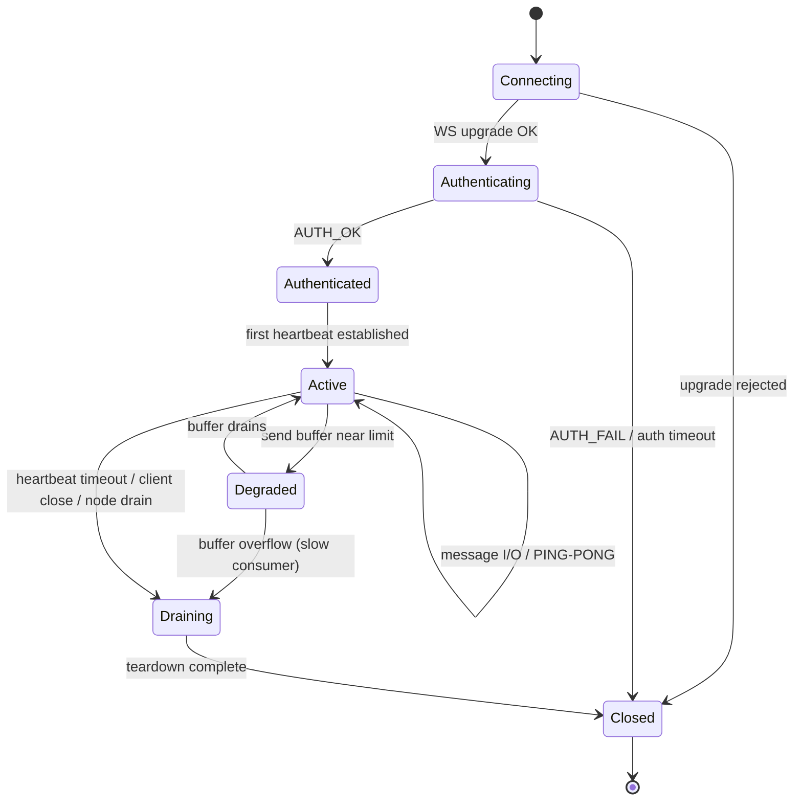
```mermaid
stateDiagram-v2
    [*] --> Connecting
    Connecting --> Authenticating: WS upgrade OK
    Connecting --> Closed: upgrade rejected
    Authenticating --> Authenticated: AUTH_OK
    Authenticating --> Closed: AUTH_FAIL / auth timeout
    Authenticated --> Active: first heartbeat established
    Active --> Active: message I/O / PING-PONG
    Active --> Degraded: send buffer near limit
    Degraded --> Active: buffer drains
    Degraded --> Draining: buffer overflow (slow consumer)
    Active --> Draining: heartbeat timeout / client close / node drain
    Draining --> Closed: teardown complete
    Closed --> [*]
```

- **Invariant:** presence for this connection is updated on entry to `Active` (announce) and on entry to `Draining` (reap).
- **Degraded → Draining** is the slow-consumer isolation path: the offending connection is closed, never the room.

## 2.2 Room State Machine

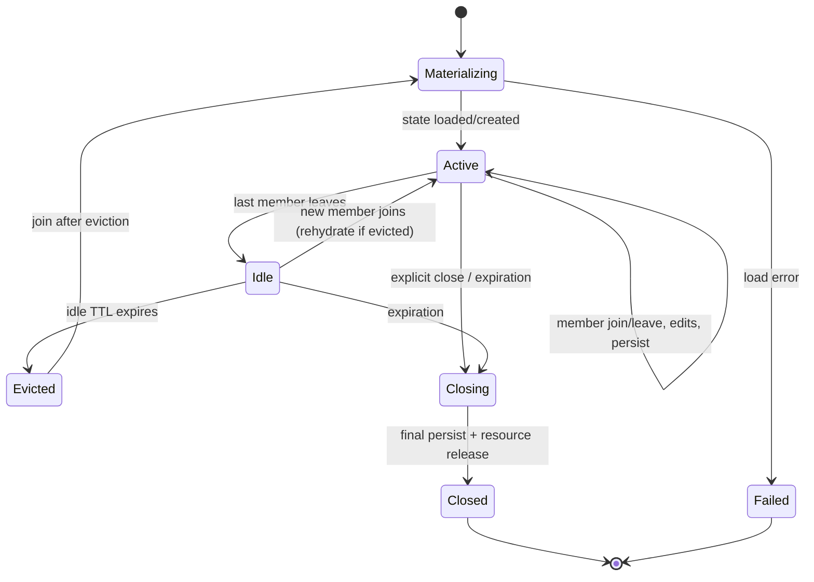
```mermaid
stateDiagram-v2
    [*] --> Materializing
    Materializing --> Active: state loaded/created
    Materializing --> Failed: load error
    Active --> Active: member join/leave, edits, persist
    Active --> Idle: last member leaves
    Idle --> Active: new member joins (rehydrate if evicted)
    Idle --> Evicted: idle TTL expires
    Evicted --> Materializing: join after eviction
    Active --> Closing: explicit close / expiration
    Idle --> Closing: expiration
    Closing --> Closed: final persist + resource release
    Closed --> [*]
    Failed --> [*]
```

- **Evicted** means "not in memory," **not** "deleted": durable state persists. `Closed` is the only state that releases the room's durable identity (per retention policy).

## 2.3 Execution Job State Machine

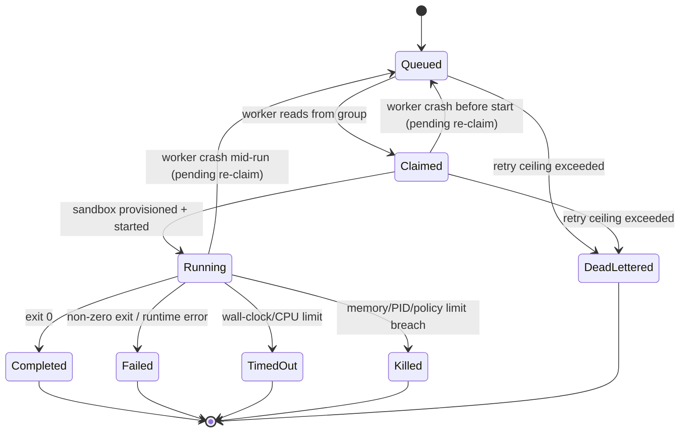
```mermaid
stateDiagram-v2
    [*] --> Queued
    Queued --> Claimed: worker reads from group
    Claimed --> Running: sandbox provisioned + started
    Claimed --> Queued: worker crash before start (pending re-claim)
    Running --> Completed: exit 0
    Running --> Failed: non-zero exit / runtime error
    Running --> TimedOut: wall-clock/CPU limit
    Running --> Killed: memory/PID/policy limit breach
    Running --> Queued: worker crash mid-run (pending re-claim)
    Queued --> DeadLettered: retry ceiling exceeded
    Claimed --> DeadLettered: retry ceiling exceeded
    Completed --> [*]
    Failed --> [*]
    TimedOut --> [*]
    Killed --> [*]
    DeadLettered --> [*]
```

- **Re-claim edges** (`→ Queued`) implement at-least-once. Idempotent handling ensures the client observes exactly one coherent result despite re-claims.
- Terminal states are **precise**: `TimedOut ≠ Killed ≠ Failed`. Implementations **MUST NOT** collapse these into a generic failure.

## 2.4 Worker State Machine

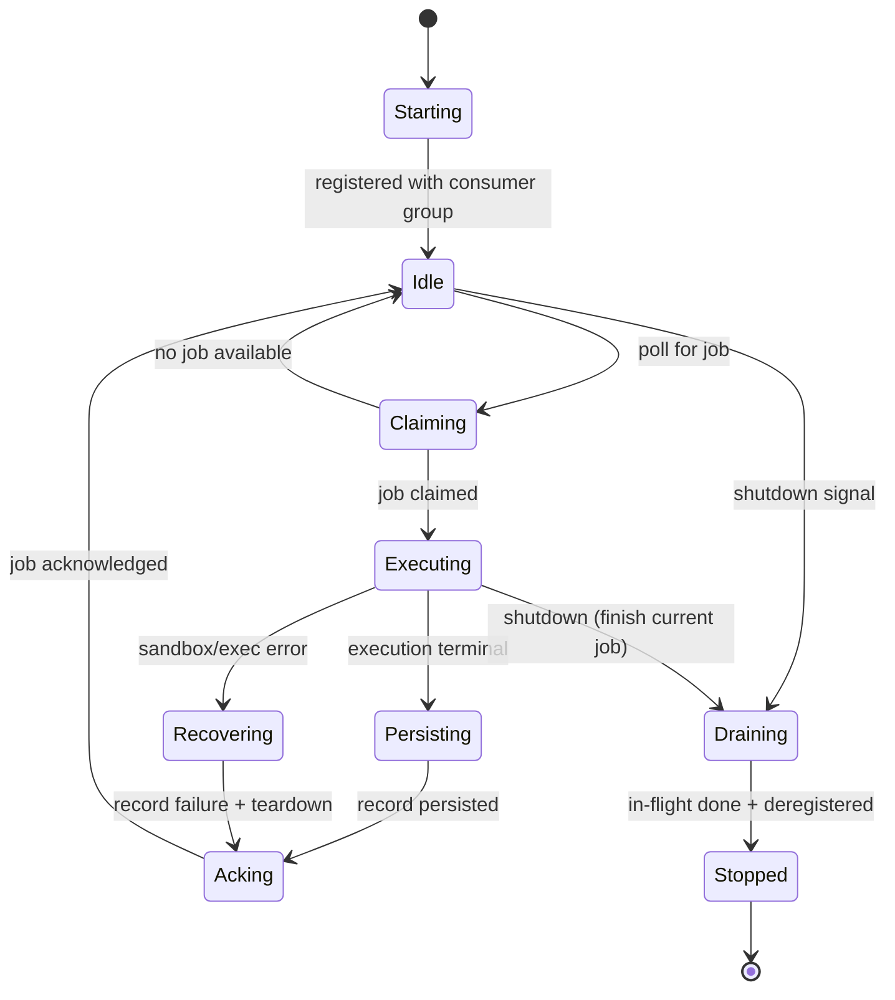
```mermaid
stateDiagram-v2
    [*] --> Starting
    Starting --> Idle: registered with consumer group
    Idle --> Claiming: poll for job
    Claiming --> Idle: no job available
    Claiming --> Executing: job claimed
    Executing --> Persisting: execution terminal
    Persisting --> Acking: record persisted
    Acking --> Idle: job acknowledged
    Executing --> Recovering: sandbox/exec error
    Recovering --> Acking: record failure + teardown
    Idle --> Draining: shutdown signal
    Executing --> Draining: shutdown (finish current job)
    Draining --> Stopped: in-flight done + deregistered
    Stopped --> [*]
```

- A worker in `Draining` **MUST** stop claiming new jobs but **MUST** finish (or safely release) the in-flight job before `Stopped`.

## 2.5 Sandbox Container State Machine

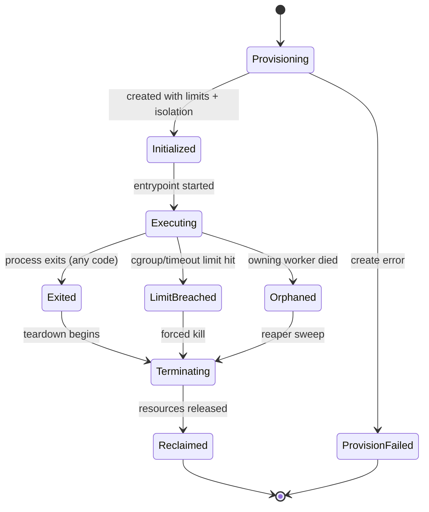
```mermaid
stateDiagram-v2
    [*] --> Provisioning
    Provisioning --> Initialized: created with limits + isolation
    Provisioning --> ProvisionFailed: create error
    Initialized --> Executing: entrypoint started
    Executing --> Exited: process exits (any code)
    Executing --> LimitBreached: cgroup/timeout limit hit
    Exited --> Terminating: teardown begins
    LimitBreached --> Terminating: forced kill
    Terminating --> Reclaimed: resources released
    Reclaimed --> [*]
    ProvisionFailed --> [*]
    Executing --> Orphaned: owning worker died
    Orphaned --> Terminating: reaper sweep
```

- **Single-use invariant:** a container **MUST NOT** transition back to `Executing` for a different job. Reuse across jobs is prohibited (see §10.9).

---

# 3. WebSocket Protocol

## 3.1 Transport Rules
- The WebSocket connection is the sole real-time channel; it carries all categories below.
- Text frames carry JSON envelopes. Binary frames **MAY** carry opaque CRDT/output blobs referenced by a preceding or enveloping JSON message; at this layer such blobs are opaque.
- Every message from `C→S` that expects a reply **MUST** include a `msgId`; the server's reply **MUST** echo it as `correlationId`.
- Unknown message `type` values **MUST** be answered with an `ERROR` of code `UNKNOWN_TYPE` and **MUST NOT** close the connection (forward-compatibility, §16).

## 3.2 Envelope (common to all messages)

```json
{
  "v": 1,                       // protocol major version (see §16)
  "type": "COLLAB_UPDATE",      // message type (screaming snake case)
  "category": "collaboration",  // one of the categories in §3.3
  "msgId": "m-8f3a...",         // sender-generated id (required if a reply is expected)
  "correlationId": "m-8f3a...", // echo of the request msgId (on replies only)
  "roomId": "r-42",             // scope, when applicable
  "ts": 1752300000000,          // sender timestamp (ms), advisory
  "payload": { }                // category/type-specific body
}
```

**Field rules:**
- `v` **MUST** be present; mismatches are handled per §16.
- `type` **MUST** be present and known (else `UNKNOWN_TYPE`).
- `msgId` **MUST** be present on any request expecting a response; **SHOULD** be present otherwise for traceability.
- `roomId` **MUST** be present for room/collaboration/presence/execution-in-room messages.
- `ts` is advisory only; the protocol **MUST NOT** rely on client clocks for ordering or security.

## 3.3 Categories
`authentication` · `room` · `presence` · `collaboration` · `execution` · `streaming` · `heartbeat` · `error` · `administration`.

---

Each message below is specified as: **Purpose · Direction · Required · Optional · Expected response · Error cases · Retry · Example.**

## 3.4 Authentication

### `AUTH_REQUEST`
- **Purpose:** Establish the connection's identity in-band immediately after upgrade.
- **Direction:** C→S
- **Required:** `payload.credential` (opaque token)
- **Optional:** `payload.clientInfo` (client version, capabilities for §16 negotiation)
- **Expected response:** `AUTH_OK` or `AUTH_FAIL`
- **Error cases:** invalid/expired credential → `AUTH_FAIL`; no `AUTH_REQUEST` within the auth timeout (§13) → connection closed.
- **Retry:** The client **MUST NOT** silently retry a rejected credential on the same connection; it **MUST** obtain a fresh credential (out of band) and reconnect.
- **Example:**
```json
{ "v":1, "type":"AUTH_REQUEST", "category":"authentication", "msgId":"m-1",
  "payload": { "credential":"<opaque-token>", "clientInfo":{"app":"cpip-ref","proto":[1]} } }
```

### `AUTH_OK` / `AUTH_FAIL`
- **Direction:** S→C
- **`AUTH_OK` payload:** `sessionId`, `userId`, `serverCapabilities`, negotiated `v`.
- **`AUTH_FAIL` payload:** `code`, `reason`.
- **Retry:** on `AUTH_FAIL`, reconnect with a new credential (backoff per §14).

## 3.5 Room

### `ROOM_JOIN`
- **Purpose:** Bind this connection to a room and begin collaboration.
- **Direction:** C→S · **Required:** `roomId` · **Optional:** `payload.stateVector` (client's CRDT state vector to bound the initial sync, §7).
- **Expected response:** `ROOM_JOINED` (with roster + sync payload) or `ERROR` (`ROOM_FORBIDDEN`, `ROOM_NOT_FOUND`).
- **Error cases:** unauthorized → `ROOM_FORBIDDEN`; nonexistent + not creatable → `ROOM_NOT_FOUND`.
- **Retry:** idempotent — a repeated `ROOM_JOIN` for an already-joined room **MUST** return the current `ROOM_JOINED` state, not an error.

### `ROOM_JOINED`
- **Direction:** S→C · **Payload:** `roster` (present users), `initialSync` (opaque CRDT), `roomMeta`.

### `ROOM_LEAVE` / `ROOM_LEFT`
- **Purpose:** Voluntarily unbind from a room. · **Direction:** C→S / S→C(broadcast).
- **Retry:** idempotent; leaving a room not joined is a no-op success.

### `ROOM_CLOSED`
- **Purpose:** Notify members that the room is closing (expiration/admin). · **Direction:** S→C (broadcast).

## 3.6 Presence

### `PRESENCE_UPDATE`
- **Purpose:** Announce cursor/selection/typing/status changes. · **Direction:** C→S (then fanned out S→C).
- **Required:** `roomId`, `payload.kind` (`cursor` | `selection` | `typing` | `status`).
- **Optional:** `payload.cursor`, `payload.selection`, `payload.typing`, `payload.status`.
- **Expected response:** none (fire-and-forget); server fans out `PRESENCE_STATE`.
- **Retry:** **MUST NOT** be retried; presence is soft, latest-wins, and self-corrects on the next update (§6.8).
- **Example:**
```json
{ "v":1, "type":"PRESENCE_UPDATE", "category":"presence", "roomId":"r-42",
  "payload": { "kind":"cursor", "cursor":{"line":12,"col":5} } }
```

### `PRESENCE_STATE`
- **Direction:** S→C · **Payload:** `users[]` with per-user latest presence. Sent on join and on change (coalesced, §6).

## 3.7 Collaboration

### `COLLAB_UPDATE`
- **Purpose:** Carry an incremental CRDT update. · **Direction:** C→S (then relayed S→C to other members).
- **Required:** `roomId`, `payload.update` (opaque base64 CRDT delta).
- **Expected response:** none (optimistic); server relays and persists asynchronously.
- **Error cases:** update for a room not joined → `ERROR` `NOT_IN_ROOM`; malformed opaque blob → dropped + `ERROR` `INVALID_UPDATE` (server **MUST NOT** crash).
- **Retry:** **MUST NOT** be retried by sequence number; because CRDTs are idempotent under merge, a client **MAY** re-send an unacknowledged update after reconnect without harm.

### `SYNC_REQUEST` / `SYNC_RESPONSE`
- **Purpose:** Reconcile state on join/reconnect/late-join (§7). · **Direction:** C→S / S→C.
- **`SYNC_REQUEST` required:** `roomId`, `payload.stateVector`.
- **`SYNC_RESPONSE` payload:** `update` (opaque delta bringing the client current), `serverStateVector`.
- **Retry:** safe to retry; the exchange is idempotent (delivering the same delta twice is harmless under CRDT merge).

### `DOCUMENT_SAVED`
- **Purpose:** Inform members that a durable checkpoint was persisted. · **Direction:** S→C (advisory).

## 3.8 Execution

> Job **submission** occurs over `HTTP` (§8) to keep acceptance request/response and idempotent; **result control/streaming** occurs over `WS`. This split is deliberate (§19.4). The WS execution messages below are the client's live view of a job it submitted over HTTP.

### `EXEC_SUBSCRIBE`
- **Purpose:** Ask the server to stream a submitted job's lifecycle+output on this connection. · **Direction:** C→S.
- **Required:** `payload.jobId` (from the HTTP acceptance). · **Expected response:** `EXECUTION_ACCEPTED` snapshot, then streaming events.
- **Error cases:** unknown/forbidden job → `ERROR` `JOB_NOT_FOUND` / `JOB_FORBIDDEN`.
- **Retry:** idempotent; re-subscribing replays from the durable output channel cursor (§11).

### `EXECUTION_ACCEPTED` / `EXECUTION_STARTED` / `EXECUTION_COMPLETED` / `EXECUTION_FAILED`
- **Direction:** S→C · Lifecycle notifications mirroring the job state machine (§2.3).
- **`EXECUTION_COMPLETED` payload:** `status` (`completed`), `exitCode`, `resourceUsage`, `durationMs`.
- **`EXECUTION_FAILED` payload:** `status` (`failed`|`timed_out`|`killed`), `code`, `resourceUsage`.

### `EXEC_CANCEL`
- **Purpose:** Request cancellation of an in-flight job. · **Direction:** C→S.
- **Expected response:** `EXECUTION_FAILED` with `status:"killed"`,`code:"CANCELLED"` if cancellation wins the race; otherwise the natural terminal event.
- **Retry:** idempotent; cancelling a terminal job is a no-op success.

## 3.9 Streaming

### `STDOUT` / `STDERR`
- **Purpose:** Carry ordered incremental output chunks. · **Direction:** S→C.
- **Required:** `payload.jobId`, `payload.seq` (monotonic per stream), `payload.data` (chunk), `payload.stream` (`stdout`|`stderr`).
- **Ordering:** per (`jobId`,`stream`), `seq` is strictly increasing and gap-free under normal operation (§11.6).
- **Client ack:** OPTIONAL `STREAM_ACK` (§11.8) for flow control on high-volume jobs.

### `STREAM_ACK`
- **Purpose:** Client acknowledges consumption up to a `seq`, enabling server-side flow control. · **Direction:** C→S.
- **Required:** `payload.jobId`, `payload.stream`, `payload.ackSeq`.
- **Retry:** cumulative and idempotent; a later ack supersedes an earlier one.

### `EXEC_PROGRESS`
- **Purpose:** Coarse progress/status hints (e.g., `provisioning`, `compiling`, `running`). · **Direction:** S→C · advisory.

## 3.10 Heartbeat

### `PING` / `PONG`
- **Purpose:** Liveness + RTT measurement. · **Direction:** either party sends `PING`, peer replies `PONG` echoing `payload.nonce`.
- **Cadence/timeout:** see §13. Missing N consecutive expected `PONG`s → connection reaped (`HEARTBEAT_TIMEOUT`).
- **Retry:** heartbeats are not retried; a missed beat advances the liveness counter.

## 3.11 Errors

### `ERROR`
- **Purpose:** Report a problem tied to a request (via `correlationId`) or the connection. · **Direction:** S→C.
- **Required:** `payload.code` (stable enum), `payload.severity` (`warn`|`error`|`fatal`), `payload.message` (human-readable, non-sensitive).
- **Optional:** `payload.retryable` (bool), `payload.retryAfterMs`.
- **Rule:** `fatal` precedes a server-initiated close; `warn`/`error` **MUST NOT** close the connection.
- **Example:**
```json
{ "v":1, "type":"ERROR", "category":"error", "correlationId":"m-9",
  "payload": { "code":"ROOM_FORBIDDEN", "severity":"error", "message":"not a member",
               "retryable": false } }
```

## 3.12 Administration

### `SYSTEM_NOTIFICATION`
- **Purpose:** Broadcast operational notices (maintenance, drain, version deprecation §16). · **Direction:** S→C.
- **Payload:** `level`, `message`, optional `action` (`reconnect`, `upgrade`).

### `SERVER_DRAINING`
- **Purpose:** Tell clients this node is draining so they reconnect elsewhere (graceful shutdown, §12/§13). · **Direction:** S→C.
- **Client behavior:** on receipt, clients **SHOULD** proactively reconnect (through the LB) after a short jittered delay, without waiting for hard disconnect.

---

# 4. Event Catalogue

Events are the semantic units the protocol carries. For each: **Purpose · Producer · Consumer · Payload · Failure behavior.** (Transport binding is noted; some events are WS messages, some are internal STREAM/PUBSUB events.)

| Event | Purpose | Producer | Consumer | Payload (key fields) | Failure behavior |
|---|---|---|---|---|---|
| `CONNECT` | New WS established | Client | Gateway | credential | Rejected upgrades closed pre-auth |
| `DISCONNECT` | WS torn down | Either | Gateway/Presence | reason | Triggers presence reap + room unbind |
| `PING`/`PONG` | Liveness/RTT | Either | Peer | nonce | Missed beats → `HEARTBEAT_TIMEOUT` |
| `HEARTBEAT_TIMEOUT` | Liveness lost | Gateway | Gateway/Presence | connectionId | Connection reaped, presence removed |
| `AUTH_OK`/`AUTH_FAIL` | Identity result | Auth | Client | userId/code | Fail → close after `AUTH_FAIL` |
| `JOIN_ROOM` | Bind to room | Client | Room Mgr | roomId, stateVector | Unauthorized → `ERROR ROOM_FORBIDDEN` |
| `LEAVE_ROOM` | Unbind | Client | Room Mgr | roomId | Idempotent no-op if not joined |
| `ROOM_CREATED` | Room materialized | Room Mgr | Members/Admin | roomId, meta | Load failure → `Failed` state |
| `ROOM_CLOSED` | Room closing | Room Mgr | Members | roomId, reason | Members must rejoin a new/rehydrated room |
| `USER_JOINED` | Member added | Presence | Members | userId | Fan-out best-effort; self-heals |
| `USER_LEFT` | Member removed | Presence | Members | userId | Emitted on leave or reap |
| `USER_TYPING` | Typing indicator | Client | Members | roomId, bool | Soft; expires by TTL if not refreshed |
| `CURSOR_UPDATED` | Cursor moved | Client | Members | cursor | Latest-wins; lost updates harmless |
| `SELECTION_UPDATED` | Selection changed | Client | Members | selection range | Latest-wins |
| `DOCUMENT_CHANGED` | CRDT delta | Client | Relay→Members | opaque update | Malformed → dropped + `INVALID_UPDATE` |
| `DOCUMENT_SAVED` | Durable checkpoint | Relay | Members | version marker | Persist failure → degrade + alert |
| `SYNC_REQUEST` | Ask for catch-up | Client | Relay | stateVector | Retriable/idempotent |
| `SYNC_RESPONSE` | Provide catch-up | Relay | Client | opaque delta | Idempotent under merge |
| `EXECUTE_CODE` | Submit job (HTTP) | Client | Exec API | snapshot, params | Rejected if invalid/rate-limited |
| `EXECUTION_ACCEPTED` | Job enqueued | Exec API | Client | jobId | Append fail → submission rejected (fail closed) |
| `EXECUTION_STARTED` | Sandbox running | Worker | Client | jobId | — |
| `STDOUT`/`STDERR` | Output chunk | Worker | Client | jobId, seq, data | Gaps trigger client resync (§11) |
| `EXEC_PROGRESS` | Coarse status | Worker | Client | phase | Advisory; loss harmless |
| `EXECUTION_COMPLETED` | Success terminal | Worker | Client | exitCode, usage | Delivered exactly once (idempotent) |
| `EXECUTION_FAILED` | Non-success terminal | Worker | Client | status, code | Precise status (timeout/killed/failed) |
| `CONTAINER_CREATED` | Sandbox up | Worker | Metrics/Log | jobId, sandboxId | Provision fail → job retried/dead-lettered |
| `CONTAINER_DESTROYED` | Sandbox reclaimed | Worker/Reaper | Metrics/Log | sandboxId | Reaper backstops crash paths |
| `JOB_DEAD_LETTERED` | Retry ceiling hit | Worker/Queue | Ops/Metrics | jobId, cause | Removed from live pipeline, alert |
| `RECONNECT` | Client resuming | Client | Gateway | sessionHint | Resync via `SYNC_REQUEST` + `EXEC_SUBSCRIBE` |
| `ERROR` | Problem report | Server | Client | code, severity | `fatal` precedes close |
| `SYSTEM_NOTIFICATION` | Ops notice | Admin/Server | Client | level, action | Advisory |
| `SERVER_DRAINING` | Node draining | Server | Client | — | Client reconnects elsewhere |

**Producer/Consumer note:** collaboration/presence events fan out via `PUBSUB` across nodes; execution lifecycle/output events flow via `STREAM` (durable) then to `WS`. This binding is what makes any-node-serves-any-client work (see `ARCHITECTURE.md §10`).

---

# 5. Room Lifecycle

## 5.1 Creation
Rooms are created explicitly (via HTTP provisioning) or **lazily** on first authorized `ROOM_JOIN` (policy-dependent). Creation materializes an in-memory room object and an empty (or seeded) CRDT document; durable existence is recorded. The `ROOM_CREATED` event is emitted.

## 5.2 Joining
On `ROOM_JOIN`: authorize → load/rehydrate document → send `ROOM_JOINED` with roster + initial sync → announce presence. Joining is **idempotent**: a duplicate join returns current state.

## 5.3 Leaving
On `ROOM_LEAVE` or disconnect: remove from membership → emit `USER_LEFT` → if last member, transition room to `Idle`. Leaving is idempotent.

## 5.4 Rejoining
A returning client issues `ROOM_JOIN` (possibly on a different node) and reconciles via `SYNC_REQUEST`. Because authoritative state is externalized, rejoin does not depend on the original node.

## 5.5 Expiration
Idle rooms (no members) start an **idle TTL** (§13). On expiry they transition `Idle→Closing→Closed` (or `Idle→Evicted` first for soft memory reclamation). Expiration is driven by a periodic sweeper, not client action.

## 5.6 Cleanup
`Closing` performs a final durable persist and releases in-memory resources and pub/sub subscriptions. `Evicted` releases memory only; durable state remains for later rehydration.

## 5.7 Persistence
Document state is persisted on a **debounced checkpoint** cadence during activity and on `Closing`. Persistence is off the hot path; edits flow through memory + pub/sub and are checkpointed asynchronously.

## 5.8 Ownership
A room has an **owner** (creator/authorized principal). Ownership governs administrative actions (close, permission changes). Ownership is durable metadata, not tied to any connection or node.

## 5.9 Host Migration
CPIP is **not host-authoritative** for document correctness — the CRDT + durable backstop mean no single client or node "hosts" the document state. Therefore classic host migration is unnecessary for *document continuity*. If the owner disconnects, the room **MUST** continue for remaining members; administrative ownership **MAY** be transferred per policy (e.g., to another authorized principal) but this is an administrative event, not a correctness requirement.

## 5.10 Inactive Room Handling
Rooms with members but no edits for a long window remain `Active` (presence alone keeps them alive) but **MAY** reduce checkpoint frequency. Rooms with no members follow §5.5.

---

# 6. Presence Protocol

## 6.1 Online Users
Presence-of-record is **soft state in Redis with a TTL**, keyed per room. Each connection refreshes its presence via activity and heartbeat. The authoritative roster is the union of unexpired entries across nodes.

## 6.2 Typing Status
`typing:true` is a self-expiring signal: it **MUST** carry (or imply) a short TTL and be refreshed while typing; absence of refresh naturally clears it. Clients **SHOULD** debounce typing updates.

## 6.3 Cursor Synchronization
Cursor position is sent via `PRESENCE_UPDATE(kind:cursor)`, coalesced server-side, and fanned out via `PRESENCE_STATE`. Cursors are **latest-wins**; dropped intermediate updates are harmless.

## 6.4 Selection Synchronization
Identical model to cursors (`kind:selection`), carrying a range. Latest-wins.

## 6.5 Heartbeat (presence liveness)
Presence liveness is tied to the connection heartbeat (§3.10). A connection that stops heart-beating has its presence entry expire by TTL and emits `USER_LEFT`. Presence TTL **MUST** be strictly greater than the heartbeat interval to avoid fl[a]pping (see §13).

## 6.6 Presence Timeout
If a presence entry's TTL lapses without refresh, the user is considered gone and removed from all rosters. This is the self-healing mechanism for crashed clients/nodes.

## 6.7 Reconnect Behavior
On reconnect, the client re-announces presence; the roster converges within one TTL cycle. No explicit presence "recovery" protocol is needed — presence is regenerated, not restored.

## 6.8 Conflict Handling
Presence is **conflict-free by construction**: every field is latest-writer-wins per user, and each user only writes their own presence. There is no cross-user contention. Stale-vs-fresh is resolved by the newest update/refresh; there is no merge to perform.

---

# 7. CRDT Synchronization Flow

The division of responsibility is strict and **normative**.

## 7.1 Server Responsibilities (MUST)
- Relay `COLLAB_UPDATE` deltas to all other room members (cross-node via pub/sub).
- Persist converged document state on a debounced checkpoint cadence and on room close.
- Serve `SYNC_RESPONSE` deltas bounded by a client's `stateVector`.
- Treat all CRDT payloads as **opaque**; the server **MUST NOT** parse, transform, or resolve conflicts within them.

## 7.2 Client Responsibilities (MUST)
- Maintain the local Yjs document and generate deltas.
- Send incremental deltas as `COLLAB_UPDATE`.
- On join/reconnect, send `SYNC_REQUEST` with its `stateVector` and apply the returned delta.
- Buffer local edits while disconnected and flush on reconnect.

## 7.3 Yjs Responsibilities
- Provide the CRDT algorithm guaranteeing **convergence** regardless of delivery order or duplication.
- Encode/decode deltas and state vectors.
- Merge remote deltas into local state deterministically.

## 7.4 Document Creation
An empty (or seed) Yjs document is created on room materialization. Its initial state vector is the baseline for sync.

## 7.5 Initial Synchronization
On `ROOM_JOIN`, the server includes an `initialSync` (or the client follows with `SYNC_REQUEST`). The exchange transfers the delta between the client's known state and the server's current state — **not** the whole document when avoidable.

## 7.6 Incremental Updates
Steady-state editing is a stream of small `COLLAB_UPDATE` deltas, relayed and periodically checkpointed. There is no per-edit server acknowledgement (optimistic model).

## 7.7 Conflict Resolution
Handled entirely by the CRDT on clients. Concurrent edits merge deterministically; all replicas converge. **The server never adjudicates conflicts.**

## 7.8 Offline Editing
A disconnected client continues editing locally (Yjs). On reconnect, buffered deltas are flushed via `COLLAB_UPDATE` and remote changes are pulled via `SYNC_REQUEST`. Convergence holds because CRDT merge is order- and duplication-independent.

## 7.9 Late Joins
A client joining an established room receives a `SYNC_RESPONSE` computed from its (empty/partial) `stateVector`, bringing it fully current in one exchange, then follows live updates.

## 7.10 Persistence & Recovery
Durable checkpoints (Postgres) allow a room to be rehydrated after eviction or full restart. Recovery loads the last checkpoint; any deltas newer than the checkpoint that were lost are reconciled by connected clients re-sending (idempotent under merge). This is why debounced checkpointing is safe: worst case is a re-sync, never a lost edit among connected clients.

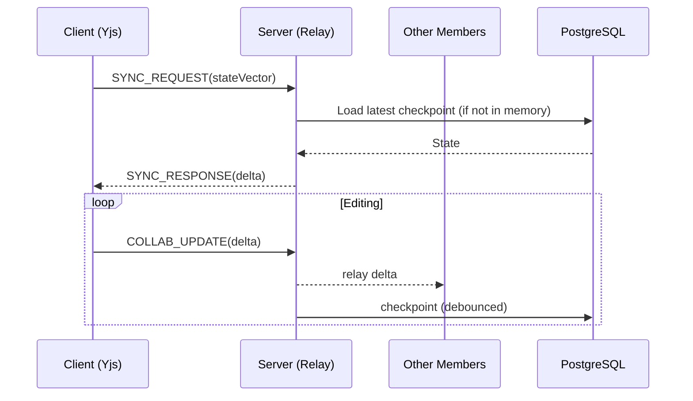
```mermaid
sequenceDiagram
    participant Cl as Client (Yjs)
    participant S as Server (Relay)
    participant Peers as Other Members
    participant DB as PostgreSQL

    Cl->>S: SYNC_REQUEST(stateVector)
    S->>DB: Load latest checkpoint (if not in memory)
    DB-->>S: State
    S-->>Cl: SYNC_RESPONSE(delta)
    loop Editing
        Cl->>S: COLLAB_UPDATE(delta)
        S-->>Peers: relay delta
        S->>DB: checkpoint (debounced)
    end
```

---

# 8. Code Execution Pipeline

End-to-end path with each transition explained.

```
Client → Gateway/HTTP → Execution Service → Redis Streams → Worker → Container → Runtime → Output Stream → Client
```

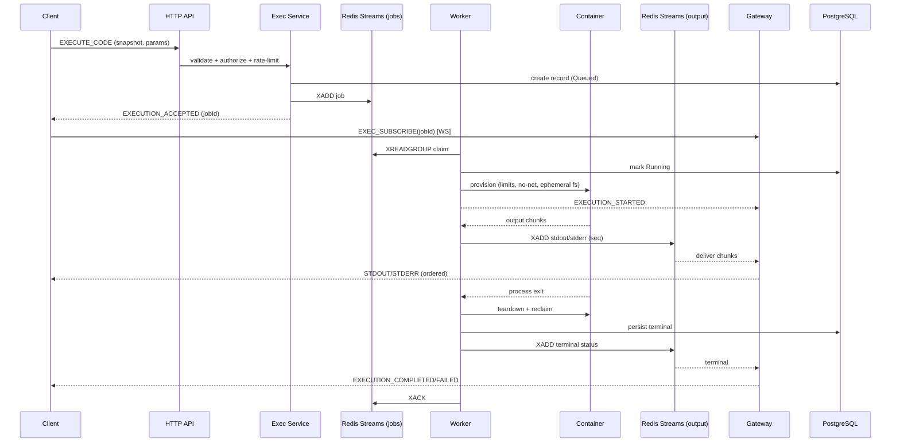
```mermaid
sequenceDiagram
    participant C as Client
    participant H as HTTP API
    participant E as Exec Service
    participant RS as Redis Streams (jobs)
    participant W as Worker
    participant SB as Container
    participant OUT as Redis Streams (output)
    participant G as Gateway
    participant DB as PostgreSQL

    C->>H: EXECUTE_CODE (snapshot, params)
    H->>E: validate + authorize + rate-limit
    E->>DB: create record (Queued)
    E->>RS: XADD job
    E-->>C: EXECUTION_ACCEPTED (jobId)
    C->>G: EXEC_SUBSCRIBE(jobId) [WS]
    W->>RS: XREADGROUP claim
    W->>DB: mark Running
    W->>SB: provision (limits, no-net, ephemeral fs)
    W-->>G: EXECUTION_STARTED
    SB-->>W: output chunks
    W->>OUT: XADD stdout/stderr (seq)
    OUT-->>G: deliver chunks
    G-->>C: STDOUT/STDERR (ordered)
    SB-->>W: process exit
    W->>SB: teardown + reclaim
    W->>DB: persist terminal
    W->>OUT: XADD terminal status
    OUT-->>G: terminal
    G-->>C: EXECUTION_COMPLETED/FAILED
    W->>RS: XACK
```

**Transition explanations:**
1. **Client → HTTP:** submission is request/response so acceptance is confirmable and idempotent.
2. **HTTP → Exec Service:** validation, authorization, rate limiting, size checks (fail closed).
3. **Exec Service → Redis Streams:** durable append; job survives node restarts; acceptance decoupled from execution.
4. **Streams → Worker:** consumer-group claim gives at-least-once + pending recovery.
5. **Worker → Container:** provision fresh isolated sandbox with all limits (§10).
6. **Container → Runtime:** compile/interpret and run under limits; output produced incrementally.
7. **Runtime → Output Stream:** chunks appended to a durable per-job output stream with monotonic `seq`.
8. **Output Stream → Client:** gateway relays chunks (possibly cross-node) to the subscribed client, in order.
9. **Terminal + XACK:** precise terminal status persisted and delivered; job acknowledged (or dead-lettered on repeated failure).

---

# 9. Worker Lifecycle

## 9.1 Startup
Worker registers with the consumer group and enters `Idle`. It loads config (pool identity, limits) and verifies sandbox-runtime availability; failure to verify **MUST** prevent it from claiming jobs (readiness gate).

## 9.2 Idle
Polls (blocking read) the consumer group for pending/new entries. Idle workers consume no execution resources beyond the poll.

## 9.3 Job Assignment
A claim moves an entry into the group's pending set for this worker (job `Queued→Claimed`). The claim is exclusive per entry within the visibility window.

## 9.4 Execution
Worker provisions a sandbox and drives execution (`Running`), streaming output and enforcing the per-job deadline via context cancellation.

## 9.5 Completion
On terminal exit: persist record, append terminal output event, `XACK` the job (`→Idle`). Acknowledgement **MUST** happen only after the record + terminal event are durably written (so a crash before ack yields a safe re-claim, not a lost result).

## 9.6 Crash
A crashed worker's claimed entry remains **pending**; after the visibility timeout another worker re-claims it. The reaper cleans the orphaned container. Idempotent handling ensures no duplicate client-visible result.

## 9.7 Restart
A restarted worker re-registers and resumes claiming; it **MAY** pick up its own previously-pending entries after the visibility timeout.

## 9.8 Shutdown / Graceful Termination
On signal: stop claiming, finish the in-flight job (bounded by the job deadline), ack, deregister, exit. If the in-flight job cannot finish within the drain deadline, the worker **MUST** release it (leave pending) rather than corrupt or truncate results.

---

# 10. Container Lifecycle

## 10.1 Creation
A fresh container is created per job from a pinned base image, with resource limits and isolation applied at creation (never after start).

## 10.2 Initialization
Code snapshot injected into the ephemeral writable layer; environment scrubbed of host secrets; network disabled; non-root user set.

## 10.3 Execution
Entrypoint runs the compile/run step; stdout/stderr captured and forwarded as ordered chunks.

## 10.4 Monitoring
The worker monitors the container against wall-clock, CPU, memory, and PID limits, and watches for exit. Monitoring drives the terminal-state determination.

## 10.5 Resource Limits (MUST all be enforced)
- **CPU time** and **wall-clock timeout**.
- **Memory ceiling** (hard cgroup limit).
- **PID/process count** limit (fork-bomb containment).
- **Filesystem:** read-only base + size-bounded ephemeral scratch, destroyed on teardown.
- **Network:** denied by default.
- **Capabilities:** dropped; no privilege escalation.

## 10.6 Termination
Container is terminated on normal exit, limit breach, cancellation, or job deadline. Termination sets the precise terminal status.

## 10.7 Cleanup
Container and its scratch layer are removed and resources reclaimed on **every** exit path. The reaper sweeps orphans (owning worker died) by label/age.

## 10.8 Failure Handling
Provision failure → job retried (up to ceiling, then dead-lettered). Runtime crash inside the sandbox → legitimate `failed`/`killed` outcome recorded (not a system fault). Host is protected by cgroup ceilings regardless of job behavior.

## 10.9 Reuse Policy
**Containers MUST NOT be reused across jobs.** Single-use is a hard isolation guarantee: reuse could leak state or state-dependent side channels between untrusted submissions. (Warm *pools of un-started* sandboxes are a permissible future latency optimization, but a given container still serves exactly one job — see `ARCHITECTURE.md §17.1`.)

---

# 11. Streaming Protocol

## 11.1 Stdout / Stderr Streaming
Output is delivered as `STDOUT`/`STDERR` chunks, each with a per-(job,stream) monotonic `seq`. The two streams are independently ordered; clients interleave by arrival or by `ts` for display.

## 11.2 Execution Status
Lifecycle events (`EXECUTION_STARTED`, terminal events) are delivered on the same channel, ordered relative to output such that the terminal event is **last** for that job.

## 11.3 Progress Updates
`EXEC_PROGRESS` gives coarse phase hints (`provisioning`,`compiling`,`running`); advisory and lossy-tolerant.

## 11.4 Chunking
Output is chunked at a bounded maximum size. Producers **MUST** cap total output volume per job (a limit); on breach the job is terminated (`Killed`,`code:OUTPUT_LIMIT`) to prevent output-flood DoS.

## 11.5 Ordering
Within a (job,stream), `seq` is strictly increasing and gap-free under normal operation. The durable output stream is the ordering authority; the gateway preserves order on delivery.

## 11.6 Gap Detection & Resync
A client detecting a `seq` gap **MAY** issue `EXEC_SUBSCRIBE` (re-subscribe) to replay from its last contiguous `seq` using the durable stream cursor. This is the reconnect/catch-up mechanism (durable output channel).

## 11.7 Backpressure
Delivery to the client is bounded by the connection's send buffer (§3.1/§2.1). If a client cannot keep up:
- The server **MUST** apply backpressure by pausing reads from the output stream for that subscriber (the durable stream retains data up to TTL).
- If the send buffer overflows, the slow connection is dropped (`Degraded→Draining`); the job continues and output remains retrievable on reconnect.

## 11.8 Client Acknowledgement
For high-volume jobs, clients **MAY** send cumulative `STREAM_ACK(ackSeq)`. The server **MAY** use acks to bound how far ahead it streams (credit-based flow control). Acks are cumulative and idempotent. Absence of acks falls back to send-buffer-bounded delivery.

---

# 12. Error Handling Strategy

For each class: **Detection · Response · Retry · Recovery.**

## 12.1 Validation Errors
- **Detection:** at the edge (schema/size/param checks) before pipeline entry.
- **Response:** reject with `ERROR VALIDATION_FAILED` (HTTP 4xx or WS `ERROR`), non-retryable as-is.
- **Retry:** client fixes input and resubmits. **Recovery:** none needed (no state mutated).

## 12.2 Authentication Errors
- **Detection:** during `AUTH_REQUEST` or credential expiry mid-session.
- **Response:** `AUTH_FAIL` / `ERROR AUTH_EXPIRED`; connection closed for hard failures.
- **Retry:** obtain fresh credential, reconnect (backoff §14). **Recovery:** re-auth on new connection.

## 12.3 Room Errors
- **Detection:** authorization/existence checks on join.
- **Response:** `ERROR ROOM_FORBIDDEN`/`ROOM_NOT_FOUND`, non-retryable without a permission change.
- **Recovery:** none; client selects a valid room.

## 12.4 Execution Errors
- **Detection:** non-zero exit / runtime error inside sandbox.
- **Response:** `EXECUTION_FAILED` with precise `status`/`code`; this is a **normal** outcome of untrusted code, not a system fault.
- **Retry:** client-initiated resubmit only. **Recovery:** none (isolated).

## 12.5 Worker Failures
- **Detection:** pending-entry visibility timeout.
- **Response:** re-claim by another worker; reap orphan container.
- **Retry:** automatic, at-least-once, idempotent. **Recovery:** transparent to client.

## 12.6 Container Failures
- **Detection:** provision error or abnormal termination.
- **Response:** record precise status; retry provision up to ceiling.
- **Retry:** bounded; exceeding ceiling → `JOB_DEAD_LETTERED`. **Recovery:** ops inspects DLQ.

## 12.7 Redis Failures
- **Detection:** operation errors / health check failure.
- **Response:** **fail closed** — reject new executions; pause cross-node collaboration fan-out; node reports **not-ready**.
- **Retry:** operations retried with backoff (§14); on sustained failure, node stays not-ready.
- **Recovery:** on Redis recovery, streams resume from durable entries; presence regenerates by TTL cycle.

## 12.8 Database Failures
- **Detection:** query/connection errors.
- **Response:** **Collaboration** degrades to in-memory relay (edits still flow/converge) with alerting — never silent edit loss. **Execution** acceptance fails closed (can't create record → reject submission).
- **Retry:** with backoff. **Recovery:** resume checkpointing on DB recovery; connected clients' re-sync backfills any gap.

## 12.9 Timeouts
- **Detection:** deadline exceeded at any layer (§13).
- **Response:** precise terminal status (`TimedOut`) for jobs; connection reap for heartbeat; operation abort + retry for internal ops.
- **Recovery:** per the specific layer's policy.

## 12.10 Unexpected Failures (panics/unknowns)
- **Detection:** recovery middleware / supervisory goroutines.
- **Response:** contain the failure to the smallest scope (one request/job/connection), log with correlation ID, emit `ERROR INTERNAL` (`severity:error`), never crash the node.
- **Retry:** none automatic for the affected unit unless idempotent. **Recovery:** the rest of the system is unaffected by design (blast-radius containment).

**Global rule:** errors are **categorized, correlated (correlationId/jobId), and non-sensitive** in client-facing form. Internal detail is logged, never leaked to clients or into sandboxes.

---

# 13. Timeout Strategy

All values are **defaults, configurable per deployment**; the *relationships* between them are normative.

| Timeout | Default (indicative) | Normative relationship / rule |
|---|---|---|
| **Connection auth** | 5 s | If no `AUTH_REQUEST` within this window → close. |
| **Heartbeat interval** | 15 s | Base liveness cadence. |
| **Heartbeat timeout** | 3 missed beats (~45 s) | Connection reaped after N consecutive missed `PONG`s. |
| **Presence TTL** | > heartbeat timeout (e.g. 60 s) | MUST exceed heartbeat timeout to avoid presence flapping. |
| **Room idle TTL** | 30 min | No-member rooms expire/evict after this. |
| **Job wall-clock** | 10 s (per language/profile) | Hard execution deadline; breach → `TimedOut`. |
| **Job CPU limit** | ≤ wall-clock | Enforced by cgroups independently of wall-clock. |
| **Container provision** | 10 s | Provision exceeding this → provision failure → retry. |
| **Worker visibility (pending)** | > max job wall-clock (e.g. 2× ) | MUST exceed a legitimate job's max runtime so healthy jobs aren't falsely re-claimed. |
| **Worker drain deadline** | 30 s | On shutdown, finish/release in-flight within this. |
| **Output stream TTL** | 5 min post-terminal | Reconnect catch-up window for results. |
| **Redis op timeout** | 1–2 s | Short; failures fail closed + retry. |
| **DB op timeout** | 2–5 s | Bounded; collaboration degrades rather than blocks. |
| **HTTP request timeout** | 10–30 s | Bounds submission/handshake requests. |

**Key ordering invariants (MUST hold):**
`heartbeat interval < heartbeat timeout < presence TTL`
`max job wall-clock < worker visibility timeout`
`Redis/DB op timeouts ≪ job wall-clock` (dependency slowness must surface fast, not block execution).

---

# 14. Retry Strategy

## 14.1 Principles
- Retry **only** idempotent operations, or operations made idempotent by design.
- Never retry a rejection caused by client error (validation/auth/authz) — those need a *different* input, not a repeat.
- Use **exponential backoff with jitter** for transient infrastructure failures to avoid thundering herds.
- Every retry loop **MUST** have a ceiling and a terminal action (fail closed / dead-letter).

## 14.2 Retry Matrix

| Operation | Retry? | Policy | Terminal action |
|---|---|---|---|
| Rejected credential | **No** | — | Reconnect with fresh credential |
| Validation failure | **No** | — | Client fixes input |
| WS reconnect | **Yes** | Exp. backoff + jitter (e.g. 0.5s→30s cap) | Surface persistent-failure to user |
| `COLLAB_UPDATE` after reconnect | **Yes (safe)** | Re-send buffered deltas once | Idempotent under CRDT merge |
| `SYNC_REQUEST` | **Yes** | Bounded retries | Rejoin/reload |
| Job claim (worker) | **Yes** | Continuous poll (blocking read) | — |
| Job re-claim after crash | **Yes (auto)** | After visibility timeout | Dead-letter at ceiling |
| Container provision | **Yes** | Bounded (e.g. 3), short backoff | `JOB_DEAD_LETTERED` |
| Job execution itself | **Yes, cautiously** | Re-run on infra fault only; **not** on legitimate non-zero exit | Non-zero exit is a final result, not an error |
| Redis op | **Yes** | Exp. backoff, short cap | Fail closed + not-ready |
| DB op | **Yes** | Exp. backoff | Degrade (collab) / fail closed (exec) |
| `EXECUTE_CODE` submission | **Client-controlled** | Idempotency key prevents dup jobs on retry | Client decides |
| Presence update | **No** | — | Superseded by next update |
| Heartbeat | **No** | — | Advances liveness counter |

## 14.3 Idempotency for Submissions
`EXECUTE_CODE` **SHOULD** carry a client-generated idempotency key. A repeated submission with the same key within a window **MUST** return the original `jobId` rather than creating a duplicate job — making client retries safe.

## 14.4 Backoff Shape
Transient-failure backoff **SHOULD** be `min(cap, base × 2^attempt) ± jitter`. Jitter is mandatory to decorrelate retries across many clients/workers.

---

# 15. Concurrency Model

(Runtime concurrency semantics; no code.)

## 15.1 Goroutines
- **Per connection:** one reader, one writer (writer drains a bounded outbound channel).
- **Per room:** a relay owner coordinating fan-out and checkpoint scheduling.
- **Worker pool:** fixed N worker goroutines; N is the global execution concurrency bound.
- **Supervisors:** sweepers/reapers (idle rooms, orphan containers, presence TTL) run as periodic goroutines.

## 15.2 Channels
Channels are the primary coordination primitive: bounded outbound queues (backpressure), job hand-off, and cancellation signaling. **All inter-goroutine queues MUST be bounded.**

## 15.3 Context Cancellation
Every connection, room operation, and job carries a `context`. Cancellation propagates: connection close cancels its ops; job deadline/cancel cancels sandbox execution and teardown; node shutdown cancels roots, draining children.

## 15.4 Shared State
Authoritative shared state lives **outside** process memory (Redis/Postgres). In-memory shared structures (room member sets, connection registry) are the minimum necessary and are **owned by a single goroutine** or guarded explicitly.

## 15.5 Synchronization & Locking Strategy
- Prefer **ownership + message passing** over shared-memory locking.
- Where locks are unavoidable (registries), use fine-grained, short-held locks; never hold a lock across I/O or a channel send.
- Read-heavy shared maps **MAY** use read-write separation; the default is single-owner goroutines.

## 15.6 Avoiding Race Conditions
- No shared mutable state without a defined owner or guard.
- The race detector **MUST** gate CI for concurrency-critical packages.
- Fan-out never blocks on a single slow member (bounded per-member channel; drop-slowest).

## 15.7 Ownership Model
- Gateway owns sockets and outbound buffers.
- Room owns its member set and relay/checkpoint scheduling.
- Worker owns its in-flight job + sandbox handle.
- No component reaches into another's owned state; interaction is via messages/interfaces.

## 15.8 Memory Management
- In-memory structures are **caches or transient buffers**, sized and bounded.
- Rooms evict when idle; connections free buffers on teardown; sandboxes release on reclaim.
- Backpressure prevents unbounded buffer growth anywhere (§2.10 invariant).

---

# 16. Protocol Versioning

## 16.1 Version Negotiation
- The envelope carries `v` (major version). During `AUTH_REQUEST`, the client advertises supported versions (`clientInfo.proto`); the server selects the highest mutually supported and returns it in `AUTH_OK.negotiatedVersion`.
- If no common version exists, the server returns `AUTH_FAIL AUTH_VERSION_UNSUPPORTED` with the server's supported range.

## 16.2 Backward Compatibility
- **Additive changes** (new optional fields, new message types) are **minor** and **MUST NOT** break older clients.
- Receivers **MUST** ignore unknown fields and reply `UNKNOWN_TYPE` (non-fatal) to unknown message types — the forward-compat rule (§3.1).
- Breaking changes require a **major** `v` bump and dual-version support during migration.

## 16.3 Deprecation Strategy
- Deprecated messages/fields are announced via `SYSTEM_NOTIFICATION(level:deprecation)` and documented with a sunset date.
- A deprecation window (≥ one major cycle) during which both old and new are honored precedes removal.

## 16.4 Feature Flags
- The server advertises `serverCapabilities` in `AUTH_OK`; clients gate optional behaviors (e.g., credit-based streaming acks) on advertised capabilities rather than assuming them.
- This lets features roll out per-deployment without protocol bumps.

## 16.5 Protocol Evolution Principles
- Evolve additively; reserve major bumps for genuine breaks.
- Never overload existing fields with new meaning (add a new field instead).
- Keep the envelope stable; evolve `payload`.
- Every change is captured in a versioned changelog referenced by `v`.

---

# 17. Sequence Diagrams

## 17.1 Client Connects
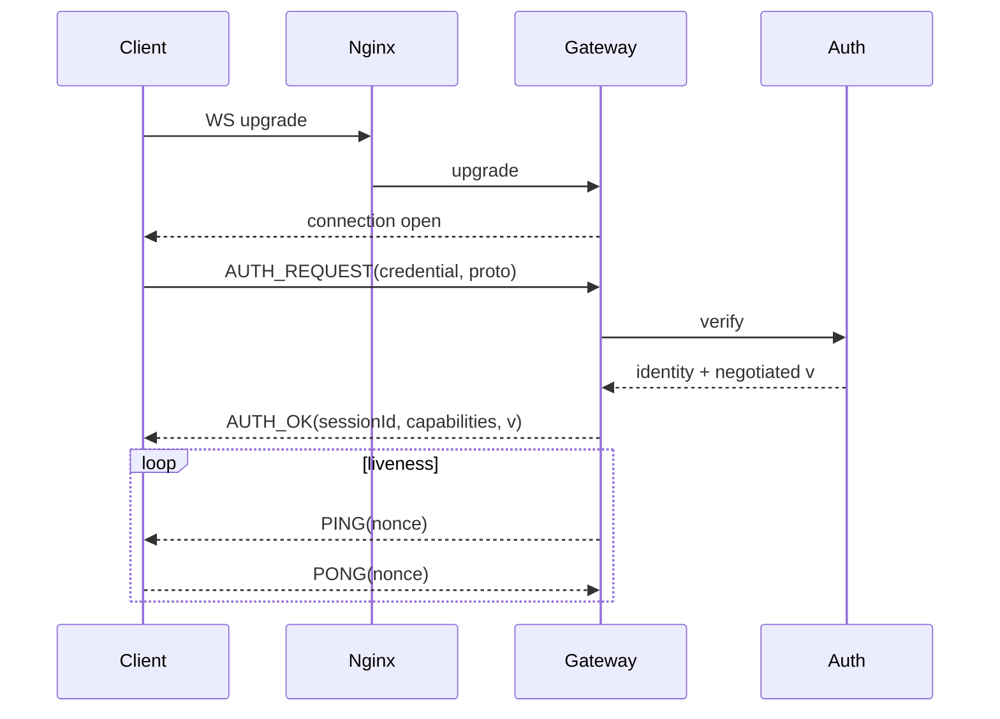
```mermaid
sequenceDiagram
    participant C as Client
    participant LB as Nginx
    participant G as Gateway
    participant A as Auth
    C->>LB: WS upgrade
    LB->>G: upgrade
    G-->>C: connection open
    C->>G: AUTH_REQUEST(credential, proto)
    G->>A: verify
    A-->>G: identity + negotiated v
    G-->>C: AUTH_OK(sessionId, capabilities, v)
    loop liveness
        G-->>C: PING(nonce)
        C-->>G: PONG(nonce)
    end
```

## 17.2 Join Room
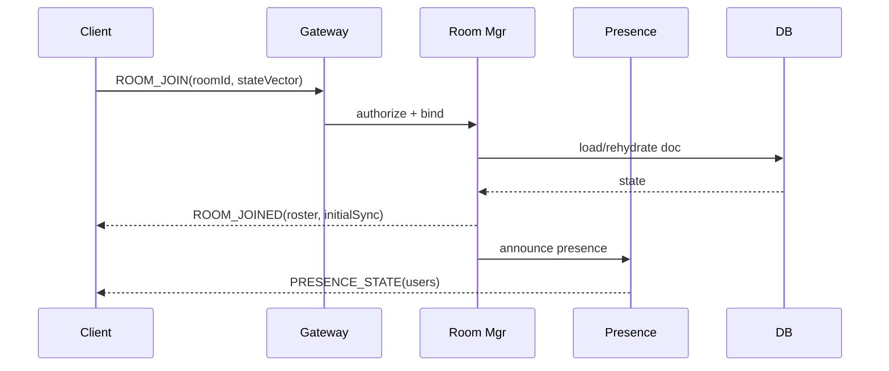
```mermaid
sequenceDiagram
    participant C as Client
    participant G as Gateway
    participant R as Room Mgr
    participant P as Presence
    participant DB as DB
    C->>G: ROOM_JOIN(roomId, stateVector)
    G->>R: authorize + bind
    R->>DB: load/rehydrate doc
    DB-->>R: state
    R-->>C: ROOM_JOINED(roster, initialSync)
    R->>P: announce presence
    P-->>C: PRESENCE_STATE(users)
```

## 17.3 Realtime Editing
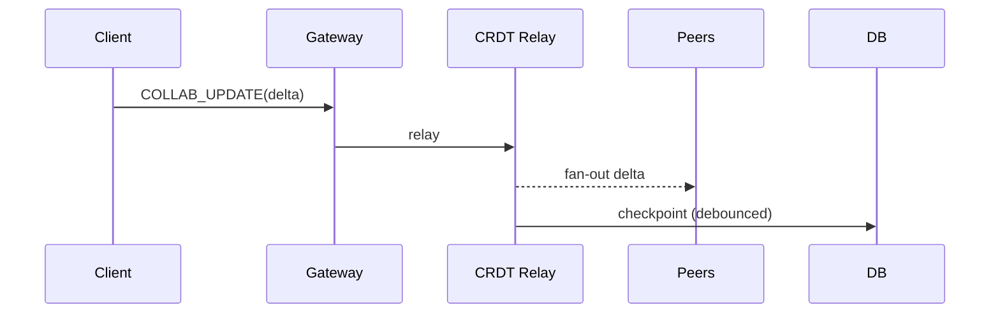
```mermaid
sequenceDiagram
    participant C as Client
    participant G as Gateway
    participant CR as CRDT Relay
    participant Pe as Peers
    participant DB as DB
    C->>G: COLLAB_UPDATE(delta)
    G->>CR: relay
    CR-->>Pe: fan-out delta
    CR->>DB: checkpoint (debounced)
```

## 17.4 Concurrent Editing
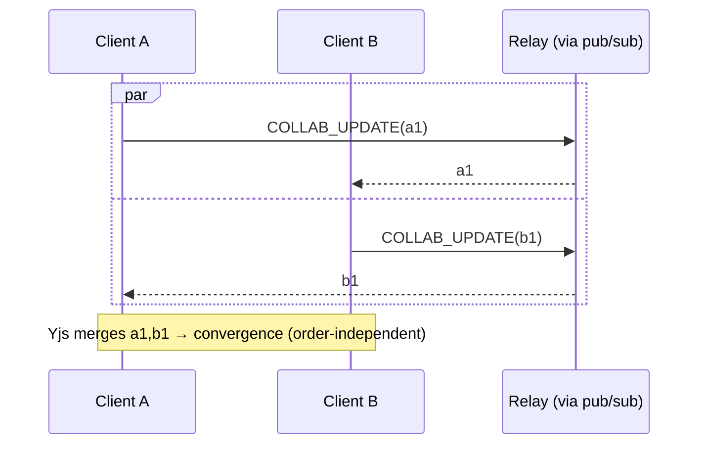
```mermaid
sequenceDiagram
    participant A as Client A
    participant B as Client B
    participant CR as Relay (via pub/sub)
    par
        A->>CR: COLLAB_UPDATE(a1)
        CR-->>B: a1
    and
        B->>CR: COLLAB_UPDATE(b1)
        CR-->>A: b1
    end
    Note over A,B: Yjs merges a1,b1 → convergence (order-independent)
```

## 17.5 Late-Join Synchronization
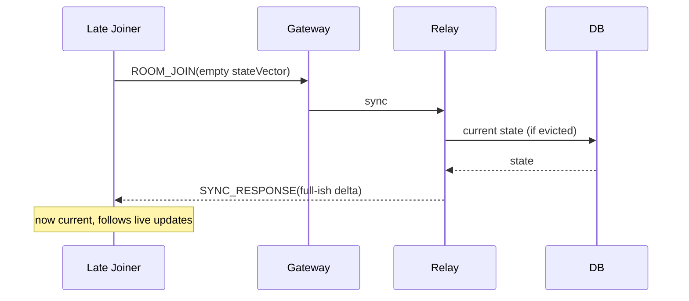
```mermaid
sequenceDiagram
    participant L as Late Joiner
    participant G as Gateway
    participant CR as Relay
    participant DB as DB
    L->>G: ROOM_JOIN(empty stateVector)
    G->>CR: sync
    CR->>DB: current state (if evicted)
    DB-->>CR: state
    CR-->>L: SYNC_RESPONSE(full-ish delta)
    Note over L: now current, follows live updates
```

## 17.6 Code Execution
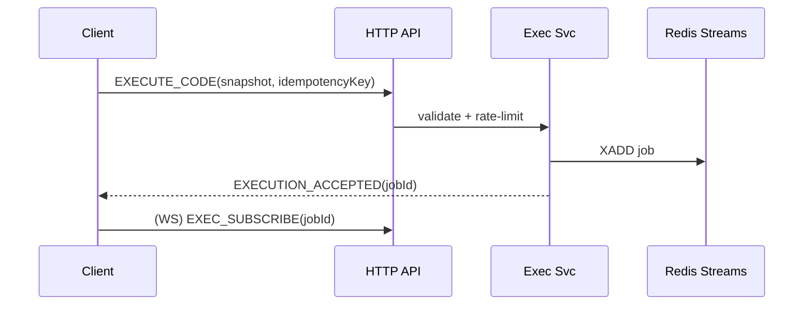
```mermaid
sequenceDiagram
    participant C as Client
    participant H as HTTP API
    participant E as Exec Svc
    participant RS as Redis Streams
    C->>H: EXECUTE_CODE(snapshot, idempotencyKey)
    H->>E: validate + rate-limit
    E->>RS: XADD job
    E-->>C: EXECUTION_ACCEPTED(jobId)
    C->>H: (WS) EXEC_SUBSCRIBE(jobId)
```

## 17.7 Streaming Output
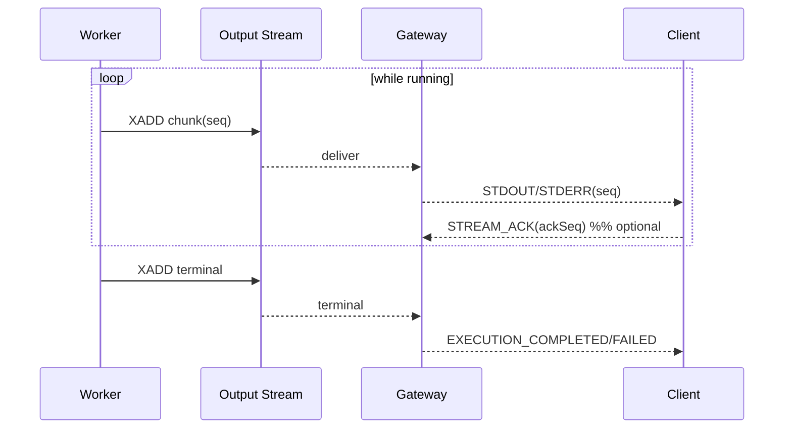
```mermaid
sequenceDiagram
    participant W as Worker
    participant OUT as Output Stream
    participant G as Gateway
    participant C as Client
    loop while running
        W->>OUT: XADD chunk(seq)
        OUT-->>G: deliver
        G-->>C: STDOUT/STDERR(seq)
        C-->>G: STREAM_ACK(ackSeq)   %% optional
    end
    W->>OUT: XADD terminal
    OUT-->>G: terminal
    G-->>C: EXECUTION_COMPLETED/FAILED
```

## 17.8 Worker Execution
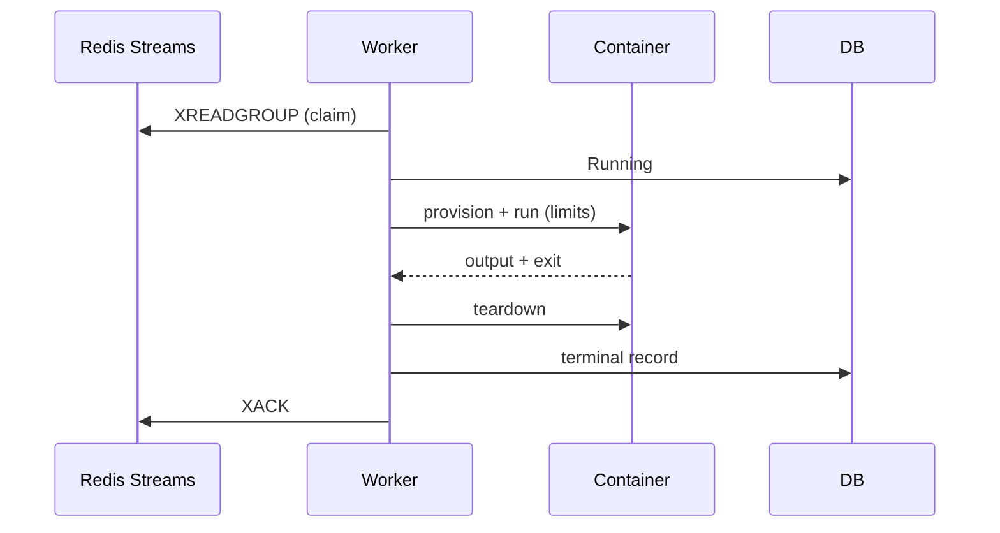
```mermaid
sequenceDiagram
    participant RS as Redis Streams
    participant W as Worker
    participant SB as Container
    participant DB as DB
    W->>RS: XREADGROUP (claim)
    W->>DB: Running
    W->>SB: provision + run (limits)
    SB-->>W: output + exit
    W->>SB: teardown
    W->>DB: terminal record
    W->>RS: XACK
```

## 17.9 Container Lifecycle
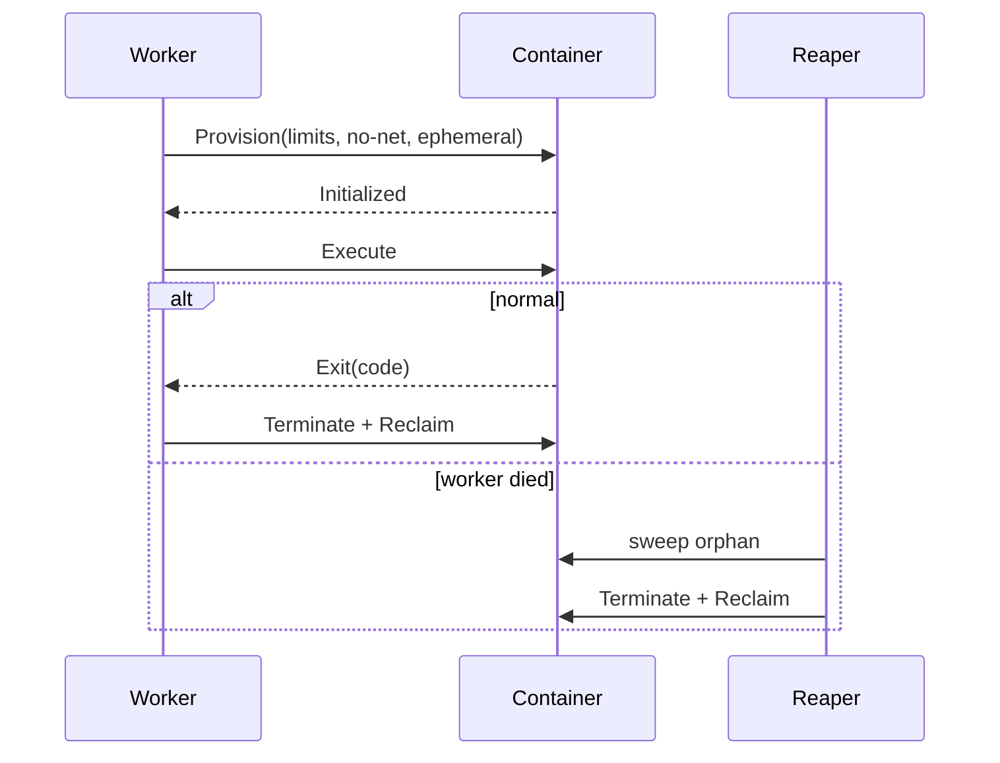
```mermaid
sequenceDiagram
    participant W as Worker
    participant SB as Container
    participant RE as Reaper
    W->>SB: Provision(limits, no-net, ephemeral)
    SB-->>W: Initialized
    W->>SB: Execute
    alt normal
        SB-->>W: Exit(code)
        W->>SB: Terminate + Reclaim
    else worker died
        RE->>SB: sweep orphan
        RE->>SB: Terminate + Reclaim
    end
```

## 17.10 Reconnect
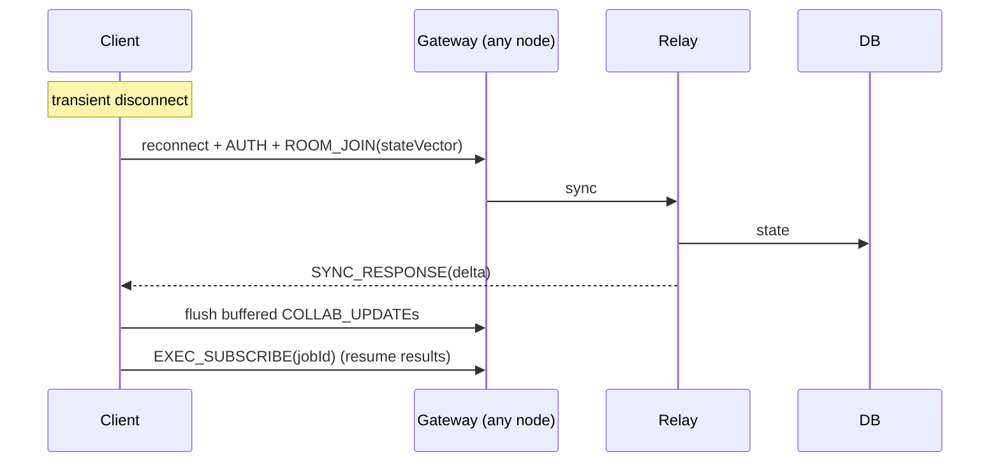
```mermaid
sequenceDiagram
    participant C as Client
    participant G as Gateway (any node)
    participant CR as Relay
    participant DB as DB
    Note over C: transient disconnect
    C->>G: reconnect + AUTH + ROOM_JOIN(stateVector)
    G->>CR: sync
    CR->>DB: state
    CR-->>C: SYNC_RESPONSE(delta)
    C->>G: flush buffered COLLAB_UPDATEs
    C->>G: EXEC_SUBSCRIBE(jobId) (resume results)
```

## 17.11 Failure Recovery (worker crash mid-job)
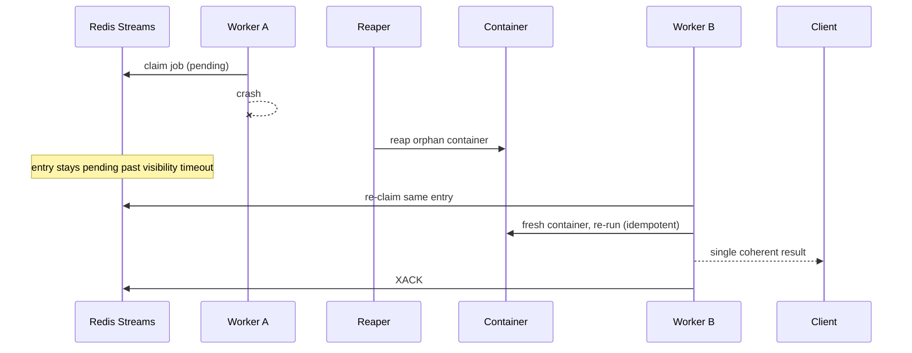
```mermaid
sequenceDiagram
    participant RS as Redis Streams
    participant W1 as Worker A
    participant RE as Reaper
    participant SB as Container
    participant W2 as Worker B
    participant C as Client
    W1->>RS: claim job (pending)
    W1--xW1: crash
    RE->>SB: reap orphan container
    Note over RS: entry stays pending past visibility timeout
    W2->>RS: re-claim same entry
    W2->>SB: fresh container, re-run (idempotent)
    W2-->>C: single coherent result
    W2->>RS: XACK
```

---

# 18. Security Considerations

## 18.1 Replay Attacks
- Credentials **MUST** be time-bounded; the server **MUST NOT** trust client timestamps for security decisions.
- Idempotency keys bound the effect of replayed submissions (a replay yields the *same* job, not a new one).
- Presence/collaboration replays are harmless (CRDT idempotency, latest-wins presence), so replay grants no advantage there.

## 18.2 Unauthorized Room Access
- Every `ROOM_JOIN` and every room-scoped message is authorized against membership; unauthorized access → `ROOM_FORBIDDEN`.
- A connection **MUST NOT** receive a room's edits/presence without an authorized bind; the server **MUST NOT** rely on the client to self-restrict.

## 18.3 Message Validation
- Every inbound message is validated (envelope well-formedness, known `type`, required fields, size bounds) before processing.
- Room/scope fields are validated against the connection's authorized bindings (no spoofing another room via `roomId`).

## 18.4 Malformed Payloads
- Malformed envelopes → `ERROR INVALID_MESSAGE`; malformed opaque CRDT blobs → dropped + `INVALID_UPDATE`. Neither **MUST** ever crash the node (blast-radius containment, §12.10).

## 18.5 Rate Limiting
- Applied per principal/connection to: connection establishment, execution submissions, and edit ingress.
- Excess is shed with `ERROR RATE_LIMITED(retryAfterMs)`. Rate limiting is the front-door complement to per-job resource limits at the back.

## 18.6 Connection Abuse
- Bounded connections per principal; auth-timeout closes idle unauthenticated sockets; heartbeat reaps zombies; send-buffer bounds prevent memory-exhaustion via slow-consumer attacks.

## 18.7 Execution Abuse
- Per-job CPU/memory/PID/time/output limits contain resource-exhaustion attempts (fork bombs, infinite loops, memory hogs, output floods).
- Submission rate limits + bounded worker concurrency bound aggregate load. Idempotency prevents duplicate-job amplification.

## 18.8 Container Escape Considerations
- Untrusted code is assumed hostile. Defense in depth: dropped capabilities, non-root, seccomp profile, no network, ephemeral read-mostly fs, hard cgroup ceilings.
- **Docker (shared kernel) is the phase-1 boundary and is treated as the weakest link.** The migration to **gVisor** (user-space kernel, syscall interception) is the planned hardening; because the sandbox is a runtime-agnostic seam, this is a runtime swap, not a protocol change.
- The protocol itself never places host secrets or cross-tenant data inside a sandbox, minimizing what an escape could reach.

## 18.9 Cross-Cutting Rules (MUST)
- Client-facing errors are non-sensitive; internal detail is logged with correlation IDs only.
- No untrusted output is interpreted as protocol control (output is data, never re-parsed as messages).
- All security-relevant limits are server-enforced; the client is never trusted to enforce them.

---

# 19. Engineering Decisions

Each decision: rationale + alternatives/trade-offs. (Consistent with `ARCHITECTURE.md §15–16`; here focused on *protocol* implications.)

## 19.1 Why WebSockets
Full-duplex, low-latency, persistent server-push is required for the editing loop, presence, and live output. **Alternatives:** SSE (unidirectional — can't carry edits/presence upstream), long-polling (latency/overhead). **Trade-off:** stateful connections need heartbeats, backpressure, reconnection — all specified here (§3.10, §11.7, §17.10).

## 19.2 Why Event-Driven Architecture
Discrete, typed events decouple producers/consumers, enable fan-out across nodes, and make the system observable and extensible (new event types are additive, §16.2). **Alternative:** RPC-style request/response for everything — poor fit for broadcast/streaming and unnecessary coupling. **Trade-off:** requires disciplined event cataloguing (§4) and versioning (§16).

## 19.3 Why Redis Streams
Durable, ordered, at-least-once delivery with consumer groups and pending-entry recovery — exactly the job-pipeline primitives — plus reuse for pub/sub fan-out and TTL soft-state. **Alternatives:** Kafka (heavier ops), RabbitMQ (separate dependency, no soft-state reuse). **Trade-off:** single-instance Redis is the reliability ceiling in phase 1 (§12.7); mitigated by HA later. Enables the re-claim/dead-letter semantics in §2.3/§9.6.

## 19.4 Why Asynchronous Execution (HTTP submit + WS stream)
Decoupling acceptance from processing gives natural buffering, backpressure, and independent scaling; request/response submission makes acceptance confirmable and idempotent, while WS streaming delivers incremental results. **Alternative:** synchronous execute-and-wait — blocks connections, no burst absorption, no clean retry. **Trade-off:** two channels for one logical operation, justified by the different interaction shapes (§3.8).

## 19.5 Why Streaming Results
Long-running jobs must show incremental output; streaming with ordered `seq` + durable channel enables progressive display and reconnect catch-up. **Alternative:** deliver output only at completion — poor UX, loses partial output on failure, no catch-up. **Trade-off:** ordering/backpressure/ack machinery (§11), deemed essential.

## 19.6 Why CRDT Synchronization
CRDTs converge regardless of order/duplication, tolerate offline editing, and let the **server be a simple relay + durable backstop** rather than an authoritative transformer. **Alternative:** Operational Transformation (server-authoritative, hard to get correct, complex offline story). **Trade-off:** CRDT metadata overhead and Yjs format coupling — accepted because it drastically simplifies the *protocol* (no per-edit acks, no server-side conflict adjudication, idempotent re-sends).

## 19.7 Why an Opaque-CRDT Protocol Boundary
Treating CRDT payloads as opaque base64 blobs keeps the protocol independent of the CRDT encoding, lets the server avoid parsing untrusted structured data on the hot path, and cleanly separates transport from merge semantics. **Trade-off:** the server can't do content-based logic on edits (by design it shouldn't).

## 19.8 Why Idempotency Keys on Submission
They make client retries safe (§14.3) without duplicating jobs — essential given at-least-once delivery and unreliable networks. **Trade-off:** clients must generate/track keys; minor and standard.

---

# 20. Conclusion

This specification defines the complete runtime behavior and wire protocol for CPIP as an internal engineering RFC. It is designed so that independent teams can implement interoperable clients, gateways, workers, and sandboxes directly from it. It supports the platform's core properties as follows:

- **Scalability:** event-driven, externalized-state design with durable job/output streams and pub/sub fan-out lets any node serve any client and lets workers and gateways scale independently. The protocol never assumes node affinity for correctness.
- **Reliability:** precise state machines, at-least-once delivery with idempotent handling, bounded retries with dead-lettering, graceful drain, and fail-closed dependency handling ensure no acknowledged work is lost and no failure silently corrupts state.
- **Concurrency:** a CSP-based ownership model with bounded channels, context cancellation, and race-free shared state, plus backpressure at every producer/consumer boundary, keeps the system correct and responsive under load.
- **Realtime collaboration:** CRDT synchronization with an opaque relay, latest-wins presence, and low-latency WebSocket transport deliver convergent, offline-tolerant, multi-user editing with live awareness.
- **Secure execution:** a strict submit→queue→claim→sandbox→stream pipeline with single-use, resource-capped, network-denied, ephemeral containers — and a runtime-agnostic seam for the Docker→gVisor hardening path — safely runs untrusted code while protecting the host and other tenants.
- **Production readiness:** precise timeouts with normative ordering invariants, categorized error handling, protocol versioning with additive evolution and deprecation windows, and security controls against replay, unauthorized access, abuse, and container escape make the protocol operable and evolvable in production.

The protocol's guiding discipline is consistent throughout: **decouple acceptance from processing, make every retryable operation idempotent, bound every buffer, keep authoritative state outside process memory, treat untrusted input (code and payloads) as hostile, and evolve additively.** Adhering to these rules, an implementation built from this document will be scalable, reliable, and safe by construction.

---

# Appendix A — Message Type Index (quick reference)

| Category | Messages |
|---|---|
| authentication | `AUTH_REQUEST`, `AUTH_OK`, `AUTH_FAIL` |
| room | `ROOM_JOIN`, `ROOM_JOINED`, `ROOM_LEAVE`, `ROOM_LEFT`, `ROOM_CLOSED` |
| presence | `PRESENCE_UPDATE`, `PRESENCE_STATE` |
| collaboration | `COLLAB_UPDATE`, `SYNC_REQUEST`, `SYNC_RESPONSE`, `DOCUMENT_SAVED` |
| execution | `EXEC_SUBSCRIBE`, `EXECUTION_ACCEPTED`, `EXECUTION_STARTED`, `EXECUTION_COMPLETED`, `EXECUTION_FAILED`, `EXEC_CANCEL` |
| streaming | `STDOUT`, `STDERR`, `STREAM_ACK`, `EXEC_PROGRESS` |
| heartbeat | `PING`, `PONG` |
| error | `ERROR` |
| administration | `SYSTEM_NOTIFICATION`, `SERVER_DRAINING` |

# Appendix B — Normative Invariants (checklist)

1. Acceptance of work is decoupled from processing (HTTP submit, async execute).
2. Every retryable operation is idempotent (CRDT merge, idempotency keys, at-least-once + ack-after-durable-write).
3. Every buffer/queue/fan-out is bounded with defined overflow behavior.
4. Authoritative correctness-critical state lives outside process memory.
5. Terminal job states are precise (`Completed`/`Failed`/`TimedOut`/`Killed`/`DeadLettered`).
6. Timeout ordering invariants hold (§13).
7. Unknown message types are non-fatal (forward compatibility).
8. Untrusted code and payloads are treated as hostile; limits are server-enforced.
9. Containers are single-use; teardown is guaranteed on every path.
10. Protocol evolves additively; breaking changes require a major version bump with a deprecation window.

---

*End of Protocol & Runtime Design Specification v1.0. Message-contract schemas, persistence schemas, package structure, and handler implementations follow in subsequent modules, governed by the runtime behavior, state machines, events, and normative invariants established here.*
