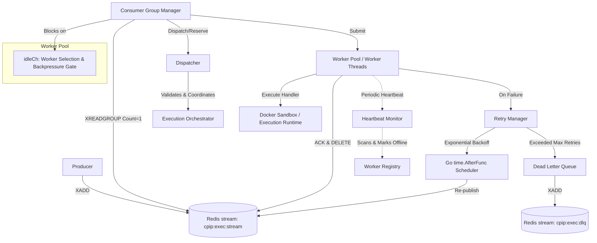

# Distributed Execution Queue & Worker Subsystem

This package implements the core production-grade distributed execution queue and worker infrastructure for the Collaborative Programming Infrastructure Platform (CPIP). It is designed to act as the asynchronous code-execution backbone, supporting high-throughput, fault-tolerant job orchestration.

## Architecture Overview

The system is designed around **Redis Streams** and Go concurrency primitives, enforcing complete decoupling from the execution sandboxes and runtime modules.



### Core Components

1. **Queue Manager (`manager/manager.go`)**: The composition root that wires all components together. It implements the `execution/scheduler.Scheduler` interface, allowing the Execution Orchestrator to interact with the queue.
2. **Producer (`producer/producer.go`)**: Handles job serialization and publishes tasks onto the primary execution stream using `XADD`.
3. **Consumer Group Manager (`consumer/consumer.go`)**: Runs the execution loops (`XREADGROUP`) and coordinates backpressure.
4. **Dispatcher (`dispatcher/dispatcher.go`)**: Coordinates worker capability matching, job reservation, and state validation with the Execution Orchestrator.
5. **Worker Pool (`workers/pool.go`)**: Manages the lifecycles and goroutines of active execution workers.
6. **Heartbeat Monitor (`heartbeat/heartbeat.go`)**: Performs out-of-band monitoring of active worker heartbeats to detect and recover zombie workers.
7. **Retry Manager (`retry/retry.go`)**: Implements exponential backoff with jitter and queues retries.
8. **Dead Letter Queue (`deadletter/deadletter.go`)**: Routes repeatedly failing jobs to a dead-letter stream for troubleshooting and manual replay.
9. **Worker Registry (`registry/registry.go`)**: A thread-safe, in-memory repository tracking worker states, capabilities, and statistics.

---

## Design Guarantees

### 1. Decoupling & Modular Monolith
The worker pool interacts with the execution runtime solely through the `Handler` interface callback and the `Orchestrator` lifecycle interface. There are no direct dependencies on Docker, sandboxing, or language runner modules.

### 2. Strict Backpressure
To prevent memory inflation and unconstrained consumption, the consumer does not read messages unless an execution worker is available.
- The Worker Pool exposes a read-only channel `IdleChan() <-chan string`.
- The Consumer Group Manager blocks reading from `IdleChan()` before making an `XREADGROUP` call.
- A worker is fetched, reserved, and only then is the message read and submitted for execution.

### 3. At-Least-Once Delivery
Consumer Group mechanics are utilized:
- When a worker claims a message via `XREADGROUP`, it enters the group's Pending Entries List (PEL) in Redis.
- If execution succeeds, the worker acknowledges (`XACK`) and deletes (`XDEL`) the message from the stream.
- If the worker crashes mid-execution, its heartbeat ceases. The heartbeat monitor detects the timeout and marks the worker offline.
- The consumer's recovery loop periodically runs `XAUTOCLAIM` with a `VisibilityTimeout`. Any messages left pending by crashed workers are reclaimed and dispatched to another healthy worker.

### 4. Poison Message & Crash Resilience
A poison message is a task that causes the worker process to crash immediately (e.g., SEGFAULT, panic, Out-Of-Memory) without leaving traces.
- If a message causes a crash, it is reclaimed by the recovery loop.
- The recovery loop queries `XPENDING` to retrieve the exact `DeliveryCount` from Redis.
- If `DeliveryCount > MaxRetries`, the manager bypasses execution entirely, routes the message to the DLQ, and acknowledges/deletes it from the stream. This prevents infinite retry-crash-reclaim loops.

---

## Lifecycle State Machines

### Message Lifecycle

```
             ┌──────────┐
             │ Created  │
             └────┬─────┘
                  │ Enqueued (XADD)
                  ▼
             ┌──────────┐
             │  Queued  │
             └────┬─────┘
                  │ Claimed (XREADGROUP)
                  ▼
             ┌──────────┐
      ┌─────►│ Claimed  │◄─────┐
      │      └────┬─────┘      │ Reclaim
      │           │            │ (XAUTOCLAIM)
      │           ├────────────┴───────────┐
      │           │ Success                │ Failure / Crash
      │           ▼                        ▼
      │      ┌──────────┐             ┌──────────┐
      │      │ Acknowledged           │  Failed  │
      │      └────┬─────┘             └────┬─────┘
      │           │                        │
      │           ▼                        ├─────────────────┐
      │      ┌──────────┐                  │                 │ Exceeded Max
      │      │Completed │                  ▼                 ▼
      │      └────┬─────┘            ┌──────────┐      ┌──────────┐
      │           │                  │  Retry   │      │DeadLetter│
      │           ▼                  └────┬─────┘      └────┬─────┘
      │      ┌──────────┐                 │                 │
      └──────┤ Archived │                 └─────────────────┤
             └──────────┘                                   ▼
                                                       ┌──────────┐
                                                       │ Archived │
                                                       └──────────┘
```

### Worker Lifecycle

```
        ┌──────────┐
        │ Starting │
        └────┬─────┘
             │ Register
             ▼
        ┌──────────┐
   ┌───►│   Idle   │◄────────────────────────┐
   │    └────┬─────┘                         │
   │         │ Match / Reserve               │
   │         ▼                               │
   │    ┌──────────┐                         │
   │    │ Reserved │                         │
   │    └────┬─────┘                         │
   │         │ Execute                       │
   │         ▼                               │
   │    ┌──────────┐                         │
   │    │Executing │                         │
   │    └────┬─────┘                         │
   │         │                               │
   │         ├────────────────┐              │
   │         ▼ Success        ▼ Failure      │
   │    ┌──────────┐     ┌──────────┐        │
   │    │Completed │     │  Failed  │        │
   │    └────┬─────┘     └────┬─────┘        │
   │         │                │              │
   │         │                ▼              │
   │         │           ┌──────────┐        │
   │         │           │Recovering│────────┘
   │         │           └────┬─────┘
   │         │                │ Missed Heartbeat / Stop
   └─────────┴────────────────┼────────┐
                              ▼        ▼
                        ┌──────────────────┐
                        │     Offline      │ (Terminal)
                        └──────────────────┘
```

---

## Configuration Tuning

Tune your deployment parameters in `config.Config`:

| Configuration Key | Type | Default | Description |
| :--- | :--- | :--- | :--- |
| `Streams.Execution` | `string` | `"cpip:exec:stream"` | Primary execution stream name. |
| `Streams.Retry` | `string` | `"cpip:exec:retry"` | Retry stream name (time-based schedule). |
| `Streams.DeadLetter` | `string` | `"cpip:exec:dlq"` | Dead Letter Queue stream name. |
| `Streams.Group` | `string` | `"cpip-executors"` | Shared consumer group name for scaling. |
| `WorkerCount` | `int` | `8` | Number of concurrent execution worker threads. |
| `MaxWorkerCount` | `int` | `64` | Bound for dynamic scaling. |
| `HeartbeatInterval` | `time.Duration` | `2s` | Interval at which workers send heartbeats. |
| `HeartbeatTimeout` | `time.Duration` | `10s` | Age after which workers are considered dead. |
| `VisibilityTimeout` | `time.Duration` | `30s` | PEL visibility window for reclaims. |
| `PendingCheckInterval` | `time.Duration` | `5s` | Recovery check loop scan frequency. |
| `MaxRetries` | `int` | `3` | Max failure count before moving to DLQ. |
| `RetryBaseDelay` | `time.Duration` | `500ms` | Base delay for exponential backoff retries. |
| `ShutdownGrace` | `time.Duration` | `15s` | Worker drain timeout during graceful shutdown. |

---

## Setup & Execution Example

```go
package main

import (
	"context"
	"log/slog"
	"os"
	"time"

	"cpip/internal/execution/job"
	"cpip/internal/queue/config"
	"cpip/internal/queue/manager"
	"cpip/internal/queue/redisstream"
	"cpip/internal/queue/types"
)

func main() {
	logger := slog.New(slog.NewJSONHandler(os.Stdout, nil))
	ctx, cancel := context.WithCancel(context.Background())
	defer cancel()

	// 1. Initialize Redis Streams client (or emulator in tests)
	redisClient := redisstream.NewEmulator() // replace with Redis client in prod

	// 2. Define job execution handler callback
	handler := func(ctx context.Context, msg types.Message) error {
		logger.Info("Executing code run...", "job_id", msg.JobID, "language", msg.Language)
		// Perform sandbox execution logic here...
		return nil
	}

	// 3. Construct Queue Manager
	cfg := config.Default()
	mgr, err := manager.NewManager(manager.Params{
		Config:  cfg,
		Client:  redisClient,
		Orch:    nil, // optional mock/live orchestrator
		Handler: handler,
		Logger:  logger,
	})
	if err != nil {
		logger.Error("Failed to initialize manager", "err", err)
		return
	}

	// 4. Start Queue Subsystem
	if err := mgr.Start(ctx); err != nil {
		logger.Error("Failed to start manager", "err", err)
		return
	}

	// 5. Schedule a Job
	j := job.Job{
		ID:         "job-uuid-123",
		Language:   "python",
		MaxRetries: 3,
		Metadata:   map[string]string{"user": "pranav"},
	}
	if err := mgr.Schedule(ctx, j); err != nil {
		logger.Error("Failed to schedule job", "err", err)
	}

	// Wait for processing...
	time.Sleep(2 * time.Second)

	// 6. Graceful Shutdown
	mgr.Stop()
}
```
