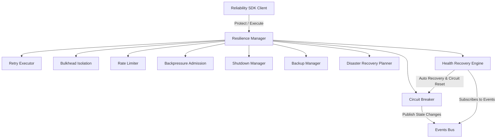

# Reliability, Resilience & Disaster Recovery Platform (CPIP)

The **Reliability SDK and Resilience Engine** provides modular, thread-safe, and self-healing infrastructure to protect all CPIP subsystems against cascading failures, network partitions, memory resource exhaustions, and service degradation.

---

## 🛠 Architectural Overview



---

## 🚀 Key Subsystems & Algorithms

### 1. Resilience Policies (`config/`)
All reliability parameters are defined via type-safe structures:
*   **Retry Config**: Max attempts, intervals, backoff strategies, classification filters.
*   **Circuit Breaker Config**: Failure threshold ratio, recovery timeouts, success threshold requirements, minimum requests windows.
*   **Bulkhead Config**: Concurrency limit and queue capacities.
*   **Rate Limiter Config**: Algorithm selections (Token Bucket, Leaky Bucket, Sliding Window), limits, window sizes.
*   **Backup Config**: Schedule frequencies, retention limits, SHA-256 verification settings.

### 2. Backoff Engine (`backoff/`)
Mathematical implementations of five backoff delay strategies:
*   **Fixed**: Precise interval loops.
*   **Linear**: Increments linearly per attempt.
*   **Exponential**: Multiplies base interval exponentially.
*   **Exponential Jitter**: Applies random uniform noise within the exponential range.
*   **Decorrelated Jitter**: Decorrelates delays based on current and previous intervals to minimize service load clustering.

### 3. Retry Framework (`retry/`)
Context-aware execution engine supporting:
*   Fatal exception bypasses (no retry on user auth errors or invalid input).
*   Automatic exhaustion telemetry dispatch.

### 4. Circuit Breaker (`circuitbreaker/`)
A thread-safe state machine managing states:
*   `Closed`: Standard operational path.
*   `Open`: Immediate rejection of requests via `ErrCircuitOpen`.
*   `Half-Open`: Single validation request pathway to test system recovery.

### 5. Bulkhead Isolation (`bulkhead/`)
Limits concurrency resources:
*   `Semaphore`: Locks concurrent worker loops.
*   `Pool`: Queues overflow jobs to separate worker-pools.

### 6. Rate Limiting (`ratelimit/`)
Three flow control filters:
*   `Token Bucket`: High throughput bursts with refilling token buckets.
*   `Leaky Bucket`: Smooth uniform request processing rates.
*   `Sliding Window`: Precise count constraints over moving windows.

### 7. Backpressure Manager (`backpressure/`)
Dynamically measures current task processing latencies:
*   Task load-shedding when queue sizes exceed bounds.
*   Priority bypasses for high-priority user-facing transactions.

### 8. Disaster Recovery (`recovery/`)
Executes recovery steps:
*   Topological sorting ensures dependencies (Database -> Cache -> API) start in order.
*   Failure mitigations abort plans safely on critical faults.

---

## 💻 Developer Guide: Usage Examples

### Initialize the Resilience Manager & SDK Client

```go
package main

import (
    "context"
    "time"

    "cpip/internal/reliability/config"
    "cpip/internal/reliability/events"
    "cpip/internal/reliability/logger"
    "cpip/internal/reliability/manager"
    "cpip/internal/reliability/metrics"
    "cpip/internal/reliability/sdk"
)

func main() {
    cfg := config.DefaultPlatformConfig()
    bus := events.NewBus()
    rec := metrics.NewInMemoryRecorder()
    log := logger.New(nil)

    mgr, _ := manager.NewManager(cfg, bus, rec, log, "/var/lib/cpip/backups")
    client := sdk.NewClient(mgr)

    ctx := context.Background()

    // 1. Basic Protected Execution
    err := client.Protect(ctx, "default", func() error {
        // Core business logic goes here
        return nil
    })
}
```

### Apply Reliability Middleware to HTTP Routes

```go
import (
    "net/http"
    "cpip/internal/reliability/middleware"
)

func RegisterRoutes(client *sdk.Client) {
    mux := http.NewServeMux()
    
    // Protect routes with custom policy limits
    handler := http.HandlerFunc(func(w http.ResponseWriter, r *http.Request) {
        w.Write([]byte("Hello, CPIP Resilience!"))
    })
    
    mux.Handle("/api/exec", middleware.HTTPMiddleware(client, "execute_policy", handler))
}
```
