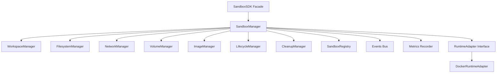

# Stage 3 Module 1: Docker Sandbox Infrastructure

This module implements a production-grade, highly decoupled sandbox execution infrastructure for the Collaborative Programming Infrastructure Platform (CPIP). It abstracts container operations to support multiple sandboxed execution technologies (such as Docker, gVisor, or Firecracker) while managing sandbox state, network connectivity, workspace directories, filesystem security, TTL-based cleanups, metrics, and lifecycle events.

## Architecture Overview



### Components

1. **SandboxSDK (`internal/sandbox/sdk/sdk.go`)**: The abstract public interface decoupling the execution layer from container technologies.
2. **RuntimeAdapter (`internal/sandbox/runtime/runtime.go`)**: Low-level engine interface to swap runtimes (e.g., Docker, gVisor).
3. **DockerRuntimeAdapter (`internal/sandbox/docker/adapter.go`)**: Concrete implementation of `RuntimeAdapter` using the official Docker Go SDK.
4. **SandboxRegistry (`internal/sandbox/registry/registry.go`)**: Thread-safe in-memory index cataloging active sandboxes.
5. **LifecycleManager (`internal/sandbox/lifecycle/lifecycle.go`)**: Thread-safe state machine governing sandbox lifecycle states:
   - `Created` -> `Preparing` -> `Container Created` -> `Ready` -> `Executing` -> `Cleaning` -> `Destroyed`.
6. **WorkspaceManager (`internal/sandbox/workspace/workspace.go`)**: Directs host-side directory preparation and deletions.
7. **FilesystemManager (`internal/sandbox/filesystem/filesystem.go`)**: Injects and extracts files with path-traversal prevention.
8. **NetworkManager (`internal/sandbox/network/network.go`)**: Manages container network bridge assignments.
9. **VolumeManager (`internal/sandbox/volumes/volumes.go`)**: Formats host bind-mounts mapping workspaces to `/workspace` inside containers.
10. **ImageManager (`internal/sandbox/images/images.go`)**: Maps programming languages to container images, resolving and caching pulls.
11. **CleanupManager (`internal/sandbox/cleanup/cleanup.go`)**: Periodic background sweep loop reclaiming expired sandboxes based on TTLs.

## Concurrency & Thread-Safety

All operations on `SandboxSession` structs use a reader/writer mutex (`sync.RWMutex`) to guarantee absolute race-free mutations. State transitions are validated and applied atomically.

## Running Tests

To run the unit and integration test suite:

```bash
go test -v -race ./internal/sandbox/...
```
